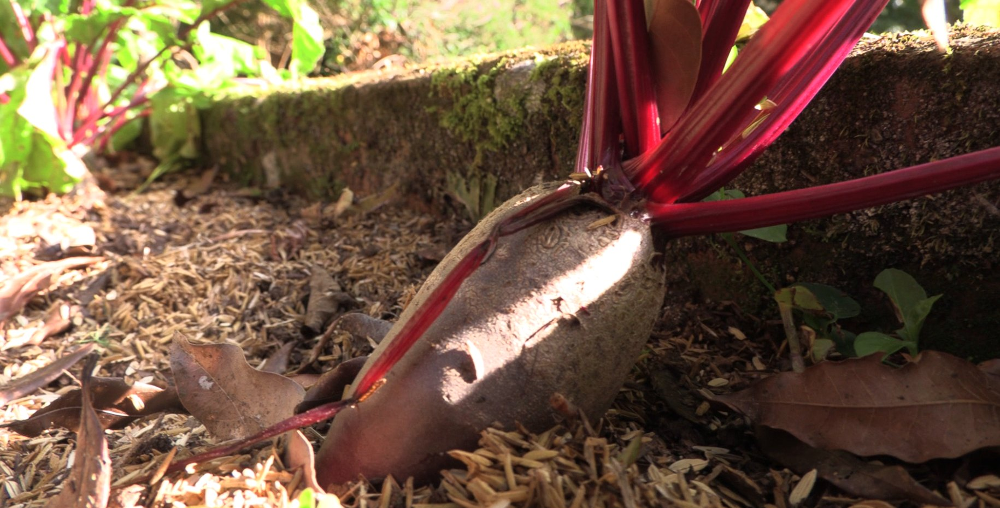

import MedicalDisclaimer from '../../../components/MedicalDisclaimer.astro';

## Nutritional Properties & Benefits

Beetroot (*Beta vulgaris* subsp. *vulgaris*) owes its characteristic purple color to **betalains**, a family of antioxidant pigments that is relatively rare in the plant kingdom: it's found almost only in plants of the order Caryophyllales — beetroot and chard of course, but also amaranth, quinoa, bougainvillea, and dragon fruit (pitaya), plus some cacti such as the prickly pear — whereas the vast majority of other plants get their color from a different family of pigments, the anthocyanins. It's also one of the most concentrated plant sources of natural **dietary nitrates**, which the body converts into nitric oxide — a compound that helps blood vessels dilate, which explains the interest in beetroot and its juice for endurance sports performance, an area where scientific research nonetheless remains active and nuanced. It also provides folate (vitamin B9), potassium, manganese, and fiber that feeds the gut microbiome. A harmless but sometimes surprising effect for anyone discovering it for the first time: beetroot can turn urine and stools pinkish red ("beeturia"), a completely harmless phenomenon linked to how differently people absorb betalains.

<MedicalDisclaimer />

## How to Eat It

Raw beetroot, finely grated, brings a sweet, earthy crunch to any salad — an underrated preparation, often overshadowed by the cooked version. **Cooked** — roasted whole in foil, then peeled — it develops a much sweeter, more concentrated flavor than when boiled, where some of its sugars and color are lost to the cooking water. It pairs especially well with goat cheese, walnuts, citrus, and balsamic vinegar. It's also a mainstay of many Eastern European cuisines, from Russian and Ukrainian borscht to Polish ćwikła (a beetroot-horseradish condiment). Beetroot juice, raw or lightly cooked, is increasingly drunk on its own or in blends for its natural nitrates. And whatever you do, don't overlook the **greens**: the young leaves cook exactly like chard — to which beetroot is directly related — sautéed with garlic or added to soup. A free vegetable that all too often ends up in the compost.

## How to Grow It Organically

Beetroot shares the carrot's principle of a root growing in the ground, but it's much less fussy about soil texture — while having very particular needs of its own.

- **Loose soil, but not necessarily perfect.** Unlike carrots, beetroot tolerates slightly heavier, uneven soil without visibly suffering too much, but stony or compacted soil still produces misshapen or awkwardly elongated roots.
- **Each "seed" hides several.** As with chard, a beetroot seed is actually a cluster of several seeds fused together: several seedlings almost always come up in the same spot, and early thinning to one seedling every 8 to 10 cm is essential for good-sized roots.
- **A slightly higher pH than average.** Beetroot likes soil close to neutral or even slightly alkaline (pH 6.5 to 7.5); overly acidic soil encourages deficiencies — boron in particular — which show up as a blackened root core and a corky texture.
- **Boron, a trace element to watch.** It's one of the few well-documented specific deficiencies in organic beetroot — a well-diversified compost is usually enough to prevent it, with no need for a specific input.
- **Regular watering.** As with carrots, irregular watering causes hard, fibrous, or split roots; mulch helps stabilize soil moisture.
- **Harvest progressively.** Roots can be pulled once they reach the size of a golf ball for the most tender flesh, up to the size of a tennis ball for a more classic beet — beyond that, the texture often becomes more fibrous and woody.

## Beetroot in Our Garden

The cool climate of the cloud forest, with moderate temperatures all year round, is exactly what beetroot prefers: like carrots, it dreads excessive heat, which triggers early bolting and leaves the root stunted. The volcanic soils, rich in minerals but sometimes naturally a little acidic depending on the plot, deserve particular attention to pH before sowing beetroot — a carefully measured addition of wood ash can help correct excess acidity while adding potassium. Once those conditions are met, beetroot grows here with lovely regularity, without the soil fussiness its cousin the carrot demands.

## Good Companions

- **Alliums — onion, leek, garlic.** Good general neighbors with a repellent effect on certain insects and no notable competition for resources.
- **Brassicas — cabbage, cauliflower, broccoli.** Complementary root systems and no notable shared diseases make them good bed companions.
- **Lettuces and other salad greens.** Compact, they fill the space between rows of beetroot without competing with them, much as they do with carrots.
- **Bush beans (in moderation).** They add nitrogen to the soil, which benefits beetroot, but some gardeners report mutual growth inhibition with pole beans — bush varieties remain the safest choice.

## Plants to Avoid

- **Chard and spinach.** From the same botanical family as beetroot (Amaranthaceae / Chenopodiaceae), they share the same pests and diseases, notably the downy mildew specific to this family — keep them as far apart as possible in the garden.
- **Pole (climbing) beans.** Unlike bush varieties, several gardeners report slower beetroot growth right next to them — an antagonism still poorly explained by science but widely documented in gardening tradition.
- **Mustard and other very fast-growing, sprawling brassicas** can, in tight competition, rob young beetroot of light before it gets established.

## Good to Know

- **It's exactly the same species as chard.** Garden beetroot and chard are two selections of the same botanical species, *Beta vulgaris* — which explains why they share both their edible leaves and their pests.
- **It's also the historical source of beet sugar.** A distinct variety, the sugar beet — paler and far richer in sucrose — now supplies nearly a third of the world's sugar, an 18th-century European discovery that upended the sugar trade, until then dominated by tropical sugarcane.
- **It's a biennial**, like carrots and chard: it only flowers in its second year, which is why it can be harvested for its root in the first season, before it bolts.
- **The color can stain — that's normal and harmless.** The betalains that color beetroot easily stain hands, cutting boards, and clothes; a little lemon juice or vinegar usually takes care of it.
