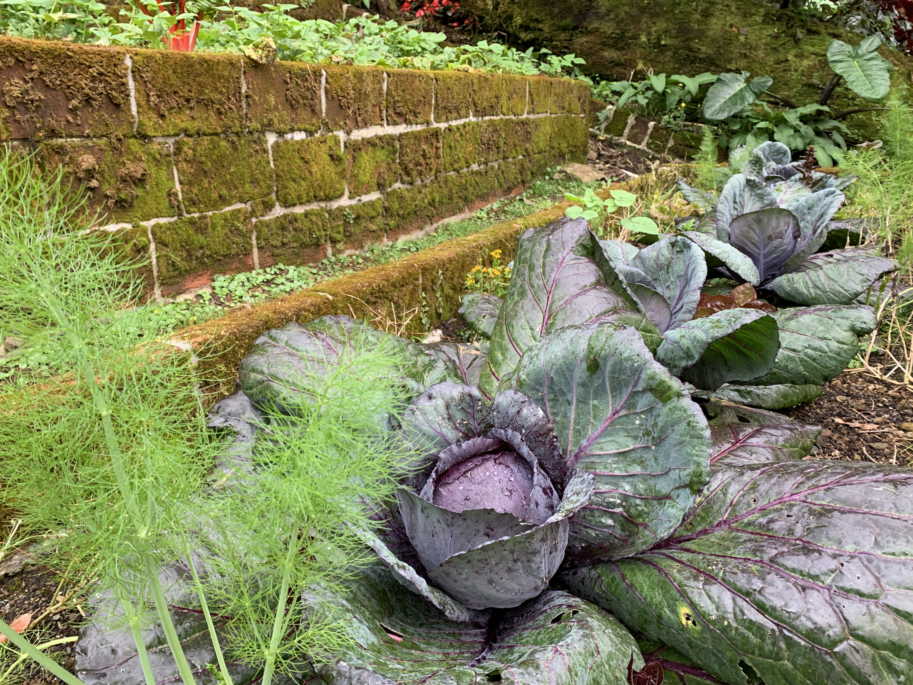

import MedicalDisclaimer from '../../../components/MedicalDisclaimer.astro';

## Nutritional Properties & Benefits

Green cabbage (*Brassica oleracea* var. *capitata*) is more than 90% water and very low in calories, yet it's one of the most micronutrient-dense vegetables in the garden. It's an excellent source of **vitamin C** — historically precious for preventing scurvy on long sea voyages — and of **vitamin K**, which it provides in particularly high amounts, as well as a good source of folate. Like all brassicas, it contains glucosinolates, sulfur compounds that turn, when chewed or cut, into substances researchers are studying for their antioxidant properties. Its botanical epithet, *capitata*, comes from the Latin for simply "having a head," a reference to the compact head its tightly packed leaves form — a trait acquired through gradual selection, since the original wild cabbage has no head at all. Fermented into sauerkraut, cabbage sees its beneficial compounds change further, with lacto-fermentation adding probiotic properties on top.

<MedicalDisclaimer />

## How to Eat It

Green cabbage lends itself to a range of preparations, from raw to long-simmered. Finely shredded, it becomes the base of coleslaw, where its crunch pairs well with a creamy or tangy dressing. Fermented with nothing but salt, it turns into sauerkraut, a traditional way of preserving that once kept vegetables on the table all winter. Its whole leaves, lightly blanched to make them pliable, are used to wrap a filling of meat and rice in stuffed cabbage rolls, a classic of many home kitchens. It's just as good quickly pan-fried with garlic, which softens its natural bitterness while keeping its crunch, or cooked slowly in soup, where it gradually releases all its sweetness.

## How to Grow It Organically

Green cabbage isn't the fastest vegetable in the garden, but it's among the hardiest — as long as you give it rich soil and steady watering while the head forms.

- **Sown in a nursery, then transplanted.** Like most brassicas, cabbage is first sown in pots or a nursery bed, then transplanted to the garden once the seedlings have four to six true leaves, with generous spacing to let the head develop.
- **High nitrogen needs.** Cabbage is a hungry plant that draws heavily on the soil to produce its abundant foliage; well-rotted compost worked in before planting, topped up during growth, encourages a dense head.
- **Regular, even watering.** Irregular irrigation — too dry, then suddenly heavy — can split the head as it forms; steady watering is better than heavy but infrequent soakings.
- **A 70- to 120-day cycle depending on variety.** Slower than lettuce or Chinese cabbage, green cabbage rewards patience by keeping well once harvested.
- **The cabbage white caterpillar is the main pest.** Insect netting laid over the bed at planting remains the most reliable organic method for stopping the white butterflies from laying eggs directly on the foliage.
- **Harvest at the base when the head feels firm.** A clean cut at ground level, leaving the roots in the soil, sometimes allows a second flush of small secondary heads.

## Cabbage in Our Garden

The cool and remarkably stable climate of the Horqueta cloud forest gives green cabbage conditions close to the ones it naturally prefers — this is, after all, a plant descended from a wild species of Europe's temperate coastal cliffs. The altitude spares it the heat peaks that, in the tropical lowlands, would slow its growth and weaken its head, while the region's volcanic soils, rich in organic matter, respond well to its pronounced appetite for nitrogen. It's a crop that can occupy a bed for several months without trouble — a real advantage when planning a long-term rotation in the vegetable garden.

## Good Companions

- **Dill.** Its scent attracts beneficial insects that prey on cabbage white caterpillars, while repelling some common cabbage pests.
- **Nasturtium.** Used as a trap crop, it draws aphids and certain caterpillars away from the cabbage, sacrificing its own leaves to protect the main crop.
- **Chamomile and calendula.** Known for attracting pollinators and beneficial insects, they contribute to the overall balance of the cabbage bed.
- **Celery.** A good traditional companion, with no marked competition for root space or nutrients.
- **Onion and garlic.** Their strong scent is thought to mask the smell of cabbage from flying pests that find it by smell.

## Plants to Avoid

- **Tomatoes and other nightshades.** Several gardeners report slower growth when cabbage is planted too close to tomatoes, although the exact mechanism is still debated and documented mostly by experience rather than controlled trials.
- **Strawberries**, whose growth sometimes seems held back by nearby cabbage, for reasons that are, here too, more anecdotal than scientifically established.
- **Too many other brassicas in the same bed** — not because of any direct incompatibility, but because they share the same pests and soil diseases such as clubroot. A good reason to rotate plant families rather than piling cabbages into the same spot year after year.

## Good to Know

- **Sauerkraut was long used as a store of vitamin C.** Captain James Cook took large quantities on his 18th-century expeditions, a practice that helped limit scurvy among his crews long before the link with vitamin C was scientifically established.
- **The original wild cabbage has no head.** All of today's varieties — head cabbage, kale, broccoli, cauliflower, Brussels sprouts, kohlrabi — descend from the same wild species, *Brassica oleracea*, which still grows today on the limestone cliffs of the European coast, and which was selected in radically different directions depending on which part of the plant was emphasized.
- **In French, "chou" (cabbage) is also a term of endearment**, as in "mon chou" ("my sweetheart") — a shift in meaning thought to date from the 19th century, with no proven link to any particular quality of the vegetable itself.
- **Cabbage was domesticated in Europe more than 3,000 years ago**, probably by the Celtic peoples of central and western Europe, long before selection produced the compact head we know today.
