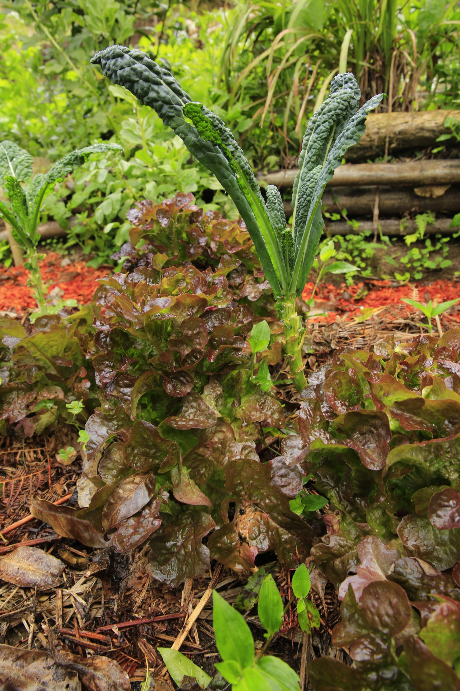

import MedicalDisclaimer from '../../../components/MedicalDisclaimer.astro';

## Nutritional Properties & Benefits

Lettuce (*Lactuca sativa*) has long had a somewhat unfair reputation as a nutritionally almost empty vegetable — a reputation mostly earned by iceberg lettuce, the palest and most watery variety. Darker-leaved lettuces (romaine, oak leaf, batavia) are actually good sources of **vitamin K1**, **vitamin A** in the form of beta-carotene, and folate (vitamin B9), especially useful during pregnancy. It's also very rich in water (more than 95%), which makes it a low-calorie, hydrating food, and it provides gentle fiber that supports regular digestion. Its botanical name, *Lactuca*, comes from the Latin *lac* (milk), a reference to the white, slightly bitter latex that oozes from the stem when it's cut — a compound, lactucin, traditionally credited with mild sedative properties, more pronounced in its wild cousin, wild lettuce.

<MedicalDisclaimer />

## How to Eat It

Lettuce is eaten almost exclusively raw, and that's precisely its strength: its freshness, crunch, and slight bitterness (more or less pronounced depending on the variety) make it the base of the most universal green salad. Firmer romaine leaves work well in a Caesar salad, or even lightly cooked on a griddle, which gives them an unexpected smoky profile. Tender-leaved varieties (oak leaf, batavia, butterhead) pair well with light dressings that don't overwhelm them. Lettuce is also used as an edible wrapper, especially in Asian cooking, where large leaves replace tortillas or bread to wrap meat, rice, or grilled vegetables — a use that makes the most of its supple texture and neutral flavor. A simple trick to cut waste: the outer leaves, often discarded, are very good lightly sautéed, like any other leafy green.

## How to Grow It Organically

Lettuce is probably the most generous vegetable for anyone starting out in organic gardening: fast growth, few soil requirements, and decent tolerance of beginner mistakes. Its real difficulty isn't the growing itself, but the timing.

- **Very easy to sow, in place or in pots.** Seeds germinate quickly (5 to 10 days) at moderate temperatures, and young plants transplant well, unlike carrots — transplanting at 3–4 true leaves is even often recommended for heading varieties.
- **Heat is enemy number one.** Above roughly 25–27°C for a prolonged period, lettuce "bolts": it sends up a flower stalk, its leaves turn bitter, and its texture quickly deteriorates. It's a cool-climate crop that much prefers spring, autumn, or altitude to the height of a tropical summer.
- **Staggered sowings rather than one big sowing.** Because it grows fast (30 to 60 days depending on the variety) and doesn't keep long once harvested, sow a short row every two to three weeks to spread the harvest, rather than ending up with twenty lettuces ready on the same day.
- **Regular, shallow watering.** Lettuce roots stay shallow; light but frequent watering at the surface suits it better than heavy but infrequent watering.
- **Harvest by the leaf or as a whole head.** Cut-and-come-again varieties (oak leaf, batavia) can be harvested leaf by leaf, leaving the heart to regrow for several successive harvests; heading varieties (butterhead, iceberg) are harvested all at once, at the base.
- **Few serious pests in organic growing**, apart from slugs and snails on young plants — a ring of wood ash or crushed eggshells around seedlings is still a simple, effective protection.

## Lettuce in Our Garden

The cool climate of the cloud forest, with temperatures that almost never reach the extremes that make lettuce bolt elsewhere in the tropics, is probably one of the greatest luxuries altitude offers this vegetable: here, lettuce can be grown almost all year round, without the forced midsummer breaks that heat imposes in the lowlands — even if, at the height of the dry season, that heat sometimes does climb up to Boquete. It grows remarkably fast on volcanic soils rich in organic matter, and its quick growth makes it an ideal crop between two longer harvests, or along the edges of beds of slower vegetables such as carrots or beetroot.

## Good Companions

- **Carrot.** The classic pairing par excellence: lettuce, compact and shallow-rooted, fills the space between rows of carrots without competing with their taproots, and acts as a living mulch that keeps the soil cool.
- **Radishes.** Just as fast-growing, no competition for resources, and a good traditional pairing along the edge of a bed.
- **Alliums — onion, chives.** Their smell helps repel some of the aphids and slugs that readily attack lettuce's tender young foliage.
- **Cucurbits (cucumber, zucchini).** The large leaves of cucurbits give lettuce partial shade in summer, delaying heat-induced bolting — a pairing that plays to each plant's strengths.
- **Strawberries.** A good traditional border companion with no notable competition, both enjoying cool, well-mulched soil.

## Plants to Avoid

- **Parsley**, which some gardeners report slows the growth of lettuce planted right next to it, although scientific evidence for this incompatibility is limited and comes mostly from gardening tradition.
- **Broccoli and large cabbages**, whose imposing foliage can rob lettuce of light if it's planted too close, without any real biological incompatibility — a question of space more than chemistry.
- **Being close to very long-cycle, poorly mulched crops**, which let the soil warm up and dry out more, speeding up the bolting of neighboring lettuce.

## Good to Know

- **It was originally grown for its seeds, not its leaves.** Wild lettuces in ancient Egypt, more than 4,000 years ago, were grown for the oil pressed from their seeds; selection for broader, more tender leaves came gradually, notably under the influence of Greek and then Roman gardens.
- **Its wild cousin, wild lettuce, is sometimes called "opium lettuce."** The dried latex of *Lactuca virosa* has a long history of traditional use for its mildly sedative effects, with no real pharmacological link to opium despite the nickname.
- **There are hundreds of varieties**, grouped into a few main families: heading lettuce (butterhead, iceberg), loose-leaf lettuce (oak leaf, batavia), romaine, and stem lettuce (celtuce), grown in China for its fleshy stem rather than its leaves.
- **It doesn't keep long.** Unlike carrots or beetroot, lettuce quickly loses its crunch after harvest — at best it keeps a few days in the refrigerator, wrapped in a slightly damp cloth, which makes it a vegetable to eat quickly, almost straight from garden to plate.
