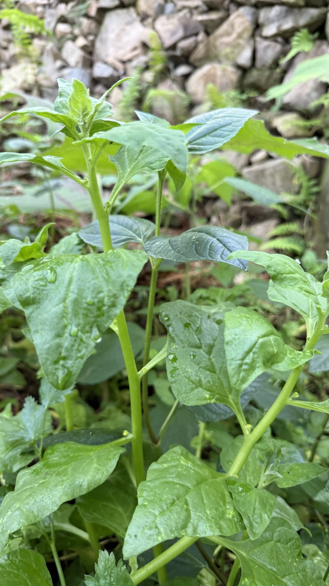

import MedicalDisclaimer from '../../../components/MedicalDisclaimer.astro';

## Nutritional Properties & Benefits

New Zealand spinach (*Tetragonia tetragonioides*), also known as tetragonia, is in fact no relation of spinach at all: it belongs to the Aizoaceae, the family of succulents such as ice plants. Its thick, slightly fleshy leaves provide **vitamin C**, **vitamin A** in the form of beta-carotene, **vitamin K**, as well as iron, calcium, and magnesium, for very few calories. Like spinach, it contains **oxalates** — in notable amounts, in fact — which is why it's almost always eaten cooked, ideally blanched for a few moments in boiling water that is then thrown away: this simple step removes a good part of the soluble oxalates, a useful point for people prone to kidney stones. Its genus name comes from the Greek *tetra*, "four," and *gonia*, "angle," after its very recognizable angular, four-horned seeds. Captain James Cook is said to have had it gathered and cooked for his crews when he called at New Zealand in 1770, as a fresh green vegetable against scurvy — it's one of the world's few vegetables of Oceanian origin.

<MedicalDisclaimer />

## How to Eat It

New Zealand spinach is cooked exactly like spinach, whose slightly mineral mildness it shares, with a somewhat firmer, fleshier texture that holds up well to cooking. The habit to adopt: **blanch** it for one to two minutes in boiling water, drain it, then sauté it in a pan with garlic, butter, or olive oil. After that it goes anywhere you'd use spinach: in a gratin, a quiche, a tart, an omelet, alongside fish, or blended into a green soup. The tender young shoots, picked from the tips of the stems, can be eaten raw in small quantities in a mixed salad, but cooking remains preferable for regular eating. Its great advantage in everyday cooking: where spinach melts down to almost nothing in the pan, New Zealand spinach keeps more of its volume.

## How to Grow It Organically

New Zealand spinach is a disarmingly simple crop, almost maintenance-free once it gets going — its only fault is slightly temperamental germination.

- **Soak the seeds before sowing.** Their hard, angular coat delays germination; soaking for 12 to 24 hours in lukewarm water speeds up emergence considerably, which can otherwise take three weeks.
- **Sow in place or in pots**, two or three seeds per station, leaving plenty of room: a single plant can cover a square meter with its creeping growth.
- **It practically never bolts in the heat.** That's its great difference from spinach, which flowers and turns bitter as soon as days lengthen or temperatures climb: New Zealand spinach goes on producing tender leaves without interruption.
- **A continuous harvest by pinching.** Cut the last ten centimeters or so of the stems; the plant branches and produces even more. Regular picking, every week, keeps the shoots tender.
- **Undemanding about soil and tolerant of drought**, thanks to its fleshy, water-storing leaves, though regular watering gives more tender and more abundant leaves.
- **Almost no pests.** Only slugs sometimes take an interest in very young plants; mature plants are remarkably resistant.

## New Zealand Spinach in Our Garden

In the cloud forest of Horqueta, New Zealand spinach has an asset few leafy vegetables can claim: it shrugs off coolness and warmer spells alike, and the absence of frost in Boquete lets it behave as a true perennial, producing year after year in the same spot. It's the leafy green of consistency, the one that keeps delivering when spinach and lettuce are going through a difficult patch. Its creeping habit also makes it an excellent living groundcover, ideal for keeping the soil cool and holding back weeds along the edge of a terrace. One caution: it readily reseeds itself, and its hard seeds can stay in the ground for a long time before germinating — an advantage if you want perpetual production, a drawback if you'd like the space back for something else.

## Good Companions

- **Corn and tall upright crops.** New Zealand spinach creeps at their feet like a living mulch, keeping the soil cool and shaded without competing with them for height.
- **Squash and other cucurbits.** Two ground-covering crops that share the space well, each enjoying the shade and moisture the other holds.
- **Strawberries.** Good companions along a border, both liking cool, covered soil.
- **Alliums (onion, garlic).** Good neighbors in general, with a repellent effect on certain insects.

## Plants to Avoid

- **Low crops that are slow to start (carrots, onions from seed).** The vigorous creeping growth of New Zealand spinach can smother them before they establish.
- **Small, closely sown salad greens right next to it**, for the same reason — crowding rather than incompatibility.
- **Fennel**, for its general allelopathic effect on many neighboring plants.

## Good to Know

- **It travelled with Captain Cook.** Brought back to England by the botanist Joseph Banks after the 1770 expedition, it was one of the very first Oceanian vegetables grown in Europe.
- **It isn't a spinach but a succulent.** Its family, the Aizoaceae, includes many shore and desert plants, which explains its fleshy leaves and its tolerance of salt and drought.
- **It grows naturally on beaches.** In the wild it's found on the dunes and shores of New Zealand, Australia, Japan, and South America, often a few meters from the sea.
- **Each "seed" contains several.** The angular fruit holds several seeds, hence the clustered seedlings that sometimes need thinning.
