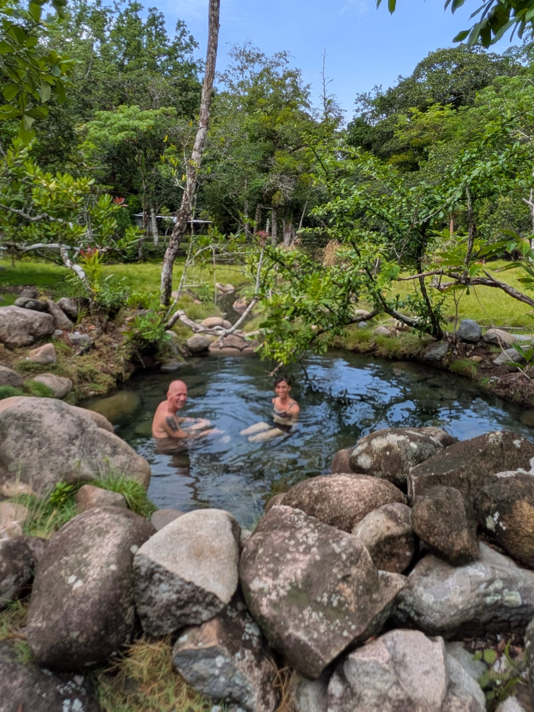
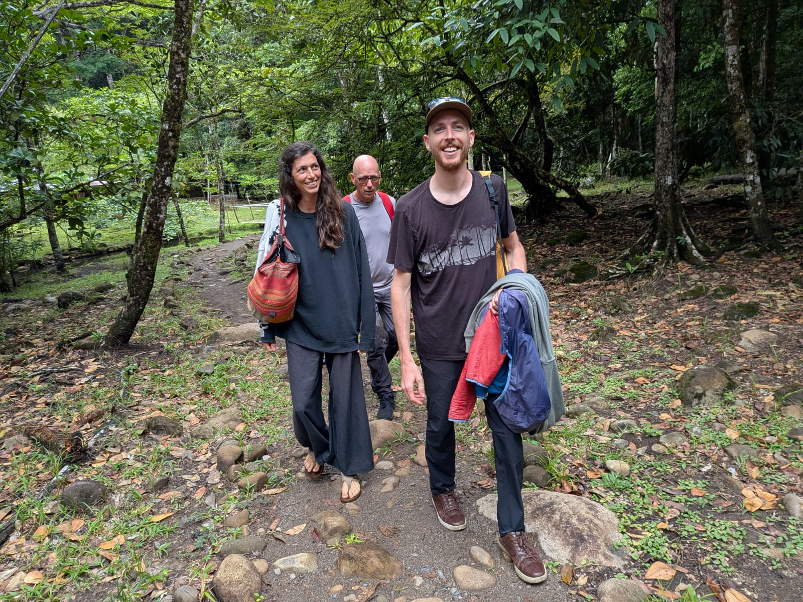
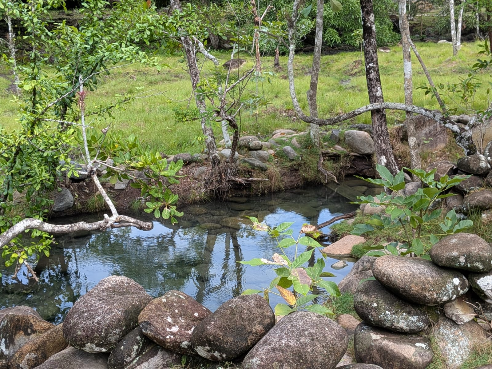
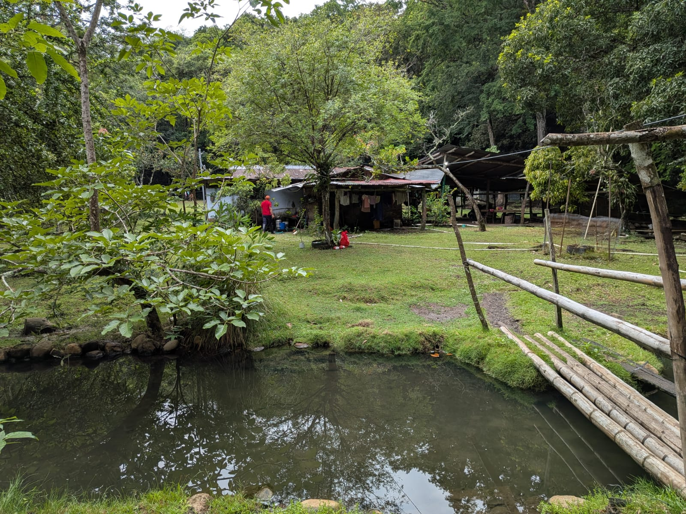
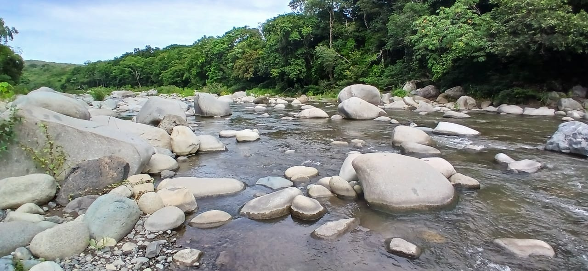

import NoteBox from '../../../components/NoteBox.astro';
import PhotoGrid from '../../../components/PhotoGrid.astro';
import { img } from '../../../lib/images';

export const morePhotos = [
  { image: img('journal/caldera-hot-springs/caldera-hot-springs-group-soak.jpg'), alt: 'Un grupo de amigos disfrutando juntos de una de las pozas' },
  { image: img('journal/caldera-hot-springs/caldera-hot-springs-friends.jpg'), alt: 'Amigos reunidos en una poza termal de Caldera' },
  { image: img('journal/caldera-hot-springs/caldera-hot-springs-water-detail.jpg'), alt: 'Detalle de las ondas en la superficie de una poza termal' },
];

## Un fenómeno geológico: el aliento del Volcán Barú

El Volcán Barú es el único volcán de Panamá y su punto más alto, con 3,475 metros. Es un estratovolcán activo — dormido, no extinto — y forma parte del Arco Volcánico de América Central, la cadena de volcanes producida por la subducción de la Placa de Cocos bajo la Placa Caribe. Su última erupción confirmada data de alrededor del año 1550 — un episodio explosivo mucho más modesto que la colosal avalancha de escombros, de entre 20 y 30 kilómetros cúbicos de material, que esculpió su cráter cumbrero en forma de herradura decenas de miles de años antes, el evento de este tipo más grande jamás documentado en América Central. Desde esa erupción de 1550, el volcán ha permanecido tranquilo; sus únicas señales de actividad son algunos enjambres sísmicos registrados en 1930, 1965, 1985 y 2006.

Es ese mismo sistema volcánico, arraigado en las profundidades bajo el valle, el que aporta el calor a las aguas termales de Caldera, a unos 30 kilómetros de la cumbre.

Una nota rápida sobre el nombre: *caldera* alude directamente a estas aguas humeantes. Sin embargo, no se trata de una caldera en el sentido geológico del término — el amplio cráter de colapso que se forma tras una erupción mayor. El pueblo debe su nombre a sus pozas, no a un cráter.

## ¿De dónde viene esta agua caliente?

Aquí nada entra en contacto directo con el magma. El agua de las pozas de Caldera comienza su recorrido como cualquier agua de lluvia caída sobre las laderas del Barú: se infiltra en el suelo, desciende a través de kilómetros de roca volcánica fracturada, hasta alcanzar profundidades donde el calor residual del sistema magmático del volcán la calienta lentamente. Impulsada por la presión, encuentra después un camino de regreso hacia la superficie a lo largo de fallas y fracturas, y resurge — años, a veces décadas después — como una fuente termal junto al Río Chiriquí. Es el mecanismo clásico detrás de la mayoría de las fuentes termales volcánicas no magmáticas: un enorme circuito subterráneo, más que un contacto directo con roca fundida.

## Temperatura y propiedades del agua

El sitio cuenta con cuatro pozas, talladas directamente en la roca y la ribera. Su temperatura varía notablemente de una a otra — entre 34 °C y 50 °C, según la poza y la temporada — dependiendo de qué tan cerca esté cada una de la resurgencia y de cuánto se mezcle con el agua fría del río cercano. La poza más grande recibe cerca de diez personas, con el agua generalmente a la altura de la cintura.

Se trata de agua mineral, cargada tras su largo recorrido subterráneo a través de la roca volcánica. La composición exacta no ha sido documentada públicamente para Caldera en particular, pero las fuentes termales de la región de Chiriquí son conocidas por ser ricas en azufre, calcio y magnesio — minerales típicos de los sistemas hidrotermales volcánicos.

## Una tradición de baños termales con 4,000 años de historia

Bañarse en agua mineral caliente por sus beneficios no es nada nuevo — la práctica se remonta a la India, Italia y Grecia antiguas, con evidencia que data de hasta 2000 a.C. Caldera se inscribe en esa misma tradición, a escala local: visitantes y habitantes llegan aquí desde hace generaciones en busca del alivio muscular, el calor reconfortante y el entorno mismo — el bosque, el sonido del río, el vapor que se eleva sobre el agua.

<NoteBox>
  

    <strong>
      No se han realizado estudios clínicos específicamente sobre las aguas de Caldera, y estos
      beneficios provienen principalmente del uso tradicional y de la experiencia personal, no de
      un protocolo médico comprobado. Como con cualquier agua termal, se recomienda precaución
      durante el embarazo o en caso de hipertensión o problemas cardíacos — consulta a un médico
      si tienes dudas.
    </strong>
  

</NoteBox>

## Un sitio cargado de historia, mucho antes de los primeros bañistas

La región de Caldera no esperó al turismo termal para estar habitada. A pocos minutos de las pozas se encuentra la **Piedra Pintada**, una enorme roca grabada con petroglifos precolombinos — animales, formas geométricas, siluetas humanas. Su edad exacta es objeto de debate: algunos investigadores la estiman en 8,000 años, otros la atribuyen a los pueblos Coclé o Dorasque, entre los años 450 y 900 d.C. Nadie sabe con certeza quién la grabó ni por qué — la teoría más aceptada sostiene que funcionaba como una especie de calendario agrícola, marcando las temporadas de cosecha.

Hoy en día, la provincia de Chiriquí sigue albergando la mayor parte de la Comarca Ngäbe-Buglé, el territorio indígena más grande de Panamá. Para los Ngäbe, el agua en movimiento — manantiales y cascadas en particular — es tradicionalmente considerada un lugar habitado por los espíritus de los ancestros, un punto de contacto con el mundo natural y espiritual.

Las pozas de Caldera, por su parte, son una incorporación turística más reciente: cuatro pozas construidas en terreno privado, a unos 2.6 km del centro del pueblo, al final de un camino de tierra — un sitio que se ha mantenido en gran parte informal, sin mucha infraestructura, lo cual es, sinceramente, buena parte de su encanto.

Justo al lado de las aguas termales corre el propio Río Chiriquí — ancho, pedregoso y frío, un contrapunto natural al calor de las pozas. La mayoría de los visitantes alternan entre los dos: un baño en el agua caliente, luego un chapuzón en el río para refrescarse, y vuelta a empezar.

## Lo que debes saber antes de ir

- **Dónde:** el pueblo de Caldera, en el distrito de Boquete — a unos 30 minutos en carro desde Boquete.
- **Acceso:** un camino de tierra secundario, a aproximadamente 2.6 km de la calle principal del pueblo.
- **Cuatro pozas**, entre 34 °C y 50 °C según el lugar.
- **Terreno privado:** por lo general se cobra una entrada módica en el sitio.
- **Combínalo** con un chapuzón en el cercano Río Chiriquí, para alternar entre el calor y el frío.

<PhotoGrid items={morePhotos} groupId="caldera-hot-springs" />

[Reserva tu estancia →](/es/preguntas-contacto/)
[Más sobre senderismo en Wild on the Farm →](/es/journal/senderismo-en-boquete/)
