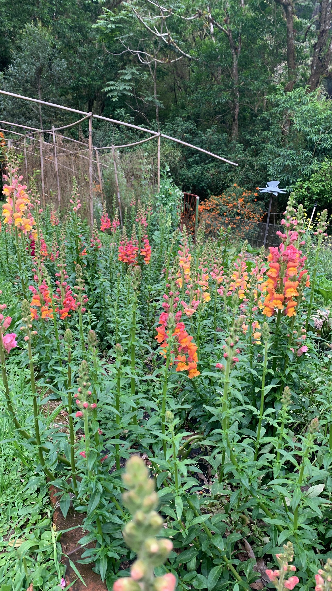

import MedicalDisclaimer from '../../../components/MedicalDisclaimer.astro';

## Propiedades nutricionales y beneficios

La boca de dragón (*Antirrhinum majus*), también llamada conejito, perrito o dragoncillo — *snapdragon* en inglés —, es una flor de las laderas rocosas del Mediterráneo, de la familia de las plantagináceas. Sus flores son **comestibles**, pero seamos honestos: se comen por su belleza mucho más que por su valor nutritivo. Se consumen unos pocos gramos a la vez, lo que aporta sobre todo color — el de las **antocianinas** en los rosas y los rojos, y el de un pigmento amarillo particular, la aureusidina, en los amarillos y los anaranjados, compuestos de la familia de los flavonoides con propiedades antioxidantes. La medicina popular mediterránea usaba antaño la planta en cataplasma, un uso hoy caído en desuso. Tres precauciones importan de verdad: comer solo flores **cultivadas sin ningún tratamiento** — nunca las de una floristería o un vivero, producidas para adorno —, consumirlas solo en pequeña cantidad, y abstenerse en caso de alergia conocida a las flores o al polen.

<MedicalDisclaimer locale="es" />

## Cómo comerla

El sabor de la boca de dragón es discreto, ligeramente vegetal, con un punto de amargor que recuerda a la endibia; es ante todo una flor de adorno. Las flores se cortan por la mañana, bien abiertas, se sacuden con suavidad para que salgan los insectos, y se desprende la corola de su base verde, donde se concentra el amargor. Se colocan en el último momento sobre una **ensalada**, una tabla de quesos, un pescado crudo o un postre, donde sus colores vivos hacen todo el efecto. También adornan los **cócteles** y las bebidas frías, se meten en cubitos de hielo y se cristalizan con clara de huevo y azúcar para decorar pasteles. Su ligero amargor combina bien con los cítricos, el queso fresco y las vinagretas suaves. Las flores se conservan uno o dos días en el refrigerador, extendidas entre dos hojas de papel húmedo.

## Cómo cultivarla de forma orgánica

La boca de dragón es una flor de clima fresco, fácil y generosa, que florece durante meses si se la corta.

- **Siembra en superficie.** Las semillas, finas como polvo, necesitan luz para germinar: se colocan sobre el sustrato sin cubrirlas y brotan en una o dos semanas.
- **Despuntar las plantas jóvenes.** Cortar la punta cuando la planta alcanza unos diez centímetros la hace ramificarse: se obtienen varias espigas en lugar de una sola.
- **Sol y suelo drenado.** Le basta una tierra corriente con un poco de compost; lo que más teme es el agua estancada.
- **De veinticinco a treinta centímetros entre plantas**, para que circule el aire.
- **Entutorar las variedades altas.** Las espigas pueden superar el metro y acostarse con la lluvia.
- **Cortar para que vuelva a florecer.** Cuanto más se cortan las espigas, para la mesa o para los ramos, más produce la planta; se quitan las flores marchitas para prolongar la floración.
- **Regar al pie.** La roya, que mancha el envés de las hojas con pústulas marrones, es la principal enfermedad en clima húmedo; un follaje seco y plantas bien espaciadas la limitan.
- **Se resiembra sola.** Unas cuantas espigas dejadas para semilla dan plantas espontáneas la temporada siguiente.

## La boca de dragón en nuestro huerto

La boca de dragón crece notablemente bien en la finca. Es una flor que ama el frescor: en los países templados florece en primavera y se agota en cuanto llegan los calores del verano. En Horqueta, a 1.800 metros, esos calores no llegan nunca, y las bocas de dragón encadenan floraciones durante largos meses. La foto muestra uno de nuestros bancales, al borde del bosque: decenas de espigas rosadas, anaranjadas y frambuesa, que suben hasta la cintura. Las cultivamos en medio del huerto, sin ningún tratamiento — que es justamente lo que permite llevarlas al plato —, para la cocina, para los ramos y para los abejorros. En la estación lluviosa vigilamos la roya y cortamos con regularidad para airear las matas.

## Buenas compañeras

- **Los tomates, los calabacines y los frijoles.** Las bocas de dragón atraen a los abejorros, que luego polinizan las hortalizas vecinas.
- **Las zinnias, los cosmos y las caléndulas.** Juntas forman una franja florida que alimenta a polinizadores e insectos auxiliares todo el año.
- **La lechuga y las ensaladas tiernas.** Aprecian la sombra ligera de las espigas altas.
- **Las coles.** Un borde florido cerca atrae a los insectos que controlan pulgones y orugas.

## Plantas que conviene evitar

- **Las plantas invasoras como la menta.** Ahogan sus raíces poco profundas.
- **Los cultivos altos que le dan sombra.** Necesita sol para florecer bien.
- **Los rincones encharcados.** Allí se pudre, sea cual sea la compañía.

## Datos curiosos

- **Su «boca» se abre cuando se la aprieta.** Al presionar los lados de la flor, bosteza como un pequeño dragón — un juego de niños en todos los países.
- **Solo los abejorros saben entrar.** Hace falta el peso de un insecto grande para separar los dos labios de la flor; las abejas más ligeras suelen quedarse en la puerta.
- **Sus cápsulas de semillas parecen pequeñas calaveras.** Una vez secas, muestran tres agujeros que dibujan dos ojos y una boca.
- **Hizo avanzar la genética.** Las bocas de dragón se estudian desde el siglo XIX para entender la herencia de los colores y la formación de las flores.
- **Cambia de nombre en cada idioma.** Boca de lobo en francés, dragón en inglés, boquita de león en alemán, y «hierba pez dorado» en japonés.
- **Su nombre latino habla de un hocico.** *Antirrhinum* viene del griego y significa «parecido a una nariz».
