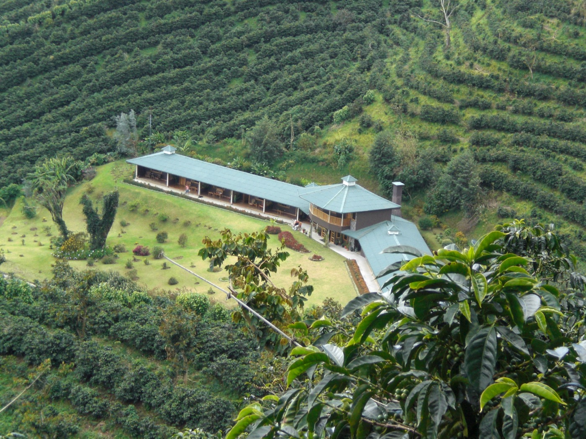
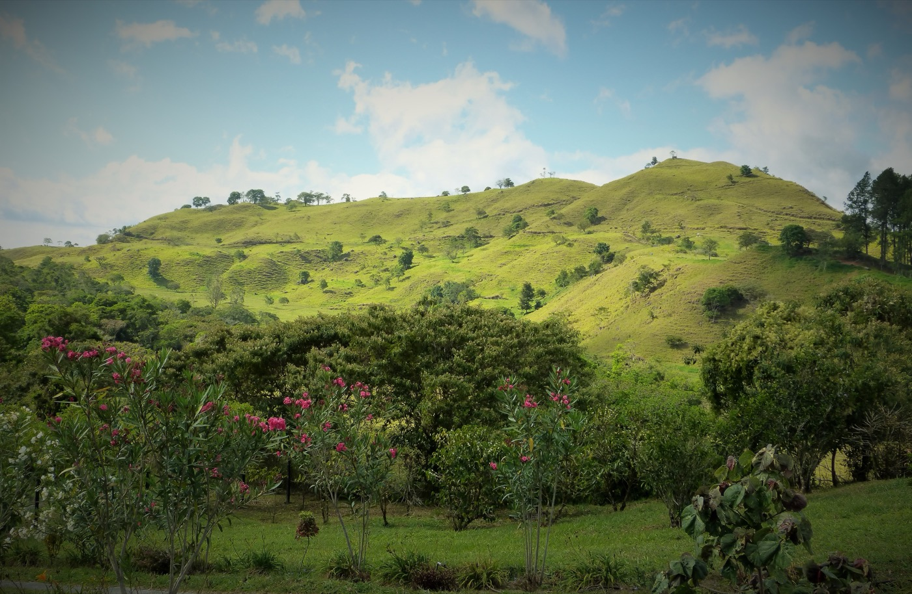

import NoteBox from '../../../components/NoteBox.astro';

## Un primer intento fallido, en la costa equivocada

Se dice que el café llegó a Panamá ya en 1742, traído por un barco procedente de las Antillas francesas. Pero la primera plantación realmente documentada data de la década de 1780-1790, y se encontraba en el lugar equivocado: en la baja costa caribeña, alrededor de Portobelo — una elección que resultó ser un error agronómico completo, entre plagas y enfermedades. Habría que esperar a la década de 1820 para que el cultivo se trasladara a las tierras altas del oeste, donde el clima fresco por fin convenía al arábica. Otra versión, recogida por el Smithsonian, atribuye la introducción del café a un capitán de la marina británica que trajo plantas a principios del siglo XIX tras casarse con una panameña. Según las fuentes, el café llega realmente a Chiriquí a mediados de la década de 1850, donde familias colonas aprovechan la altitud, un clima comparable al de Colombia y Costa Rica — y, sobre todo, el célebre **bajareque**, esa llovizna fina y constante que hidrata las plantas sin excesos y regula la temperatura.

## Los pioneros del valle

La colonización propiamente dicha del valle de Boquete se intensifica en la segunda mitad del siglo XIX. Los primeros en llegar proceden de distritos vecinos — Bugaba, Gualaca, David, Dolega — pronto acompañados de una inmigración europea más reducida pero de influencia duradera: familias francesas, alemanas y suizas, además de norteamericanos, que emprenden el cultivo del café junto a la ganadería. El distrito de Boquete se funda oficialmente el 11 de abril de 1911.

Varias de las grandes fincas que forjaron la reputación cafetalera de la región se remontan a esta época o poco después:

- **Finca Don Pachi** — fundada en 1873 por Blasina Samudio en las laderas del Barú, con un título de propiedad emitido bajo la Gran Colombia, antes incluso del nacimiento de la República de Panamá. Es en esta misma finca donde el café Geisha entrará a Panamá, noventa años después (ver más abajo).
- **Don Pepe Estate** — en actividad desde 1898, considerada una de las fincas de café más antiguas de la región, hoy en su quinta generación familiar.
- **Café Ruiz / Casa Ruiz** — la familia Ruiz cultiva café desde finales del siglo XIX según métodos tradicionales bajo sombra; la estructura comercial se formaliza en 1979. En 2001, Casa Ruiz obtiene el título de «mejor café del mundo», una primicia para un productor panameño.
- **Finca Lérida** — fundada por el ingeniero noruego **Tollef Bache Mönniche**, uno de los diseñadores de las esclusas de emergencia del Canal de Panamá, quien se jubila en 1924 y se instala en Boquete con su esposa Julia en una finca de 365 hectáreas. En 1929, su cosecha se exporta en gran parte a Alemania — la primerísima exportación de café panameño a Europa, vendida al triple del precio corriente. Mönniche inventa de paso una máquina clasificadora de cerezas de café, el «Sifón», y documenta más de 500 especies de aves de la región. La finca, hoy dirigida por la familia Chiari, obtiene el título de «Best Coffee in the World» en el concurso de Boston de 2003.
- **Kotowa Coffee** — una de las fincas más antiguas aún en actividad, fundada en 1913 (una fuente sitúa la fecha en 1918) por un inmigrante norteamericano, presentado según las fuentes como escocés o canadiense — *un punto que las fuentes no permiten zanjar con certeza*. El nombre provendría de una palabra local que significa «montaña».

## Auge, crisis y el nacimiento del café de especialidad

La producción nacional pasa de 402 toneladas en 1961 a un pico de 1.422 toneladas en 1985. Luego, en 1989, el colapso del Acuerdo Internacional del Café hace caer el precio mundial de 1,20 $ a apenas 0,74 $ la libra — una crisis severa para los productores panameños, que empuja a varias familias de Boquete a reorientar sus fincas hacia el café de especialidad en lugar del café de consumo masivo.

Un grupo de productores funda entonces la **Specialty Coffee Association of Panama (SCAP)**, en torno a 1990-1996, reuniendo entre otros a Ricardo Koyner, Price Peterson, Jaime Tedman, Hans Collins, Josué Ruiz, Wilford Lamastus y Francisco Serracín. En 1996 lanzan el concurso **Best of Panama** — una primicia mundial, organizada enteramente por los propios productores para reposicionar el café panameño en el mercado de especialidad. En 2002, un lote premiado de Elida Estate (familia Lamastus) se vende a 2,37 $/lb, unas cinco veces el precio del mercado mundial de entonces — una señal temprana de lo que vendría.

## El Geisha: una variedad despreciada durante cuarenta años

El Geisha (o Gesha) se identifica en la década de 1930 en las montañas de la región de Gesha, al suroeste de Etiopía. En 1936, un capitán británico, cónsul de la región, recolecta allí una decena de libras de semillas. Estas pasan por estaciones de investigación en Tanzania, y luego, en 1953, por el CATIE en Costa Rica, que se convierte en el punto de difusión hacia toda Centroamérica.

Según Finca Don Pachi, es en 1963 cuando el caficultor **Don Pachi Serracín** introduce los primeros granos de Geisha en Boquete, vía el CATIE. Pero durante más de cuarenta años, a nadie le interesa por su sabor: el Geisha es un árbol alto e incómodo, difícil de trabajar, de bajo rendimiento — se planta solo por su resistencia a enfermedades, en particular a la roya del café. La mayoría de las plantaciones iniciales se abandonan.

En 1967, el banquero americano-sueco **Rudolph Peterson**, entonces presidente del Bank of America, compra la finca que se convertirá en **Hacienda La Esmeralda** — al principio, un simple proyecto ganadero. La familia se vuelca al café en la década de 1980, y en 1997 compra la finca de altura de Jaramillo, en las laderas del Barú, recién devastada por la roya. Su hijo **Daniel Peterson** advierte entonces que las viejas plantas de Geisha, sembradas allí por los propietarios anteriores, habían resistido la enfermedad mucho mejor que las demás variedades — y decide extender su cultivo, incluso por encima de los 1.650 metros de altitud, algo nunca visto para esta variedad.

<NoteBox>
  

    <strong>«Era como un té afrutado»</strong> — Price Peterson, al catar en 2004 el primerísimo
    lote 100 % Geisha jamás separado del resto de la cosecha, pensó al principio que se trataba de
    un error: el perfil aromático, floral y afrutado, no tenía nada que ver con lo que
    Centroamérica había producido hasta entonces — recordaba más bien a un café etíope.
  

</NoteBox>

Ese lote gana el Best of Panama 2004 y establece, en esa ocasión, el récord del precio más alto jamás pagado por un café en subasta hasta la fecha: 21,00 $/lb. La trayectoria, desde entonces, no se ha detenido.

### La escalada de precios, edición tras edición

<table>
<thead>
<tr><th>Año</th><th>Precio récord</th><th>Detalle</th></tr>
</thead>
<tbody>
<tr><td>2004</td><td>21 $/lb</td><td>Hacienda La Esmeralda, primer lote 100 % Geisha jamás aislado</td></tr>
<tr><td>2017</td><td>601 $/lb</td><td>Hacienda La Esmeralda (natural)</td></tr>
<tr><td>2018</td><td>803 $/lb</td><td>Lamastus Family Estates (natural), comprado por Black Gold Coffee, Taiwán</td></tr>
<tr><td>2019</td><td>1.029 $/lb</td><td>«Elida Natural Geisha 1029», Lamastus Family Estates</td></tr>
<tr><td>2022</td><td>&gt; 2.000 $/lb</td><td>Varios micro-lotes; una venta privada alcanza unos 6.000 $/lb</td></tr>
<tr><td>2024</td><td>4.542 $/lb</td><td>Lamastus Family Estates (natural), comprado por un consorcio liderado por Saza Coffee (Tokio) — promedio general de la subasta: 627 $/lb en 50 lotes, más de 1,38 millones $ en total</td></tr>
<tr><td>2025</td><td>13.705 $/lb</td><td>Hacienda La Esmeralda, Geisha lavado, 98 puntos — récord actual. Un lote de 20 kg vendido por unos 605.000 $, comprado por Julith Coffee (Dubái)</td></tr>
</tbody>
</table>

Es decir, una multiplicación por más de 650 en dos décadas — una trayectoria casi sin equivalente en la historia de las materias primas agrícolas, para una variedad que, hasta 2004, no le interesaba a nadie por su sabor.

## Más allá de La Esmeralda: los otros grandes nombres

**Elida Estate** (Lamastus Family Estates), la finca más alta de Panamá en Alto Quiel, ha ganado siete veces el Best of Panama y posee varios récords mundiales. Junto a ella, Finca Lérida, Café Ruiz y Kotowa siguen siendo nombres de referencia, junto a fincas más recientes como Carmen Estate, La Torcaza Estate (orgánica), Café Eleta — reconocida por sus instalaciones de procesamiento ecológicas — y Finca Deborah, en la región Volcán-Boquete.

Un detalle raramente destacado: cerca del 90 % de la mano de obra de cosecha en la región pertenece a las comunidades indígenas Ngäbe-Buglé, que practican una recolección manual selectiva, cereza por cereza — un saber esencial para la calidad de los lotes premiados. Tras el éxito de 2004, Price Peterson implementó además una política de redistribución hacia sus recolectores: triplicación del salario promedio de cosecha, bonos anuales, cuidado infantil y becas de estudio.

## El futuro: una industria a dos velocidades frente al cambio climático

La paradoja es sorprendente: mientras el Geisha de excepción se dispara hacia cifras inéditas, la producción cafetalera panameña en su conjunto se desploma. En una década, pasó de unos 400.000 a apenas 120.000-140.000 quintales al año, y el número de productores de 10.000 a alrededor de 6.000 — muchos de ellos habiendo simplemente abandonado el café por cultivos más predecibles.

**Ricardo Koyner**, presidente de la SCAP, lo explica por la alteración de los ciclos de floración y fructificación, y por la creciente prevalencia de enfermedades, favorecida por un exceso de humedad o sequías prolongadas. Sobre el terreno, en Renacimiento, una productora como **Doris Shanto** lo resume simplemente: «siempre nos dijeron que el café necesita sol, pero con el cambio climático ya no sabemos cuándo es verano y cuándo es invierno».

No es la primera vez que el café panameño debe cambiar de altitud: es ya la historia de su llegada, cuando las plantaciones bajas de la costa caribeña tuvieron que abandonarse en favor de las alturas de Chiriquí. Un estudio global (PLOS One, 21 modelos climáticos) proyecta que hacia 2050, el rango de altitud propicio para el arábica en Centroamérica podría pasar de los 1.200 m actuales a los 1.600 m — y Panamá, gracias a sus volcanes que superan los 3.000 metros, podría salir mejor parado que vecinos como Nicaragua o El Salvador, que carecen de macizos elevados. Es exactamente este desplazamiento en altitud el que, entre 1997 y 2004, llevó a la familia Peterson a plantar Geisha cada vez más arriba en las laderas del Barú — empujados por la roya, descubrieron así, casi por accidente, el café más caro del mundo.

Entre 2008 y 2013, una severa epidemia de roya del cafeto afectó a varios países de América Latina, entre ellos Panamá, obligando a once países a declarar el estado de emergencia. Las anomalías meteorológicas ligadas al cambio climático — en particular una reducción de la diferencia entre las temperaturas mínimas y máximas — se identifican entre las causas principales. Frente a esto, algunos productores adaptan sus prácticas: cultivo bajo sombra (agroforestería), variedades más resistentes como el Obata, el Tupi Marsellesa o el Catuai SH3, y programas de formación que combinan investigación científica panameña y productoras locales.

<NoteBox>
  

    El café de lujo panameño escapa en gran medida a las fluctuaciones de la cotización mundial —
    pero no al cambio climático. Es el título, casi literal, de un artículo de prensa panameño de
    2025: incluso el segmento ultralujo del Geisha, cuyos clientes aceptan los precios fijados sin
    negociar, sigue expuesto a las sequías, las lluvias fuera de temporada y la creciente presión
    de las enfermedades.
  

</NoteBox>

<NoteBox variant="todo">
  

    Fuentes principales: Hacienda La Esmeralda, Wikipedia (Geisha coffee, Coffee production in
    Panama), Perfect Daily Grind, Daily Coffee News, Sprudge, Smithsonian Magazine, The Visitor
    Panama, Excelencias Panamá, Panamá América, Latin American Post, Crítica, SCAP, Café Ruiz.
    Créditos de fotos por confirmar antes de la publicación definitiva.
  

</NoteBox>
