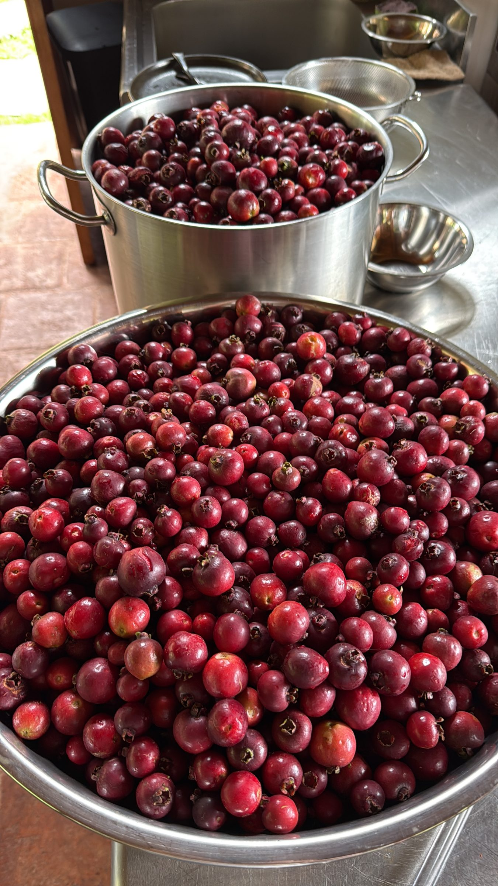
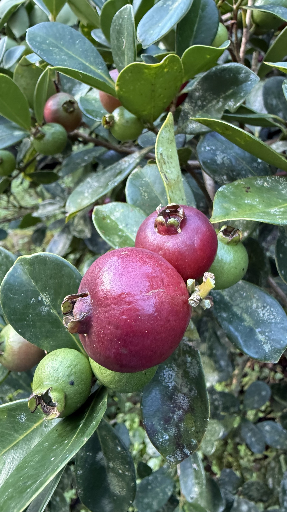

import MedicalDisclaimer from '../../../components/MedicalDisclaimer.astro';

## Propiedades nutricionales y beneficios

Primero, una precisión de identificación, porque el nombre «guayabita» designa varias plantas según la región de América Latina: la que nos ocupa aquí es la **guayabita del Perú** (*Psidium cattleianum*), también llamada guayabo peruano, guayaba fresa o, en la vecina Costa Rica, güisaro — un pequeño arbusto frutal de la familia de las mirtáceas, la misma que la guayaba común (*Psidium guajava*), de la que se distingue por sus hojas más lisas y brillantes, sin las nervaduras marcadas de su gran prima. Pese a su nombre, la planta no es originaria del Perú sino de Brasil; debe su epíteto científico *cattleianum* a William Cattley, un horticultor británico del siglo XIX que fue uno de los primeros en hacerla fructificar en Europa — el mismo nombre que dio su género a la célebre orquídea *Cattleya*. En el plano nutricional, sus pequeños frutos, apenas más grandes que una cereza grande, son, como la mayoría de las guayabas, una muy buena fuente de **vitamina C**, acompañada de fibra y de una cantidad interesante de antioxidantes concentrados en su fina piel roja o amarilla según la variedad. Su pulpa, aromática y ligeramente ácida, contiene también una buena dosis de potasio, en un fruto por lo demás bajo en calorías.

<MedicalDisclaimer locale="es" />

## Cómo comerla

La guayabita se come casi siempre fresca, mordida entera con su fina piel (las semillas internas, pequeñas y algo duras, también se comen sin problema) — un placer sencillo, recién cogida del arbusto, que muchos hogares costarricenses y panameños conocen desde la infancia. Su sabor, a la vez dulce y ligeramente ácido, con un toque que a veces recuerda a la fresa (de ahí su nombre en inglés, *strawberry guava*), se presta especialmente bien a las mermeladas y jaleas caseras, donde su aroma se concentra agradablemente con la cocción. En Costa Rica, donde el fruto es especialmente popular con el nombre de güisaro, también se prepara un *atol* tradicional — una bebida caliente y espesa de fruta cocida, leche y fécula de maíz — así como helados artesanales que realzan su delicado aroma, demasiado sutil para sobrevivir a una transformación industrial. Su generosa temporada de producción, con arbustos que a menudo dan más fruta de la que una familia puede comer fresca, la convierte también en una excelente candidata para jugos y siropes caseros.

## Cómo cultivarla de forma orgánica

La guayabita del Perú es probablemente, de las cinco plantas presentadas en esta serie, la más sencilla de cultivar de forma orgánica: un arbusto rústico, poco exigente, que pide sobre todo paciencia al principio más que un cuidado técnico particular.

- **Siembra fácil a partir de semillas frescas**, extraídas directamente del fruto maduro, que suelen germinar en 3 a 6 semanas sin tratamiento especial; el esquejado es posible pero menos habitual que en otros arbustos frutales.
- **Una planta poco exigente con el tipo de suelo**, que tolera tanto los suelos volcánicos ricos como terrenos más pobres, siempre que estén bien drenados — una clara ventaja frente a cultivos más caprichosos como la naranjilla.
- **Una buena tolerancia a la sequía una vez establecida**, aunque un riego regular durante el primer año tras la plantación acelera notablemente el arraigo del arbusto joven.
- **Un crecimiento progresivo hasta la primera fructificación**, generalmente entre 2 y 4 años después de la siembra según las condiciones, seguida de una producción anual abundante y fiable durante muchos años.
- **Una poda ligera, sobre todo para contener su tamaño y facilitar la cosecha.** Sin intervención, el arbusto puede alcanzar 4 a 6 metros; una poda regular después de la fructificación lo mantiene a una altura más práctica para recoger los frutos.
- **Pocas plagas serias en cultivo orgánico**, aparte de las moscas de la fruta comunes a todas las guayabas — recoger con regularidad los frutos caídos sigue siendo, también aquí, la mejor prevención sin recurrir a tratamientos químicos.

## La guayabita en nuestro huerto

La guayabita del Perú no es, en sentido estricto, originaria de los bosques nubosos de altura como el tomate de árbol o la naranjilla — su origen brasileño es más subtropical que estrictamente andino. Sin embargo, hace mucho que está naturalizada en los huertos y bordes de bosque de las tierras altas de Centroamérica, de Costa Rica a las regiones montañosas de Panamá, donde hoy crece casi como una planta local, mucho mejor adaptada al clima fresco que al calor tropical sostenido que exige la guayaba común. El clima estable y fresco de Horqueta, junto con sus suelos volcánicos ricos en materia orgánica, le conviene por tanto muy bien, sin ser su hábitat original — un poco como el zucchini o el tomate, que prosperan aquí por buena adaptación más que por pertenencia nativa. Un punto de vigilancia merece mencionarse con honestidad: en algunas regiones tropicales alejadas de su área de origen (sobre todo Hawái y Florida), esta especie ha resultado lo bastante vigorosa como para volverse invasora en el bosque natural, ya que sus semillas son ampliamente dispersadas por las aves — una buena razón para mantenerla en una zona cultivada del huerto y no en el borde del bosque nativo.

## Buenas compañeras

- **Las leguminosas fijadoras de nitrógeno** (guandú, otros arbustos leguminosos), plantadas cerca para enriquecer de forma natural el suelo alrededor de este arbusto que, sin ser exigente, agradece un aporte regular de nitrógeno durante su crecimiento.
- **Las hierbas aromáticas como sotobosque ligero**, que aprovechan la sombra parcial que proyectan las ramas bajas del arbusto una vez bien desarrollado, sin competir con él por el agua o los nutrientes.
- **Las plantas melíferas cercanas**, para favorecer la polinización de sus flores blancas, aunque la guayabita es en gran parte autofértil y no depende estrictamente de los polinizadores para fructificar.

Nota: a diferencia de cultivos de huerta más estudiados como el tomate o la lechuga, existe relativamente poca documentación rigurosa sobre las asociaciones beneficiosas específicas de este arbusto frutal — las recomendaciones anteriores se basan, por tanto, más en principios generales de permacultura (fijación de nitrógeno, estratificación) que en una tradición de asociación propia de la especie.

## Plantas que conviene evitar

- **La guayaba común (*Psidium guajava*) plantada muy cerca**, ya que ambas especies comparten las mismas plagas (moscas de la fruta) y ciertas enfermedades fúngicas como la roya del guayabo — un espaciado razonable limita el riesgo de propagación entre ambos arbustos.
- **Las plántulas frágiles que necesitan un suelo constantemente húmedo**, plantadas directamente bajo la copa densa de una guayabita adulta, que capta buena parte del agua de lluvia disponible gracias a su sistema radicular extendido y superficial.

## Datos curiosos

- **Su nombre engaña a casi todo el mundo: no viene del Perú.** «Guayabita del Perú» es un nombre de uso muy extendido en Centroamérica, sin relación real con el origen geográfico de la planta, que es brasileño — un ejemplo entre muchos de nombre común que viajó más rápido que la exactitud botánica.
- **Lleva el nombre de un coleccionista de plantas exóticas, no de un botánico de campo.** William Cattley, que dio nombre a la especie, era un rico horticultor aficionado inglés del siglo XIX, conocido por hacer fructificar plantas tropicales raras en sus invernaderos — la misma pasión que le valió dar su nombre al género de orquídeas *Cattleya*.
- **Existe en dos colores principales**: una forma de piel roja, la más común y la más aromática, y una forma de piel amarilla, a veces vendida por separado como «guayaba limón» por su sabor más suave y ligeramente alimonado.
- **En Costa Rica tiene un nombre totalmente distinto: el güisaro.** Este nombre, muy arraigado en la cultura culinaria costarricense (atoles, mermeladas, helados), designa exactamente el mismo fruto que la guayabita del Perú — otro ejemplo de cómo una sola especie puede llevar nombres completamente distintos de un país a otro en Centroamérica.
