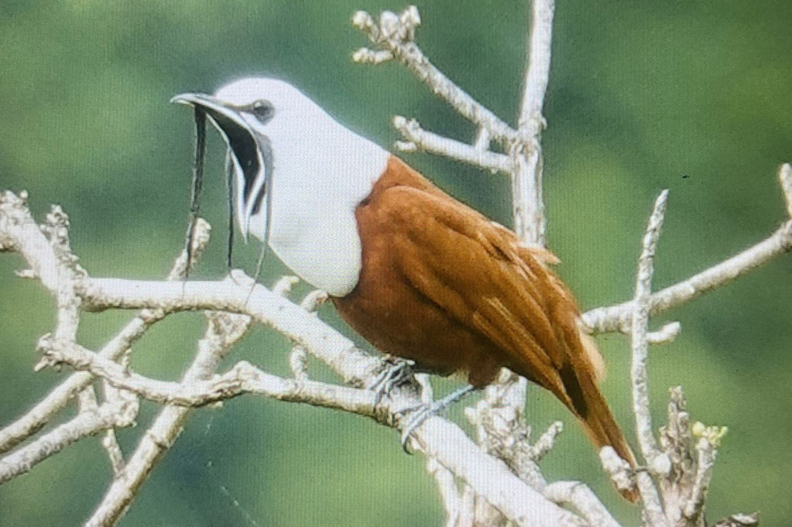
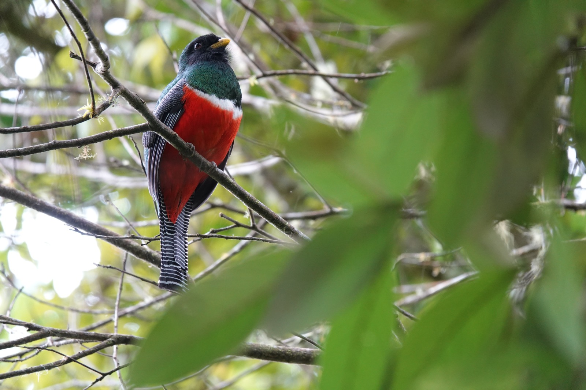

_Tu guía al paraíso del avistamiento de aves en Boquete._

## El Sueño de un Observador de Aves

Ubicado en las tierras altas de Panamá, **Boquete ofrece una experiencia de avistamiento de aves sin igual**. Sus diversos microclimas — desde bosques nubosos brumosos hasta valles exuberantes — albergan **más de 400 especies de aves**. Esto convierte a Boquete en un verdadero paraíso tanto para entusiastas casuales como para investigadores dedicados.

## Dónde Encontrar Aves en Boquete

**Las elevaciones altas, hasta 2,000 metros (6,561 pies),** albergan algunas de las especies más buscadas.

### Wild On The Farm (Parque Nacional La Amistad)

Un **santuario ecológico y lodge** en el borde del Parque Nacional La Amistad, entre 1,646 y 2,000 metros sobre el nivel del mar. Privado, hermoso y exclusivo — **sin senderos concurridos**, solo caminos de montaña donde te integras con el bosque nuboso.

**Aves que podrías encontrar:**

- Campanero cariblanco
- Quetzal resplandeciente
- Clorofonia cejidorada
- Tucancillo verde norteño
- Barbudo piquigordo
- Tangara carinegra
- Carpintero velloso
- Ratona montañera
- Colibrí rabirrufa
- Tangara color fuego
- Zorzal de Swainson
- Especies de estrellitas
- Zorzal gorgiblanco
- Coliblanco pechirojo
- Clorospingo común
- Tangara dorsiplateada
- Solitario carinegro
- Ratona pechiblanca
- Hoja-gruesa escamosa
- Cabezón blanco y negro
- Zorzal ruiseñor dorsipizarra
- Reinita de Wilson
- Pinzón arbustivo nuca blanca
- Milano tijereta
- Águila elegante
- Águila harpía

### Sendero Los Quetzales (Parque Nacional Volcán Barú)

- Campanero tricarrunculado (*Procnias tricarunculatus*)
- Zeledonia (*Zeledonia coronata*)
- Colibrí garganta de fuego (*Panterpe insignis*)
- Quetzal resplandeciente (*Pharomachrus mocinno*)

### Camino del Pipeline (Los Naranjos)

- Ermitaño verde (*Phaethornis guy*)
- Espinero carirrojo (*Cranioleuca erythrops*)
- Vireo aliamarillo (*Vireo carmioli*)
- Eufonia elegante (*Chlorophonia elegantissima*)

### Reservas La Fortuna y Palo Seco

- Pájaro sombrilla cuellinudo (*Cephalopterus glabricollis*)
- Urraca capiazul (*Cyanolyca cucullata*)
- Gavilán barrado (*Morphnarchus princeps*)
- Tiranuelo crestiescamoso (*Lophotriccus pileatus*)

**Las elevaciones bajas, cerca del pueblo, hasta 300 metros (984 pies),** revelan un conjunto diferente de maravillas aviares.

### Caldera

- Saltarín cuellinaranja (*Manacus aurantiacus*)
- Cabezón gorgirrosado (*Pachyramphus aglaiae*)
- Tirano tijereta (*Tyrannus savana*)
- Perico de Finsch (*Psittacara finschi*)

## Reflexiones Finales

Ya sea que estés caminando por los altos bosques nubosos o explorando los valles más bajos, Boquete ofrece una **diversidad de aves inigualable**. Trae tus binoculares, una cámara y tu sentido de asombro — cada sendero guarda la promesa de un avistamiento raro.

[Reserva tu estancia →](/es/preguntas-contacto/)
[Más sobre senderismo en Wild on the Farm →](/es/journal/senderismo-en-boquete/)
