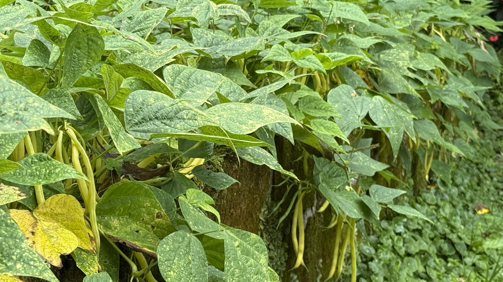

import MedicalDisclaimer from '../../../components/MedicalDisclaimer.astro';

## Propiedades nutricionales y beneficios

La habichuela amarilla, o judía mantequilla (*Phaseolus vulgaris*), pertenece exactamente a la misma especie que la habichuela verde: solo cambia el color de la vaina, que proviene de una selección de variedades pobres en **clorofila**. Esta diferencia de pigmento trae una pequeña diferencia nutricional: algo menos de carotenoides verdes, pero el mismo perfil general — **fibra**, **vitamina C**, **vitamina K**, folatos y manganeso, con muy pocas calorías. Su nombre de «judía mantequilla» no viene de su contenido en grasa, casi nulo, sino de su color y de su pulpa, considerada más tierna y más suave que la de la habichuela verde. Como todos los frijoles del género *Phaseolus*, contiene en crudo **fitohemaglutinina**, una lectina que la cocción destruye: por eso nunca se come cruda, y bastan unos minutos en agua hirviendo.

<MedicalDisclaimer locale="es" />

## Cómo comerla

La habichuela amarilla se prepara como la verde, con algunos matices que se deben a su textura más tierna: se cocina un poco más rápido, y conviene vigilarla para que no quede blanda. Blanqueada unos minutos y luego refrescada en agua helada, conserva su bonito color dorado — que por desgracia palidece un poco si se cocina demasiado. Su suavidad se presta especialmente bien a la **mantequilla avellana** y unas gotas de limón, al ajo y perejil, o a una ensalada tibia con papas nuevas y chalotas. Mezclada con habichuelas verdes en un mismo plato, aporta un juego de colores muy apetitoso. También se usa en encurtidos con eneldo, donde su tono amarillo resalta en el frasco, y se congela muy bien después de blanquearla.

## Cómo cultivarla de forma orgánica

La habichuela amarilla se cultiva exactamente igual que la verde, con una ventaja práctica nada despreciable: sus vainas claras se distinguen mucho más fácilmente entre el follaje a la hora de cosechar.

- **Siembra directa en un suelo ya templado**, de al menos 12 a 15 °C, a 2–3 cm de profundidad; las semillas se pudren en una tierra fría y encharcada.
- **Variedades enanas o de enrame.** Las enanas forman matas compactas y dan una cosecha agrupada; las de enrame trepan por un tutor y producen durante más tiempo.
- **Sin abono nitrogenado.** Como todos los frijoles, fija el nitrógeno del aire gracias a las bacterias de los nódulos de sus raíces; un exceso de nitrógeno favorece el follaje en detrimento de las vainas.
- **Un riego regular, sobre todo en la floración**, siempre al pie y nunca sobre el follaje.
- **Una cosecha frecuente.** Cosechadas jóvenes, las vainas se mantienen tiernas y la planta sigue floreciendo; demasiado grandes, se vuelven fibrosas.
- **Los mismos enemigos que la habichuela verde** — roya, antracnosis, pulgones negros — con la rotación de cultivos y un buen espaciado como mejores prevenciones orgánicas.

## La habichuela amarilla en nuestro huerto

Como su prima verde, la habichuela amarilla encuentra en las tierras altas de Centroamérica la cuna histórica de su especie. El frescor estable de Horqueta le evita los golpes de calor que hacen caer las flores en tierras bajas, pero la humedad del bosque nuboso pide las mismas precauciones: bancales bien aireados y plantas bien espaciadas, sean enanas o de enrame, para que el aire circule entre el follaje. Un detalle práctico que se agradece a la hora de cosechar: allí donde hay que rebuscar entre el follaje para encontrar todas las vainas verdes, las amarillas se ven enseguida — se olvidan muchas menos, lo que anima a la planta a seguir produciendo. Cultivada en alternancia con la habichuela verde, permite además escalonar las cosechas y variar los colores en la canasta.

## Buenas compañeras

- **El maíz y el zapallo.** La asociación de las «tres hermanas» funciona igual de bien con las variedades trepadoras de habichuela amarilla.
- **Las coles y demás brasicáceas**, que aprovechan el nitrógeno que fija el frijol.
- **La ajedrea**, de la que se dice que aleja a los pulgones negros y facilita la digestión de las habichuelas en el plato.
- **Las papas**, según una asociación tradicional muy citada: el frijol repelería al escarabajo de la papa, y la papa a ciertas plagas del frijol.
- **La caléndula y la capuchina**, para atraer a los insectos auxiliares y servir de planta trampa.

## Plantas que conviene evitar

- **Las aliáceas (ajo, cebolla, puerro, cebollino)**, de las que se dice que estorban a las bacterias fijadoras de nitrógeno del frijol.
- **El hinojo**, por su efecto alelopático.
- **Las habichuelas verdes plantadas en mezcla apretada cuando se quiere guardar semilla.** Para el consumo no hay ningún problema, pero si se quieren cosechar las propias semillas, es mejor separar las variedades: los cruces, aunque raros en el frijol, pueden desdibujar sus caracteres de un año a otro.

## Datos curiosos

- **La habichuela verde y la amarilla son la misma planta.** La única diferencia es una mutación que reduce la clorofila en la vaina, fijada después por selección.
- **La vaina es amarilla, pero las hojas siguen verdes.** La planta necesita su clorofila para la fotosíntesis; solo la vaina carece de ella.
- **En inglés se llama *wax bean*.** Una referencia al aspecto ceroso y brillante de su vaina, mientras que el francés prefirió evocar la mantequilla.
- **También existen habichuelas moradas.** Su color, debido a las antocianinas, desaparece al cocinarlas: se vuelven verdes en la olla — una pequeña magia que siempre divierte a los niños.
