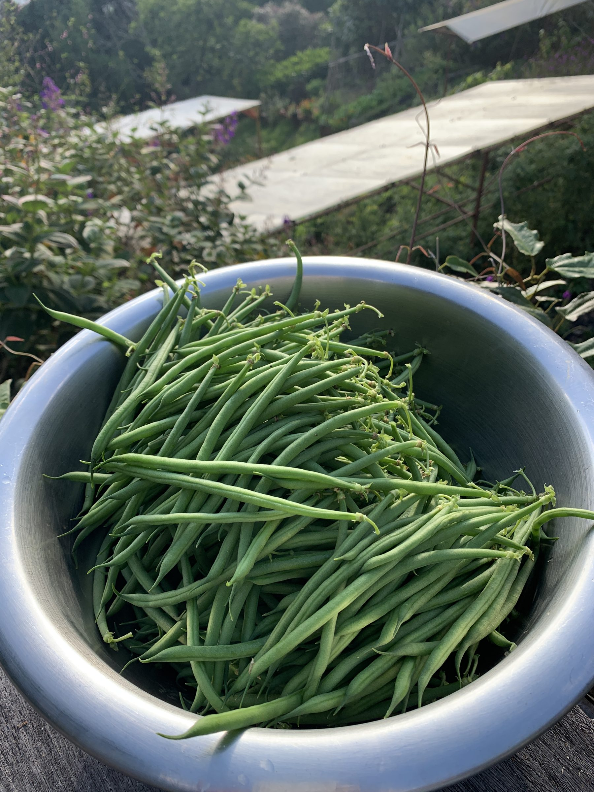

import MedicalDisclaimer from '../../../components/MedicalDisclaimer.astro';

## Propiedades nutricionales y beneficios

La habichuela (*Phaseolus vulgaris*) es la vaina inmadura del frijol común, cosechada antes de que se desarrollen las semillas. Baja en calorías, aporta una buena dosis de **fibra**, **vitamina K**, **vitamina C** y folatos, además de manganeso y un poco de hierro vegetal. Su color verde vivo se debe a su riqueza en clorofila, y contiene también carotenoides como la luteína. Un punto de seguridad importante, a menudo ignorado: como todas las leguminosas del género *Phaseolus*, el frijol crudo contiene **fitohemaglutinina**, una lectina que en cantidad puede provocar trastornos digestivos serios; una cocción suficiente la destruye. Por eso las habichuelas nunca se comen crudas — unos minutos en agua hirviendo bastan para volverlas perfectamente sanas. Originario de Centroamérica y de los Andes, donde fue domesticado hace varios miles de años, el frijol formaba parte, junto con el maíz y el zapallo, del trío fundador de la agricultura mesoamericana.

<MedicalDisclaimer locale="es" />

## Cómo comerla

La habichuela se prepara casi siempre de la misma manera al principio: **despuntada**, luego cocida unos minutos en una olla grande de agua hirviendo con sal, y sumergida enseguida en agua helada para fijar su color y detener la cocción. Así queda crujiente y de un verde brillante. Después se sirve sencillamente con mantequilla y ajo, con ajo y perejil, o en ensalada tibia con chalotas, una vinagreta de mostaza y unas almendras tostadas. Entra en la famosa ensalada nizarda junto a los tomates, los huevos y las aceitunas, se saltea en wok con jengibre y salsa de soya, o se guisa lentamente con tomate en las cocinas mediterráneas. Para conservarla, se blanquea y se congela muy bien, y también se guarda en frascos esterilizados o lactofermentada con ajo y eneldo, a la manera de los pepinillos.

## Cómo cultivarla de forma orgánica

El frijol es una de las hortalizas más fáciles y gratificantes del huerto orgánico — siempre que se respete su necesidad de calor al arrancar.

- **Siembra directa en el lugar, en un suelo ya templado.** Las semillas se pudren en una tierra fría y encharcada; se espera un suelo de al menos 12 a 15 °C, y se siembra a 2–3 cm de profundidad, en golpes o en líneas.
- **De mata baja o de enrame, dos formas de cultivar.** Las variedades enanas forman matas bajas que producen en una oleada concentrada; las de enrame trepan por un tutor hasta dos metros y producen durante más tiempo, en menos superficie de suelo.
- **Fija su propio nitrógeno.** Gracias a las bacterias *Rhizobium* que viven en simbiosis en los nódulos de sus raíces, el frijol toma el nitrógeno del aire; no necesita, pues, abono nitrogenado — un exceso incluso lo empuja a hacer hojas en detrimento de las vainas.
- **Un riego regular al pie durante la floración.** Es el momento más sensible: la falta de agua hace caer las flores. Se riega al suelo, nunca sobre el follaje, para limitar las enfermedades.
- **Una cosecha frecuente.** Cuanto más se cosechan las vainas jóvenes, finas y sin hebra, más sigue produciendo la planta; si se dejan demasiado tiempo, se vuelven fibrosas y la planta se frena.
- **La roya, la antracnosis y los pulgones negros** son los principales problemas en clima húmedo; una buena rotación, plantas espaciadas y el arranque de las enfermas limitan su propagación.

## La habichuela en nuestro huerto

El frijol está aquí en su casa en el sentido histórico: fue domesticado en Mesoamérica y en los Andes, y se cultiva desde hace milenios en las tierras altas de Centroamérica. En el frescor de Horqueta crece un poco más despacio que en tierras bajas, pero sin los golpes de calor que hacen abortar las flores. El principal reto es la humedad del bosque nuboso, que favorece la roya y la antracnosis: le reservamos los bancales mejor aireados, espaciamos bien las plantas, sean enanas o de enrame, para que el aire circule entre el follaje, y evitamos manipular las plantas cuando están mojadas. En permacultura es también un aliado valioso: después de la cosecha, cortamos las plantas a ras del suelo dejando las raíces en la tierra, para que sus nódulos ricos en nitrógeno alimenten al cultivo siguiente.

## Buenas compañeras

- **El maíz y el zapallo — las «tres hermanas».** La asociación amerindia por excelencia: el maíz sirve de tutor al frijol trepador, el frijol enriquece el suelo con nitrógeno, y el zapallo cubre el suelo con sus anchas hojas.
- **Las coles y demás brasicáceas.** Grandes consumidoras de nitrógeno, aprovechan directamente el que fija el frijol, en cultivo asociado o en rotación.
- **La zanahoria y la remolacha (con variedades enanas).** Sistemas de raíces complementarios y buena vecindad en general.
- **La ajedrea.** La asociación tradicional europea: se planta al pie de las habichuelas, a las que protege de los pulgones negros — y se la reencuentra en la olla, donde facilita su digestión.
- **La caléndula y la capuchina**, para atraer a los insectos auxiliares y desviar a los pulgones.

## Plantas que conviene evitar

- **El ajo, la cebolla, el puerro y el cebollino.** Se dice que las aliáceas frenan la actividad de las bacterias fijadoras de nitrógeno en los nódulos del frijol — una incompatibilidad ampliamente observada por los hortelanos.
- **El hinojo**, cuyo efecto alelopático frena el crecimiento del frijol.
- **Las arvejas en su cercanía inmediata**, que comparten ciertas enfermedades con el frijol; mejor alternarlas en rotación que ponerlas juntas.

## Datos curiosos

- **El origen de la palabra francesa *haricot* sigue en debate.** Una hipótesis popular la hace venir de *ayacotl*, el nombre azteca del frijol; otra, más antigua, la relaciona con el francés antiguo *harigot*, un guiso de cordero en el que se cocían habas.
- **La habichuela «sin hebra» es un invento reciente.** Las variedades antiguas tenían una hebra dura a lo largo de la vaina, que había que quitar; la selección del siglo XIX dio las variedades sin hebra que conocemos hoy.
- **La habichuela, el frijol rojo y el frijol negro son la misma especie.** Todo depende del momento de la cosecha y de la variedad: joven, se come la vaina; maduro y seco, se come el grano.
- **Enriquece el suelo para el cultivo siguiente.** Un bancal de frijoles bien llevado deja en la tierra una reserva de nitrógeno que aprovecha el cultivo que le sigue — un abono verde que se come.
