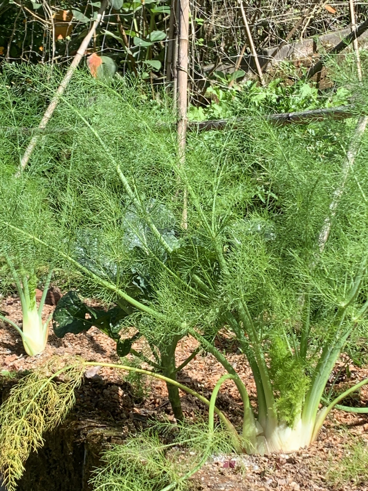

import MedicalDisclaimer from '../../../components/MedicalDisclaimer.astro';

## Propiedades nutricionales y beneficios

El hinojo de bulbo (*Foeniculum vulgare* var. *azoricum*), también llamado hinojo de Florencia, es una hortaliza ligera, compuesta en más de un 90 % de agua, pero que aporta una cantidad apreciable de **fibra**, **potasio** y **vitamina C**, además de pequeñas cantidades de folatos y manganeso. Su aroma anisado tan característico viene del **anetol**, el principal compuesto aromático de su aceite esencial — el mismo que se encuentra en el anís verde y en el anís estrellado. Desde la Antigüedad, la tradición popular le atribuye virtudes digestivas: las semillas de hinojo, masticadas después de comer, siguen formando parte de las costumbres de muchas cocinas, de la India (el *mukhwas*) a la cuenca mediterránea, y la infusión de semillas sigue siendo un remedio casero clásico contra la hinchazón — un uso tradicional bien arraigado, aunque las pruebas clínicas siguen siendo limitadas. Su nombre viene del latín *feniculum*, «pequeño heno», en referencia a su follaje fino y plumoso. Una precisión útil: como el anetol tiene una débil actividad de tipo estrogénico, las preparaciones concentradas (aceites esenciales, infusiones en gran cantidad) se desaconsejan tradicionalmente a las mujeres embarazadas y a los niños pequeños — una prudencia que no concierne al consumo normal de la hortaliza.

<MedicalDisclaimer locale="es" />

## Cómo comerlo

El hinojo cambia por completo de carácter según esté crudo o cocido. **Crudo**, cortado muy fino con mandolina, aporta una textura crujiente y fresca y una nota anisada viva a las ensaladas — la combinación con naranja, aceituna negra y un chorrito de aceite de oliva es un gran clásico siciliano. **Cocido**, braseado suavemente con mantequilla o asado al horno, pierde su textura crujiente y buena parte de su anís para volverse tierno, ligeramente dulce, casi caramelizado en los bordes. Acompaña de maravilla a los pescados — es uno de los aromáticos tradicionales de la bullabesa — y combina con el limón, el parmesano y los cítricos en general. Nada se pierde: los tallos, más fibrosos, perfuman los caldos, y las hojas verdes se usan como una hierba fresca, a la manera del eneldo. Las semillas, por último, realzan panes, salchichas italianas y currys.

## Cómo cultivarlo de forma orgánica

El hinojo de bulbo no es difícil de cultivar, pero es exigente en un punto preciso: lograr un buen bulbo en lugar de una planta que se sube directamente a flor.

- **Siembra directa de preferencia.** El hinojo tiene una raíz pivotante que soporta mal el trasplante; una siembra en el lugar, o en macetas profundas trasplantadas muy jóvenes, limita el estrés que desencadena la subida a flor.
- **El espigado, enemigo número uno.** Bajo el efecto de un estrés — sequía, calor, trasplante tardío o días que se alargan — el hinojo se salta la etapa del bulbo y sube directamente a flor. Un crecimiento regular, sin sobresaltos, es la clave de un bulbo rollizo.
- **Un suelo rico y fresco, y un riego constante.** Es una planta que pide mucha agua durante la formación del bulbo; un acolchado ayuda a mantener una humedad estable.
- **El aporcado del bulbo.** Arrimar un poco de tierra alrededor de la base cuando el bulbo empieza a engordar lo mantiene blanco y tierno, un poco como con el puerro.
- **Cosecha en el momento justo.** El bulbo se corta a ras del suelo cuando alcanza entre el tamaño de una pelota de tenis y el de un puño; si se espera demasiado, se vuelve fibroso. Dejada en la tierra, la cepa suele rebrotar pequeños bulbos secundarios.
- **Pocas plagas serias** — sobre todo pulgones y babosas en las plantas jóvenes. Sus umbelas en flor, en cambio, atraen a una multitud de insectos auxiliares, con los sírfidos y las pequeñas avispas parasitoides a la cabeza.

## El hinojo en nuestro huerto

El clima del bosque nuboso de Horqueta ofrece al hinojo una ventaja a menudo subestimada: la estabilidad. En las latitudes templadas, el hinojo se espiga en cuanto los días se alargan en verano; aquí, cerca del ecuador, la duración del día varía muy poco a lo largo del año, y la altitud mantiene temperaturas moderadas casi de forma permanente — dos condiciones que limitan claramente el espigado prematuro. Los suelos volcánicos ricos en materia orgánica convienen a su apetito de planta exigente, siempre que se vigile el riego en la estación seca, porque es justamente un período de sequía lo que lo empuja a florecer. Queda su particularidad de mal vecino: en el huerto le reservamos un rincón aparte, al borde de un bancal, donde sus flores harán la felicidad de los insectos útiles sin molestar a los demás cultivos.

## Buenas compañeras

El hinojo es una de las pocas plantas del huerto que prefiere francamente la soledad. Sus verdaderas «amigas» son, pues, sobre todo vecinas a buena distancia:

- **Las flores melíferas en el borde (caléndula, borraja).** Comparten con el hinojo en flor el papel de atraer polinizadores e insectos auxiliares, sin sufrir por su cercanía.
- **El propio hinojo, lejos de los demás cultivos.** Plantado en una franja dedicada, se convierte en un verdadero «reservorio» de insectos auxiliares para todo el huerto cuando se dejan florecer algunas plantas.
- **Las lechugas, a buena distancia.** Algunos hortelanos refieren una convivencia aceptable con las ensaladas de ciclo corto, aunque el efecto alelopático del hinojo invita a la prudencia.

## Plantas que conviene evitar

- **Casi todo el huerto en su cercanía inmediata.** El hinojo libera por sus raíces compuestos alelopáticos que frenan el crecimiento de muchas plantas vecinas — tomates, frijoles, coles, albahaca y zanahorias a la cabeza.
- **El eneldo y el cilantro.** De la misma familia de las apiáceas, el eneldo puede cruzarse con el hinojo si florecen juntos, dando semillas de sabor incierto; mejor alejarlos.
- **La zanahoria y el apio**, primos de la misma familia, con los que comparte plagas y enfermedades.

## Datos curiosos

- **El hinojo de bulbo y el hinojo silvestre son la misma especie.** El hinojo común, que crece espontáneamente al borde de los caminos mediterráneos, no forma bulbo; es una selección italiana, la variedad *azoricum*, la que dio la hortaliza que conocemos.
- **El maratón le debe su nombre.** La batalla de Maratón (490 a. C.) se habría librado en un campo de hinojo — *marathon* significa precisamente «hinojo» en griego antiguo.
- **Prometeo habría robado el fuego en un tallo de hinojo gigante.** Según la mitología griega, la brasa divina fue transportada escondida en el tallo hueco de una planta emparentada, la cañaheja.
- **Sus semillas son frutos.** Lo que llamamos «semillas» de hinojo son botánicamente aquenios dobles, frutos secos — lo que explica su aroma tan concentrado.
