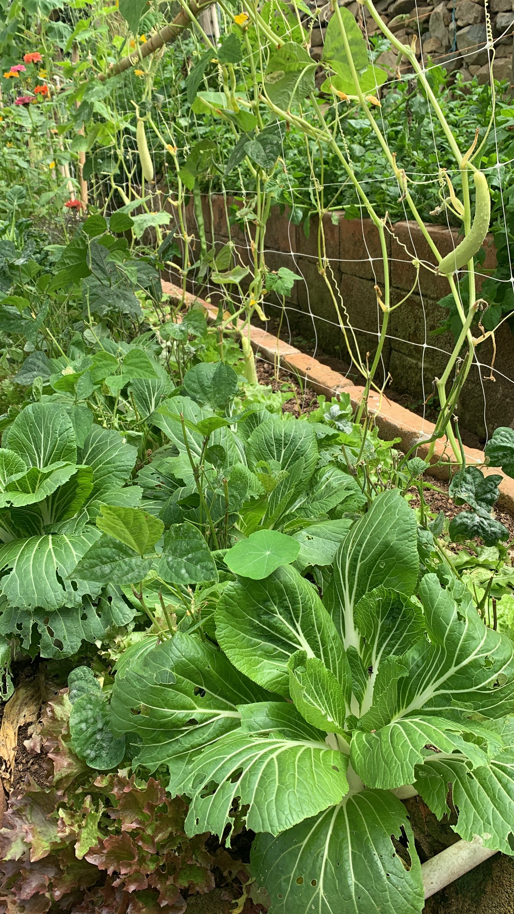

import MedicalDisclaimer from '../../../components/MedicalDisclaimer.astro';

## Propiedades nutricionales y beneficios

El pak choi, o bok choy (*Brassica rapa* subsp. *chinensis*, antiguamente clasificado por Linneo como *Brassica chinensis*), es una verdura de hoja muy hidratante — más de un 94 % de agua — y especialmente baja en calorías, sin dejar de ser una buena fuente de **vitamina C** y una fuente aceptable de folatos. Como las demás brasicáceas, contiene glucosinolatos, compuestos azufrados cuya degradación al masticar libera sustancias con propiedades antioxidantes estudiadas por la investigación nutricional. Su nombre cantonés, *bok choy* (白菜), significa literalmente «verdura blanca», en referencia a sus pecíolos pálidos y carnosos — un nombre que el inglés británico adaptó como *pak choi*, hoy la grafía más común fuera de Estados Unidos. Se cultiva en China desde al menos el siglo V de nuestra era, y hay restos arqueológicos de semillas de coles emparentadas de varios miles de años en el valle del río Amarillo, lo que lo convierte en una de las verduras de hoja domesticadas más antiguas de Asia. Hoy existen varios tipos, entre ellos el pak choi de Shanghái, de pecíolos verde claro en lugar de blancos, una variante más reciente pero igual de extendida en la cocina.

<MedicalDisclaimer locale="es" />

## Cómo comerlo

El pak choi es sin duda una de las verduras más rápidas de cocinar: unos minutos en el wok a fuego vivo, con ajo y un chorrito de salsa de soya, bastan para ablandar sus hojas manteniendo crujientes sus pencas — la preparación más clásica y la más eficaz para conservar su textura. Los pak choi jóvenes enteros, a menudo llamados «baby bok choy», quedan igual de bien braseados o al vapor, servidos enteros como guarnición. Se integra de forma natural en las sopas y los hot pots asiáticos, donde sus pecíolos carnosos soportan bien una cocción larga sin deshacerse del todo. Crudo y muy finamente cortado, aporta un toque crujiente a una ensalada, aunque es un uso menos frecuente que su cocción rápida. Por último, sus hojas centrales más tiernas se añaden perfectamente a un caldo de fideos al final de la cocción, solo el tiempo justo para que se ablanden.

## Cómo cultivarlo de forma orgánica

El pak choi es una de las brasicáceas más rápidas y sencillas de lograr, un cultivo ideal para llenar los huecos entre dos cosechas más largas.

- **Siembra directa o trasplante joven.** Las semillas germinan rápido, y las plántulas se trasplantan bien siempre que se manipulen pronto, antes de que el sistema radicular se desarrolle demasiado.
- **Un ciclo muy corto, de 30 a 60 días según el tamaño buscado.** Se puede cosechar como «baby» al cabo de un mes aproximadamente, o esperar una roseta más desarrollada para una cosecha más generosa — ambas son simplemente etapas distintas de la misma planta.
- **Sensible a la subida a flor con calor y días largos.** Como los demás miembros de la especie *Brassica rapa*, el pak choi se espiga fácilmente con el calor, lo que lo convierte en un cultivo mucho más fiable en clima fresco.
- **Un riego regular y un suelo rico en materia orgánica.** Su rápido crecimiento y sus hojas tiernas requieren una humedad constante; el estrés hídrico se traduce pronto en pencas fibrosas y un sabor más amargo.
- **Una cosecha escalonada fácil de organizar.** Gracias a su ciclo corto, se puede sembrar una hilera corta cada dos semanas para tener una cosecha continua, en lugar de una sola gran oleada.
- **Las pulguillas y las orugas como principales plagas.** Una malla antiinsectos colocada desde la siembra protege eficazmente a las plántulas, especialmente vulnerables a las pulguillas, que acribillan las hojas jóvenes de pequeños agujeros.

## El pak choi en nuestro huerto

El pak choi es probablemente una de las brasicáceas que más claramente aprovechan el clima fresco y estable del bosque nuboso de Horqueta, tan marcada es su tendencia a espigarse con el calor de las tierras bajas tropicales. La altitud de la región de Boquete le ofrece temperaturas moderadas casi todo el año, lo que permite siembras repetidas sin las pausas forzadas que impondría un verano caluroso en otros lugares, y los suelos volcánicos ricos en materia orgánica sostienen su crecimiento rápido y exigente en agua. En estas condiciones, es una verdura especialmente adaptada a un cultivo continuo, casi todo el año.

## Buenas compañeras

- **La capuchina.** Planta trampa eficaz para las brasicáceas, atrae pulgones y orugas lejos del pak choi.
- **El eneldo y el cilantro.** Su aroma atrae insectos auxiliares depredadores, útiles para regular las poblaciones de plagas sin intervención química.
- **La cebolla y el cebollino.** Su olor intenso ayudaría a ocultar el del pak choi a las plagas voladoras que lo localizan por el olfato.
- **La lechuga y la espinaca.** Todos estos cultivos de ciclo corto y necesidades de agua similares se complementan bien en un mismo bancal, sin competencia marcada.
- **El apio.** Buen vecino tradicional en el huerto orgánico, sin competencia notable por los recursos.

## Plantas que conviene evitar

- **El tomate y las demás solanáceas**, una asociación tradicionalmente desaconsejada para las brasicáceas, aunque la prueba de una incompatibilidad química directa sigue siendo limitada y procede sobre todo de la experiencia de los horticultores.
- **Las fresas**, por razones similares — una prudencia más tradicional que científicamente demostrada.
- **Un exceso de otras brasicáceas en el mismo bancal de una temporada a otra**, que favorece la acumulación de las mismas plagas y enfermedades del suelo — una buena rotación sigue siendo la mejor prevención orgánica.

## Datos curiosos

- **«Bok choy» significa literalmente «verdura blanca» en cantonés**, por sus pecíolos pálidos — la variante verde, llamada de Shanghái, suele tener además un nombre distinto en chino para diferenciarla.
- **Pertenece a la misma especie que la col china y el nabo.** *Brassica rapa* destaca por la diversidad de formas que ha dado bajo la selección humana — hoja, raíz, tallo o cabeza, según la parte de la planta favorecida a lo largo de las generaciones.
- **Tardó más de un siglo en extenderse por Occidente.** Introducido en Europa a mediados del siglo XVIII por botánicos suecos y misioneros jesuitas, no se volvió realmente común en Norteamérica hasta el siglo XX, mucho después de su llegada inicial en el XIX.
- **El «baby bok choy» no es una variedad miniatura propiamente dicha.** En la mayoría de los casos se trata simplemente del mismo pak choi cosechado en una etapa más joven — una diferencia de calendario de cosecha más que de genética.
