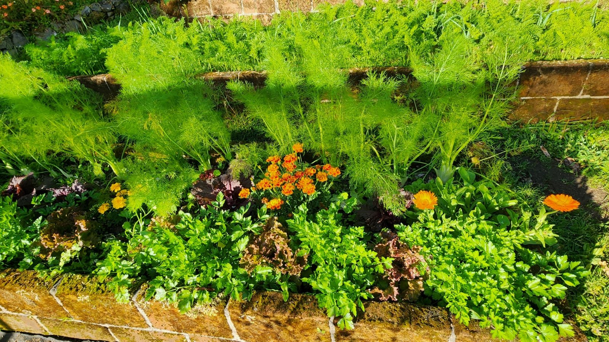
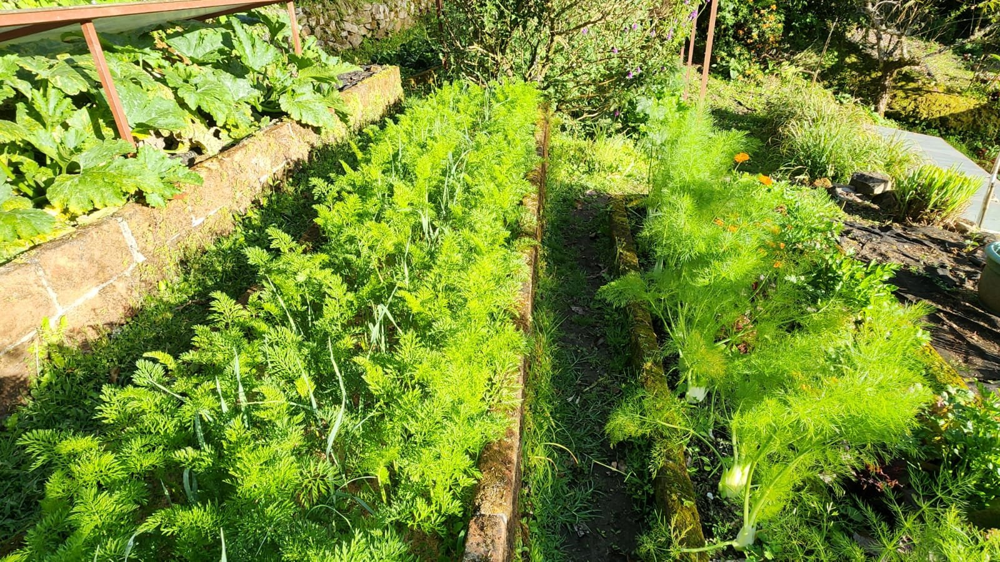
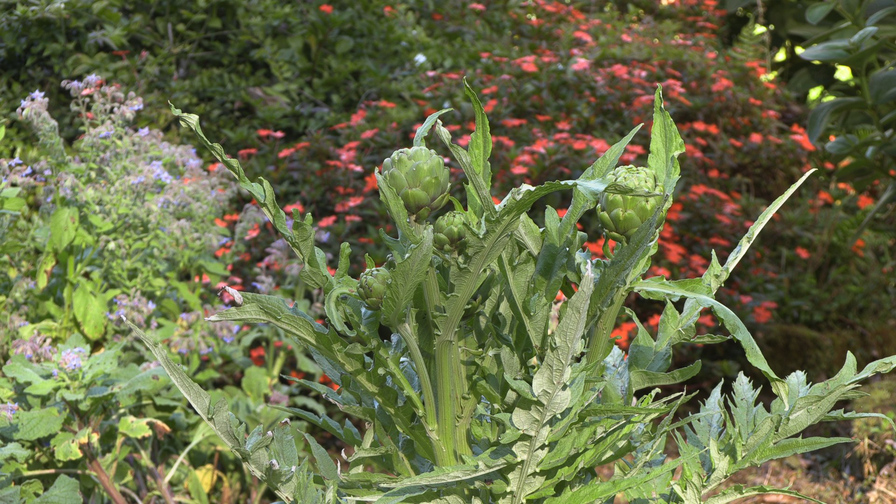
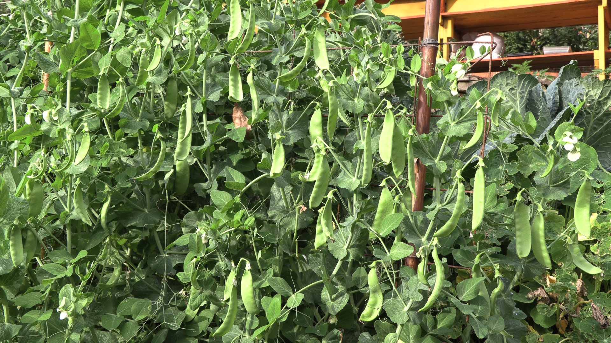

import NoteBox from '../../../components/NoteBox.astro';

## ¿Qué Es, Exactamente, la Permacultura?

La palabra nació en Tasmania, a mediados de los años setenta, del encuentro entre un naturalista y profesor, **Bill Mollison**, y uno de sus estudiantes, **David Holmgren**. Juntos publican *Permaculture One* en 1978. El término contrae «*permanent agriculture*» — una agricultura capaz de perdurar — y pronto se amplía a «*permanent culture*»: una forma de diseñar no solo una huerta, sino todo un lugar para vivir.

Porque de eso se trata: de **diseño**. La permacultura no es una técnica de jardinería más, ni un sello de certificación. Es un método de diseño que se inspira en el funcionamiento de los ecosistemas naturales — un bosque, una pradera, el borde de un bosque — para organizar un espacio productivo donde cada elemento cumple varias funciones y cada necesidad queda cubierta por varios elementos. Mollison la desarrolla en 1988 en su voluminoso *Designers' Manual*; Holmgren la condensa en 2002 en *Principles and Pathways Beyond Sustainability*, en torno a doce principios que se han vuelto referencia para todos los que la practican.

### Tres éticas, para empezar

Antes de las técnicas, hay una brújula. Toda la permacultura descansa sobre tres éticas, sencillas de enunciar y exigentes de cumplir:

- **Cuidar la Tierra** — los suelos, el agua, los bosques y todo lo que vive.
- **Cuidar a las personas** — a uno mismo, a los suyos, a la comunidad.
- **Compartir con equidad** — limitar el consumo y redistribuir los excedentes.

### Los doce principios de David Holmgren

Más que reglas, son preguntas que uno se hace frente a un terreno. Aquí, en traducción libre:

1. Observar e interactuar
2. Captar y almacenar energía
3. Obtener un rendimiento
4. Aplicar la autorregulación y aceptar la retroalimentación
5. Usar y valorar los recursos y servicios renovables
6. No producir desperdicios
7. Diseñar desde los patrones hacia los detalles
8. Integrar en lugar de segregar
9. Usar soluciones pequeñas y lentas
10. Usar y valorar la diversidad
11. Usar los bordes y valorar lo marginal
12. Usar y responder creativamente al cambio

### En la huerta, en la práctica

En el terreno, estos principios se traducen en gestos que muchos agricultores ya practican sin ponerles nombre:

- **El suelo siempre cubierto** — mulch, abonos verdes, siembras densas — para alimentar la vida del suelo y protegerlo tanto de la lluvia como del sol.
- **Las asociaciones de cultivos**: se mezclan familias, se alternan raíces y hojas, se intercalan flores entre las hortalizas para atraer insectos benéficos.
- **El compost y los abonos caseros**: los desechos de una parte del sistema se convierten en alimento de otra.
- **El manejo del agua**: terrazas, zanjas de infiltración, estanques — frenar el agua, infiltrarla, conservarla.
- **La zonificación**: lo que requiere más atención cerca de la casa, lo que se cuida solo más lejos.
- **Los animales integrados**: gallinas y ovejas deshierban, abonan, reciclan — y producen.
- **El bosque comestible**: estratos de árboles, arbustos, plantas bajas y enredaderas, como en un bosque natural.

*Foto Wild on the Farm, huerta.*

### Una filosofía antes que un método

En el fondo, la permacultura propone un cambio de actitud. En lugar de preguntarse «¿cómo obligo a esta tierra a producir?», pregunta «¿qué sabe hacer ya este lugar, y cómo puedo ayudarlo?». Prefiere la observación paciente a la intervención constante, la diversidad al monocultivo, la resiliencia al máximo rendimiento de un solo año. Mollison lo resumía diciendo que vale más trabajar *con* la naturaleza que en su contra. Nada revolucionario, en realidad — y eso es justamente lo que nos lleva a París.

## París, 1844: Cuando la Capital Cultivaba sus Propias Verduras

En francés, al horticultor se le llama *maraîcher*, palabra que viene de *marais*, «pantano»: esas tierras bajas y húmedas — el barrio parisino del Marais conserva el nombre — donde se cultivaban las verduras a las puertas de la ciudad. A mediados del siglo XIX, mucho antes de los tractores y los fertilizantes sintéticos, un cinturón de huertos abastecía a buena parte de París de verduras frescas, todo el año.

Lo sabemos con precisión gracias a dos horticultores, **J.-G. Moreau y J.-J. Daverne**, que en 1845 publican el *Manuel pratique de la culture maraîchère de Paris* (manual práctico de horticultura de París), premiado en 1844 en un concurso de la sociedad de agricultura. Describen allí su oficio «tal como se ejercía en París en 1844», conscientes de que el ferrocarril y la industria pronto lo cambiarían todo. Sus cifras impresionan: **1.378 hectáreas** de huertos alrededor de París, repartidas en **1.800 huertos** de unos 7.600 m² en promedio, y **9.000 personas** trabajando — unas cinco por huerto.

¿Su secreto? Un sistema de una coherencia admirable. París vivía entonces al ritmo de decenas de miles de caballos, y su **estiércol** era el oro de los horticultores. Colocado en **camas calientes**, fermentaba y desprendía un calor suave que permitía sembrar en pleno invierno. Encima, un poco de tierra de compost, y luego **marcos acristalados** y **campanas de vidrio**: entre todos, los horticultores tenían unos 360.000 marcos y más de dos millones de campanas. Una vez agotado, ese estiércol se convertía en un compost de una riqueza excepcional que volvía al suelo. Y las carretas que bajaban las verduras al mercado de Les Halles regresaban cargadas de estiércol y de desechos de la ciudad.

En esos canteros profundos y fértiles, los cultivos se sembraban apretados y **asociados**: se sembraban juntas hortalizas que no crecen a la misma velocidad, para cosechar una mientras la otra ocupa su lugar. Según los relatos de la época, una misma parcela podía dar así de seis a ocho cosechas al año.

<NoteBox>
  

    <strong>¿Permacultores antes de tiempo?</strong> No del todo — y sería deshonesto afirmarlo. Los
    horticultores parisinos eran comerciantes, enfocados en el mercado y en las primicias, que
    trabajaban sin descanso y usaban mucho vidrio y mucha mano de obra. Pero aplicaban, sin la
    palabra, varios principios que Holmgren formularía siglo y medio después: <em>no producir
    desperdicios</em> (el estiércol de la ciudad convertido en calor y luego en compost),
    <em>captar y almacenar energía</em> (la fermentación bajo los marcos), <em>usar soluciones
    pequeñas e intensivas</em>, <em>integrar en lugar de segregar</em> la ciudad y sus huertos.
  

</NoteBox>

Luego todo se deshizo. El crecimiento de la ciudad empujó los huertos cada vez más lejos, el tren trajo verduras de regiones lejanas, el automóvil reemplazó al caballo — y con él al estiércol —, y los fertilizantes químicos hicieron que el viejo saber pareciera inútil para la agricultura moderna. La rue des Maraîchers, en el distrito 20 de París, todavía guarda su recuerdo.

Pero las ideas viajaron. En 1909, el inglés John Weathers publica *French Market-Gardening* para dar a conocer estos métodos en Inglaterra. Más cerca de nosotros, el estadounidense **Eliot Coleman** se inspira ampliamente en ellos para sus cultivos de invierno en Maine, y el quebequense **Jean-Martin Fortier** construye sobre ellos parte de su método bio-intensivo de «horticultor». El manual de Moreau y Daverne fue reeditado en francés en 2016. El viejo saber parisino volvió por la puerta grande.

*Foto Wild on the Farm, huerta.*

## Recorrido por Panamá: la Permacultura en el Trópico

En el trópico, la permacultura encuentra un terreno a la vez ideal y exigente. Ideal porque todo crece, todo el año; exigente porque los aguaceros lavan el suelo desnudo, el sol lo quema y el monocultivo atrae rápido a las plagas. El monte, en cambio, encontró la solución hace mucho: cubrir el suelo, escalonar la vegetación, reciclar sin parar la materia orgánica. No es de extrañar que quienes practican la permacultura en Panamá se inspiren en él.

De hecho, mucho antes de que existiera la palabra, las comunidades indígenas del istmo ya cultivaban huertos mixtos donde árboles frutales, tubérculos, plantas medicinales y cacao conviven bajo la sombra de los árboles grandes — una agroforestería que la permacultura moderna no ha hecho más que redescubrir.

### Bocas del Toro, del lado del Caribe

Es probablemente en el archipiélago de Bocas del Toro donde se concentran más proyectos de permacultura del país. En Isla Bastimentos, arriba del pueblo de Old Bank, **Up in the Hill** cultiva desde 2003 cacao, café, frutas, cocos y plantas aromáticas en permacultura; sus recorridos guiados, bajo el nombre de Pure Tree Experience, siguen el cacao desde el árbol hasta la barra de chocolate. En Isla Colón, a pocos kilómetros de Bocas pueblo, **Finca Flora** desarrolla en una hectárea frente al mar un proyecto de permacultura enfocado en frutas tropicales, hortalizas, gallinas ponedoras y la acogida de voluntarios.

### De potrero a bosque comestible

En otras partes del país, cada vez más fincas familiares enfrentan un reto muy panameño: devolverles la vida a los antiguos potreros, a menudo agotados y compactados. Es el caso de **Finca 588**, una finca familiar regenerativa que convierte antiguos potreros en bosque comestible, con apicultura, quesos, fermentados y talleres prácticos abiertos al público varias veces al año.

### Chiriquí y las tierras altas de Boquete

En la vertiente del Pacífico, las tierras altas de Chiriquí ofrecen un clima totalmente distinto: la altura, el fresco, el bajareque del bosque nuboso y un suelo volcánico de gran fertilidad. En Boquete, la asociación **La Vida Orgánica** promueve la permacultura, la hidroponía y la acuaponía, y varias fincas pequeñas cultivan sin químicos para el mercado de los martes. Es aquí, a 1.800 metros, donde empieza nuestra propia historia.

*Foto Wild on the Farm, huerta.*

## Wild on the Farm: de la Finca de la Amistad Verde a Hoy

Wild on the Farm se llamó primero **Finca de la Amistad Verde**. Fundada en 2008 en las alturas de Boquete, al borde del Parque Internacional La Amistad, se convierte en 2010 en la primera finca de hortalizas certificada orgánica por Bio Latina en Panamá. Abastecía entonces a El Mercadito Biológico, en la ciudad de Panamá, y, junto con amigos agricultores del valle, introdujo al país variedades de hortalizas que aquí todavía no se conocían.

Dieciocho años después, la finca cambió de nombre, se orientó hacia la macadamia y recibe visitantes en tres cabañas con techos verdes. Pero la lógica sigue siendo la misma: producir **alimentos sanos**, sin insumos químicos, apoyándose en lo que el lugar ya ofrece. Si se mira la finca con los principios de Holmgren, se encuentran casi todos:

- **Captar y almacenar energía**: la electricidad viene del sol, y el agua de un manantial dentro del parque nacional.
- **No producir desperdicios**: el estiércol de las ovejas y gallinas, los restos de la huerta y de la cocina van al compost, que vuelve a alimentar los canteros.
- **Usar recursos renovables**: nada de fertilizantes industriales, sino abonos caseros hechos con la fermentación de ortiga, consuelda y botón de oro (tithonia), cultivadas en la finca para ese fin.
- **Integrar en lugar de segregar**: las ovejas mantienen el terreno, las gallinas dan huevos y trabajan el compost, las flores protegen las hortalizas.
- **Diseñar desde los patrones**: en una pendiente fuerte, las terrazas bordeadas de bloques retienen el suelo y el agua, y organizan la huerta en rotación.
- **Valorar la diversidad**: hortalizas, aromáticas, plantas medicinales, flores y macadamias, rodeadas de un bosque nuboso intacto.
- **Valorar los bordes**: el límite entre la huerta y el bosque, hogar de aves, insectos benéficos — y, con un poco de suerte, del quetzal.

*Foto Wild on the Farm, huerta.*

Lo que servimos en la mesa sale primero de estas terrazas: hortalizas cosechadas esa misma mañana, de temporada, cultivadas en una tierra volcánica que alimentamos en vez de explotarla. Nada espectacular, en el fondo — la misma idea que en París en 1844, la misma que en Bocas del Toro hoy: un lugar vivo, bien observado, que da con generosidad cuando se le respeta.

Los huéspedes de Wild on the Farm pueden pasear por la huerta, conocer las terrazas, el compost y los fermentos de plantas, y probar cada día lo que sale de ellos. La mejor forma de entender la permacultura sigue siendo verla crecer.

[Conoce nuestra huerta →](/es/jardin/)
[Reserva tu estancia →](/es/reservar/)

<NoteBox>
  

    Fuentes principales: David Holmgren, <em>Permaculture: Principles and Pathways Beyond
    Sustainability</em> (2002); J.-G. Moreau y J.-J. Daverne, <em>Manuel pratique de la culture
    maraîchère de Paris</em> (1845; reedición Éditions du Linteau, 2016); Revue Sesame (INRAE),
    «Moreau &amp; Daverne, influenceurs oubliés»; Vergers Urbains; New Society Publishers; sitios
    oficiales de Pure Tree Experience / Up in the Hill, Finca Flora y Finca 588.
  

</NoteBox>
