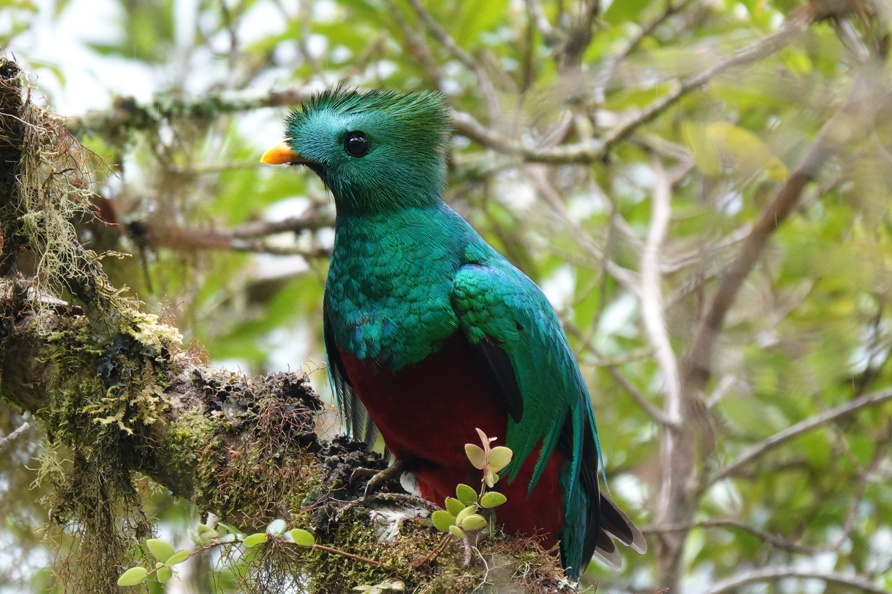
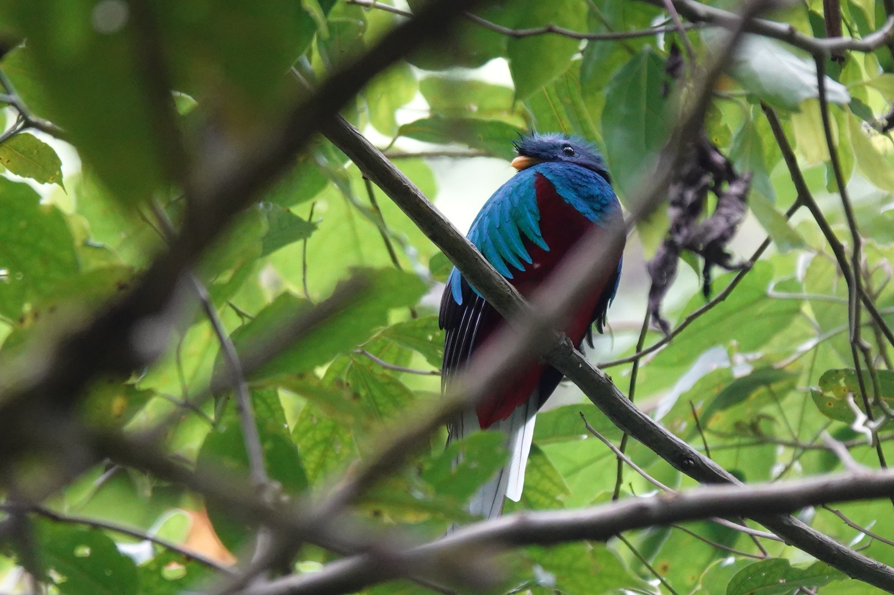

_Un ave magnífica, un símbolo de libertad para los mayas y un ícono de nuestros bosques de montaña._

## Un Símbolo Sagrado

El **Quetzal Resplandeciente** ha sido venerado durante mucho tiempo. Para los antiguos mayas, simbolizaba la **libertad**, ya que se dice que muere si se le confina en cautiverio. También era un **símbolo de riqueza y poder** — sus vibrantes plumas se usaban como moneda y ornamento real.

Mi fascinación por esta ave comenzó a principios de los años 80, cuando viví con el pueblo **Kaqchikel** en las orillas del Lago Atitlán en Guatemala. Hoy, forma parte de mi vida diaria en la **cordillera de Talamanca**, donde he vivido durante los últimos 18 años en su amado hábitat del bosque nuboso.

## Encuentros Diarios

Desde mi terraza, a menudo observo el **vuelo caótico y revoloteante** del quetzal en las primeras horas de la mañana y al atardecer mientras busca las semillas del **árbol de Cigua Blanca** que tanto le gustan.

A veces se posa en el árbol de cedro que da a mi hogar, llamando con su **distintivo grito de reunión** o emitiendo el breve cacareo que señala que está a punto de emprender el vuelo.

Su canto resuena a través del bosque del **Parque Nacional La Amistad** que rodea la finca — una banda sonora para la magia del bosque nuboso.

## Temporada de Reproducción

En **febrero**, los quetzales llegan para reunirse con sus parejas o formar nuevas. Subimos a las crestas para observarlos. No son tímidos — de hecho, son curiosos, a menudo se reúnen en grupos antes de buscar un **hueco en un árbol podrido** para preparar como nido.

- La hembra pone **dos huevos**
- Ambos padres comparten las tareas de incubación:
  - El macho durante el día
  - La hembra por la noche
- La incubación dura **17–19 días**
- Defienden su territorio con un distintivo **llamado de dos partes**

Los padres trabajan en equipo para proteger a los polluelos de depredadores como **serpientes, tucanes y rapaces**. Incluso he visto cómo ayudan a un polluelo caído a regresar al nido.

Su dieta aquí en **Wild on the Farm** incluye:

- Semillas de especies Lauraceae como la Cigua Blanca
- Semillas de Bambito
- Aguacate silvestre
- Ocasionalmente, insectos

## Primeros Vuelos y Migración

A los **cinco meses de edad**, los jóvenes quetzales aprenden a volar y encontrar alimento. Esta etapa es ruidosa y activa, ya que las familias forman **grupos grandes y vocales**. Es uno de mis momentos favoritos para observarlos.

Cuando el suministro de alimento en las tierras altas se agota, migran juntos a **elevaciones más bajas** en busca de nuevos recursos.

Aquí en nuestras montañas, tenemos el privilegio de recibirlos durante **seis a siete meses** cada año. Luego llega la temporada tranquila — esperando su regreso, sus vibrantes colores y sus encantadores cantos para llenar el bosque una vez más.

## Reflexiones Finales

Vivir junto al quetzal es un privilegio y un recordatorio diario del delicado equilibrio del bosque nuboso. Aquí en **Wild on the Farm**, compartimos esta experiencia con los visitantes que vienen a presenciar el ciclo de esta **majestuosa y esquiva ave** en su hábitat natural.

[Reserva tu estancia →](/es/preguntas-contacto/)
[Más sobre avistamiento de aves en Wild on the Farm →](/birdwatching/)
