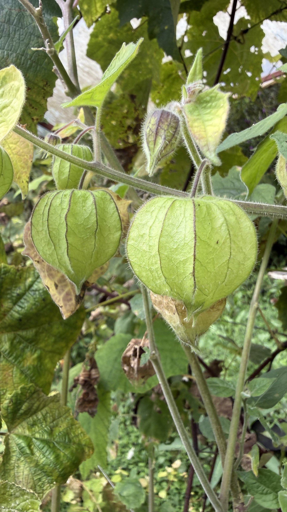

import MedicalDisclaimer from '../../../components/MedicalDisclaimer.astro';

## Propiedades nutricionales y beneficios

La uchuva (*Physalis peruviana*) tiene casi tantos nombres como países donde crece: uchuva en Colombia, aguaymanto en el Perú, uvilla en Ecuador, physalis, capulí, o incluso **amour en cage** — «amor enjaulado» — en Francia, en referencia al cáliz que envuelve el fruto como un pequeño farolillo. Esta baya anaranjada, del tamaño de una cereza grande, es rica en **vitamina C** y en **provitamina A** en forma de carotenoides, y aporta también vitaminas del grupo B, hierro, fósforo y fibra. Contiene además compuestos propios del género *Physalis*, los **witanólidos** y las fisalinas, estudiados en laboratorio por sus propiedades antiinflamatorias — investigaciones prometedoras, pero aún lejos de aplicaciones confirmadas en humanos. Una precaución importante: como muchas solanáceas, la planta contiene alcaloides en sus **hojas, tallos y frutos verdes**, que no deben consumirse. Solo son comestibles los frutos bien maduros, de un naranja dorado, con el cáliz seco y apergaminado.

<MedicalDisclaimer locale="es" />

## Cómo comerla

La uchuva se come ante todo **fresca**, sacada de su farolillo en el último momento. Su sabor sorprende: ácido y dulce a la vez, con notas que recuerdan al tomate cherry, la piña y el mango. Se come tal cual, se añade a una ensalada de frutas o se usa para decorar postres, con el cáliz levantado como pétalos sobre el fruto — así se la ve a menudo en las pastelerías europeas. En los Andes se transforma con gusto en **mermeladas**, siropes y salsas agridulces que acompañan carnes a la parrilla; en el Perú, el aguaymanto también se disfruta seco, como una pasa ácida. Combina muy bien con el chocolate negro — bañada en chocolate fundido sosteniéndola por el cáliz, se convierte en una golosina espectacular — y aporta una bonita acidez a las ensaladas saladas, con rúcula y queso fresco. Guardada en su cáliz, se conserva varias semanas en un lugar fresco.

## Cómo cultivarla de forma orgánica

La uchuva es una planta perenne generosa y poco exigente, que puede producir durante varios años — lo que más pide es espacio y un tutor.

- **Siembra en semillero.** Las semillas, diminutas, germinan en dos o tres semanas en un sustrato templado; las plántulas se trasplantan cuando alcanzan unos quince centímetros. El esqueje de tallo también funciona muy bien.
- **Un arbusto vigoroso que hay que entutorar.** La planta puede alcanzar de un metro a metro y medio de alto y otro tanto de ancho; un tutor o un emparrado ligero evita que las ramas cargadas de fruta se vengan al suelo.
- **Un suelo bien drenado, sin exceso de riqueza.** Un suelo demasiado rico en nitrógeno da un follaje exuberante en detrimento de los frutos; basta un aporte moderado de compost.
- **Una producción escalonada.** Los primeros frutos aparecen cuatro o cinco meses después de plantar, y luego la planta florece y fructifica de forma continua. Se cosecha cuando el cáliz está seco y de color paja — a menudo los frutos maduros caen solos al pie.
- **Una poda de mantenimiento** después de las grandes cosechas, para airear la planta y estimular nuevos brotes fructíferos.
- **Pocas plagas serias**, salvo algunas orugas y chinches; en clima muy húmedo, una buena aireación limita las enfermedades fúngicas en el follaje denso.

## La uchuva en nuestro huerto

La uchuva no necesita aclimatarse a Horqueta: aquí encuentra, casi idénticas, las condiciones de sus montañas de origen. *Physalis peruviana* crece de forma natural en los Andes, generalmente entre 1.500 y 3.000 metros de altitud, en climas frescos y húmedos sin heladas — exactamente el perfil del bosque nuboso de Boquete, a 1.800 metros. Colombia, primer productor mundial, la cultiva precisamente en sus tierras altas. En la finca es un cultivo casi autónomo: una vez instalada en una terraza soleada, produce durante meses sin pedir mucho más que un tutor y una cosecha regular. También tiende a resembrarse sola a partir de los frutos caídos — a menudo aparecen plántulas espontáneas alrededor de la planta madre, fáciles de trasplantar a otro lugar.

## Buenas compañeras

- **Las hierbas aromáticas bajas (albahaca, perejil).** Aprovechan la sombra ligera del arbusto y atraen insectos auxiliares.
- **Las flores melíferas (caléndula, borraja).** Atraen a los polinizadores, útiles para la fructificación, aunque la uchuva es en gran parte autofértil.
- **Las leguminosas como cultivo anterior**, que enriquecen el suelo con nitrógeno de forma moderada, sin exceso.

## Plantas que conviene evitar

- **Otras solanáceas en su cercanía inmediata (tomate, papa, berenjena, tomate de árbol, naranjilla).** Comparten las mismas enfermedades y plagas; mejor espaciarlas y alternarlas en rotación.
- **El hinojo**, por su efecto alelopático general.
- **Los cultivos bajos que necesitan pleno sol**, a los que el follaje denso de una uchuva adulta podría dar sombra.

## Datos curiosos

- **En Francia la llaman «amor enjaulado».** Un nombre poético para este fruto encerrado en su cáliz como en una pequeña jaula de papel.
- **Es de la misma familia que el tomate.** Como el tomate, la papa y la naranjilla, la uchuva es una solanácea — su prima más cercana es el tomatillo mexicano, usado en la salsa verde.
- **Su cáliz la protege durante semanas.** Guardada en su farolillo, la baya se conserva mucho más tiempo que una vez pelada.
- **Dio la vuelta al mundo en el siglo XIX.** Introducida en Sudáfrica, donde se la conoce como *Cape gooseberry*, y luego en Australia y la India, hoy se cultiva en casi todos los continentes.
