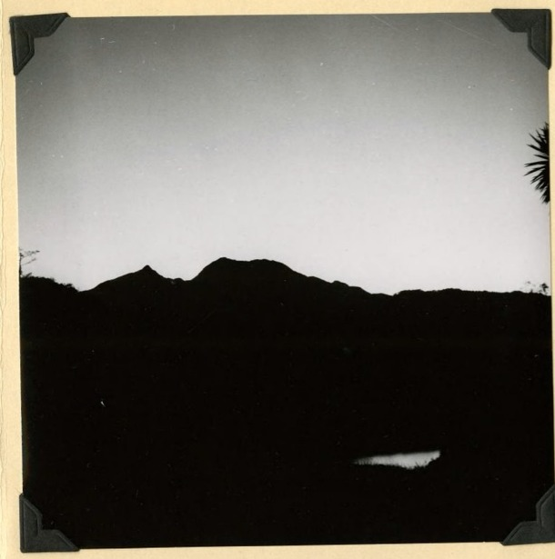

import NoteBox from '../../../components/NoteBox.astro';

## Un estratovolcán, el punto más alto de Panamá

El Volcán Barú es un estratovolcán activo — dormido, no extinto — y el único volcán del país. Con 3475 metros, es el punto más alto de Panamá, formado a lo largo de varios cientos de miles de años por la superposición de flujos piroclásticos, lahares y coladas de lava, sobre un cono que cubre aproximadamente 280 km². Pertenece al Arco Volcánico de América Central, producido por la subducción de la Placa de Cocos bajo la Placa Caribe, no muy lejos de la frontera con Costa Rica.

Su roca es principalmente andesítica y basáltico-andesítica. Los geólogos distinguen aquí dos familias de lavas: lavas calcoalcalinas «clásicas» más antiguas, y lavas **adakíticas** más recientes — producidas por la fusión parcial de la propia placa subducida, una firma geoquímica particular que se encuentra en pocos volcanes del mundo.

Lo que más llama la atención, visto desde el aire, es que la cumbre no es un cono clásico sino un anfiteatro en forma de herradura de unos 6 km de diámetro — la cicatriz de un colapso masivo de uno de los flancos del volcán. Antes de ese colapso, se cree que el Barú alcanzaba entre 300 y 500 metros más de altura que hoy.

## Dos historias eruptivas que no hay que confundir

La documentación científica distingue dos fenómenos muy diferentes, a menudo mezclados en los resúmenes divulgativos.

**Los colapsos de flanco, los más antiguos y masivos.** Se han cartografiado y datado dos avalanchas de escombros: la avalancha de **Caisán**, la más antigua, anterior a 43 000 años, que formó el anfiteatro cumbrero actual — un recorrido de 50 km, más de 1180 km² cubiertos, con un volumen combinado con el evento siguiente estimado en 25-30 km³, lo que la convierte, según el USGS, en «la avalancha de escombros más grande documentada en América Central — casi diez veces más voluminosa» que la del Monte Santa Helena en 1980. Y la avalancha de **Barriles**, más reciente, datada en aproximadamente 9000 años (inicio del Holoceno), con un recorrido de 45 km sobre más de 990 km².

**Cuatro episodios eruptivos más recientes, en los últimos 1600 años.** Un estudio de referencia del USGS (2007) documenta cuatro episodios explosivos distintos, datados por carbono 14: uno primero hacia 640-850 d. C., un segundo hacia 1000-1330 d. C., un tercero sin fecha directa, y el **último episodio conocido, entre 1400 y 1550 d. C.** — la Smithsonian Institution se decanta por una estimación puntual de aproximadamente **1550 d. C.** Estas erupciones produjeron flujos de bloques y ceniza que se desplazaron hacia el oeste, sobre el abanico volcánico hoy ocupado por la ciudad de Volcán. No se ha registrado ninguna erupción desde entonces — los registros coloniales españoles comienzan poco después de esa fecha, lo que sugiere una pausa genuina más que un simple evento no documentado.

<NoteBox>
  

    <strong>Una corrección útil.</strong> Contrariamente a una confusión frecuente, el gigantesco
    colapso que esculpió la cumbre del Barú no ocurrió hace unos 1500 años: se remonta a varias
    decenas de miles de años. Lo que ocurrió hacia el año 1550 d. C. (es decir, hace poco menos de
    500 años, no 1550 años) es la última erupción conocida — un episodio mucho más modesto que el
    colapso original.
  

</NoteBox>

Una nota arqueológica, todavía debatida: algunos trabajos asociaron durante mucho tiempo una erupción hacia el 600-700 d. C. con la desaparición de la cultura precolombina de **Barriles**, conocida por sus estatuas de piedra con casco cónico. Reevaluaciones más recientes cuestionan esa datación, sugiriendo que las cenizas halladas en los sitios de Barriles podrían corresponder más bien al episodio de 1400-1550 — un desacuerdo científico que sigue abierto.

## Un volcán dormido, bajo vigilancia

El Barú está clasificado como volcán «holoceno» por el Smithsonian — es decir, ni extinto ni amenazante, sino un volcán que el USGS califica de «potencialmente activo», que «probablemente entrará de nuevo en erupción en un futuro cercano o lejano», sin que pueda avanzarse ningún plazo. El monitoreo sísmico continuo lo lleva a cabo el Instituto de Geociencias de la Universidad de Panamá.

Varios enjambres sísmicos han marcado el siglo pasado: septiembre de 1930; junio-agosto de 1963 (hasta M4,4, con varios cientos de sismos registrados — una interpretación antigua veía en ello una señal de magma en movimiento, una lectura que el USGS considera hoy «sin fundamento»); noviembre de 1985 (M4,3, una docena de casas dañadas); y mayo de 2006 (hasta M4,7, en la región de Boquete). Hoy, la red sismográfica universitaria registra a diario pequeños sismos por debajo de M3,5 — una agitación de fondo considerada normal, no una escalada.

La prensa panameña repite a veces la idea de que el volcán entraría en erupción «cada 500-550 años aproximadamente», lo que situaría el próximo episodio hacia 2050 — una extrapolación periodística a partir de los cuatro episodios holocenos, y no una predicción científica: ni el USGS ni el Smithsonian se aventuran a dar un plazo. Una anécdota llamativa, pero que conviene manejar con las precauciones necesarias.

## Lo que podría provocar una futura erupción

La evaluación de riesgos realizada por el USGS en 2007 describe varios escenarios: flujos piroclásticos a 50-150 km/h, a varios cientos de grados, que históricamente han recorrido hasta 15 km desde la cumbre, principalmente hacia el oeste (hacia Volcán) — aunque un ligero desplazamiento del punto de emisión podría, según el informe, orientar futuros flujos hacia los valles del lado de Boquete. Los lahares, descritos como un flujo de «concreto en movimiento», podrían extenderse entre 10 y 20 km, canalizados en particular por el Río Chiriquí Viejo. Las caídas de ceniza han alcanzado históricamente más de 100 km a favor del viento, siendo la ciudad de Volcán la más expuesta. Más de 10 000 personas viven hoy en la zona de mayor riesgo, en las inmediaciones del volcán.

## El ascenso a la cumbre

Dos rutas principales permiten llegar a la cumbre. La más transitada parte de **Boquete**, por el camino de tierra llamado «Camiseta», vía el puesto de guardaparques de Los Naranjos — unos 13,5 km por trayecto (poco más de 26 km ida y vuelta), con un desnivel estimado, según las fuentes, entre 1800 y 2270 m, y un tiempo total de caminata de 11h30 a 12h30; los tours en 4×4 cubren el mismo trayecto en unas dos horas por trayecto. Este sendero, de hecho, estuvo cerrado temporalmente en julio de 2026 tras un deslizamiento de tierra en el sector de La Nevera, antes de reabrir el 14 de julio bajo el Ministerio de Ambiente (MiAmbiente) — un recordatorio de que el acceso sigue sujeto a los caprichos del terreno, y conviene verificarlo antes de partir.

La segunda ruta parte del lado de **Volcán / Cerro Punta**, más empinada, menos acondicionada, utilizada sobre todo por los habitantes locales, con un ascenso de unas seis horas.

La tradición manda que el ascenso se haga de noche, saliendo a menudo antes de las 2 de la madrugada con linterna frontal, para llegar a la cumbre al amanecer — el momento en que las nubes tienen estadísticamente menos probabilidades de haberse formado ya. Un punto de campamento intermedio, Los Fogones, también permite dividir la subida en dos, con una salida hacia las 5 de la madrugada hacia la cumbre.

El acceso lo gestiona MiAmbiente, con una tarifa de entrada generalmente citada en torno a los 5 $, y la firme recomendación de ir con guías acreditados, especialmente para las salidas nocturnas. Las temperaturas en la cumbre pueden bajar de 0°C en la estación seca, a veces con granizo o escarcha.

<NoteBox>
  

    <strong>¿De verdad los dos océanos?</strong> El Barú es efectivamente el único lugar de Panamá
    — y uno de los pocos del mundo — desde donde se puede divisar a la vez el Pacífico y el mar
    Caribe, en un día de cielo realmente despejado. Pero esa doble vista sigue siendo rara: muchos
    excursionistas que hacen el ascenso antes del amanecer solo ven nubes, o solo uno de los dos
    océanos. Es precisamente para maximizar esa posibilidad, nunca garantizada, que el ascenso
    nocturno sigue siendo la norma.
  

</NoteBox>

## Parque nacional y biodiversidad

El Parque Nacional Volcán Barú fue creado por el Decreto Ejecutivo n.º 40 del **24 de junio de 1976**, y cubre 14 322 hectáreas dentro de la cordillera de Talamanca. Constituye el anclaje sur del Corredor Biológico Mesoamericano, en conexión ecológica con el Parque Internacional La Amistad, sitio del Patrimonio Mundial de la UNESCO compartido con Costa Rica.

El parque atraviesa varios pisos ecológicos, desde el bosque tropical de montaña hasta el bosque nuboso, hasta una zona cumbrera de tipo páramo — pastos y arbustos resistentes al frío y al viento, sobre suelos delgados. El quetzal resplandeciente, emblema del parque, se alimenta en gran parte de aguacatillos silvestres; se han documentado unas 250 especies de aves. El tapir de Baird, el mamífero terrestre más grande de América Central, el puma, el ocelote, y — según algunas fuentes — las cinco especies de felinos silvestres de Panamá frecuentarían parte del territorio del parque.

Los desafíos de conservación siguen siendo reales: expansión agrícola y uso intensivo de agroquímicos en los bordes del parque, apertura no autorizada de caminos y extracción de materiales sin estudio de impacto, inseguridad en la tenencia de la tierra (tierras no tituladas, especulación), y — más recientemente — casos de intervención ilegal y cambio de uso del suelo detectados dentro del propio parque por MiAmbiente.

[Senderismo desde Wild on the Farm →](/es/senderismo/)
[Reserve su estadía →](/es/reservar/)

<NoteBox>
  

    Créditos fotográficos: «Above the Clouds, Chiriquí Volcano», grabado tomado de <em>Panama and
    the Canal in Picture and Prose</em> (1913), dominio público, vía Wikimedia Commons /
    Biodiversity Heritage Library. «Dawn silhouette of Volcán Barú, from Palo Santo, Chiriquí»,
    27 de febrero de 1954, tomada del álbum de la expedición de Alexander Wetmore, secretario de
    la Smithsonian Institution — Smithsonian Institution Archives, sin restricciones de derechos
    conocidas.
  

  

    Fuentes principales: Sherrod, Vallance, Tapia Espinosa &amp; McGeehin (2007), <em>Volcán
    Barú — Eruptive History and Volcano-Hazards Assessment</em>, USGS Open-File Report 2007-1401;
    Smithsonian Institution Global Volcanism Program; Herrick, Siebert &amp; Rose (Geological
    Society of America) sobre las avalanchas de Barriles y Caisán; MiAmbiente.
  

</NoteBox>
