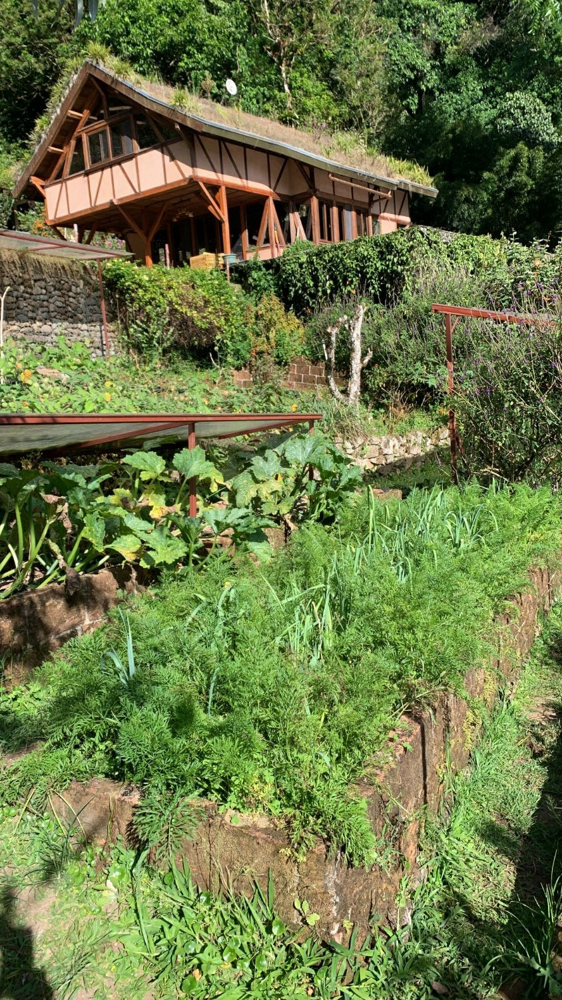

import MedicalDisclaimer from '../../../components/MedicalDisclaimer.astro';

## Propriétés nutritionnelles et bienfaits

La carotte (*Daucus carota*) doit sa couleur orange à un pigment, le **bêta-carotène**, que l'organisme convertit en vitamine A — un rôle bien documenté dans le maintien d'une vision normale, en particulier l'adaptation à la vision nocturne, ainsi que dans la santé de la peau et du système immunitaire. Une seule carotte de taille moyenne couvre une bonne partie des besoins journaliers en vitamine A sous cette forme précurseur. Elle apporte aussi une quantité notable de **vitamine K1**, utile à la coagulation sanguine, du potassium, de petites quantités de vitamine C et de biotine, ainsi que des fibres solubles (dont la pectine) qui nourrissent le microbiote intestinal et contribuent à une digestion régulière. Peu calorique et riche en eau, elle est aussi une source appréciable d'antioxydants caroténoïdes, dont l'alpha-carotène et la lutéine selon les variétés — un intérêt qui s'étend d'ailleurs aux carottes violettes et jaunes, plus anciennes, qui contiennent des composés différents (anthocyanes pour les violettes) aux propriétés antioxydantes elles aussi étudiées.

<MedicalDisclaimer locale="fr" />

## Comment la manger

La carotte se prête à presque tous les modes de préparation. **Crue**, râpée ou coupée en bâtonnets, elle garde son croquant et l'essentiel de sa vitamine C, sensible à la chaleur — c'est la base de la classique salade de carottes râpées, citron et persil. **Cuite**, à la vapeur, rôtie au four ou glacée au beurre et au miel, elle devient plus digeste et libère mieux son bêta-carotène : contrairement à la vitamine C, celui-ci est en effet mieux absorbé par l'organisme après cuisson et en présence d'un peu de matière grasse, qui l'aide à traverser la paroi intestinale. Elle se prête aussi très bien à la **fermentation lacto-fermentée** — c'est d'ailleurs l'un des légumes qui atterrit le plus souvent dans notre Garden Kimchi, selon ce que le potager nous donne cette semaine-là. Sans oublier la soupe, le velouté, le jus frais, ou tout simplement grignotée telle quelle : peu de légumes sont à la fois aussi polyvalents et aussi peu exigeants à préparer.

## Comment la cultiver biologiquement

La carotte a la réputation d'être capricieuse au potager, mais presque tous ses caprices se résument à une seule exigence : un sol **meuble, profond et sans obstacle**. C'est une racine pivotante — elle pousse en ligne droite vers le bas — et la moindre pierre, motte compacte ou fumier frais mal décomposé suffit à la faire fourcher ou se tordre. Un sol sableux ou finement ameubli sur 25 à 30 cm, sans cailloux ni matière organique grossière fraîchement incorporée, est la base de tout.

- **Semis direct, jamais de repiquage.** La racine pivotante ne supporte pas la transplantation — un repiquage abîme l'extrémité et provoque des racines fourchues ou rabougries. On sème donc toujours en place, en rangs peu profonds (environ 1 cm), en gardant le sol constamment humide jusqu'à la levée — la germination est lente (2 à 3 semaines) et le sol ne doit jamais croûter ni sécher pendant cette période.
- **L'éclaircissage, une étape non négociable.** Les graines, minuscules, lèvent toujours trop serré. Il faut éclaircir tôt, une première fois quand les jeunes plants ont 2-3 vraies feuilles, puis une seconde fois pour laisser 4 à 5 cm entre chaque carotte — sans quoi elles restent chétives et se déforment entre elles.
- **Un arrosage régulier, jamais en à-coups.** Un sol qui alterne sécheresse et arrosage abondant fait éclater les racines ou les rend amères et fibreuses. Un paillage léger aide à maintenir une humidité constante.
- **Pas de fumier frais.** Le fumier non composté, riche en azote et hétérogène, est la cause numéro un des carottes fourchues. On l'apporte plutôt à la culture précédente, et on nourrit la carotte avec un compost bien mûr et tamisé.
- **Protection contre la mouche de la carotte.** Ce petit moucheron pond près du collet et ses larves creusent des galeries dans la racine. Un voile anti-insectes posé dès le semis est la protection biologique la plus fiable ; l'association avec les alliacées (voir plus bas) aide aussi à brouiller son odorat.
- **Récolte échelonnée.** On récolte au fur et à mesure des besoins, dès que le diamètre du collet, visible en surface, paraît suffisant — inutile d'attendre une taille maximale, la chair reste plus tendre récoltée un peu jeune.

## La carotte au jardin

À 1 800 mètres d'altitude, un climat de forêt nébuleuse est en réalité un net avantage pour la carotte : c'est une culture de climat frais, qui préfère des températures entre 15 et 20°C et qui, sous une chaleur tropicale de plaine, aurait tendance à filer en fleur prématurément ou à développer une chair plus fibreuse. Des sols volcaniques, profonds et bien drainés sur des terrasses de jardin, conviennent également très bien à sa racine pivotante, à condition d'être finement ameublis avant le semis. La principale difficulté n'est alors pas la chaleur mais l'humidité : en pleine saison des pluies, il faut surveiller que les billons ne restent pas détrempés, sous peine de pourriture du collet — une bonne raison de cultiver la carotte sur des terrasses surélevées plutôt qu'à plat.

## Les plantes amies (bonnes associations)

- **Les alliacées — oignon, poireau, ail, ciboulette.** L'association la plus classique et la plus utile : l'odeur forte des alliacées perturbe l'orientation olfactive de la mouche de la carotte, qui repère normalement sa plante hôte par le parfum de son feuillage froissé. La réciproque est vraie aussi : la carotte aide à repousser la teigne du poireau. Un grand classique du potager en bonne intelligence.
- **La laitue et les salades.** Peu encombrantes et à enracinement superficiel, elles n'entrent pas en concurrence avec la racine pivotante de la carotte et peuvent même faire office de paillage vivant, gardant le sol frais entre les rangs.
- **Les pois et haricots nains.** Comme toutes les légumineuses, ils enrichissent le sol en azote grâce aux bactéries fixatrices de leurs racines — un bénéfice pour la culture suivante, à condition de ne pas en abuser, un excès d'azote favorisant justement les racines fourchues.
- **La tomate.** Association traditionnelle de longue date ; la tomate profite de l'ameublissement du sol occasionné par la carotte, et certains jardiniers lui attribuent un effet répulsif sur certains insectes, bien que la preuve scientifique en soit mince.
- **Le romarin et la sauge.** Comme les alliacées, leurs huiles essentielles aromatiques contribuent à masquer l'odeur du feuillage de la carotte face aux insectes ravageurs.

## Les plantes à éviter

- **L'aneth, le fenouil et le panais.** Tous trois appartiennent à la même famille botanique que la carotte, les Apiacées (ombellifères). Cette proximité pose deux problèmes : d'une part, ils partagent les mêmes ravageurs et maladies, ce qui favorise leur propagation d'une plante à l'autre ; d'autre part, l'aneth et le fenouil peuvent croiser avec la carotte s'ils sont laissés monter en fleur à proximité, et le fenouil est réputé pour son effet allélopathique, inhibant la croissance de nombreuses plantes voisines dont la carotte elle-même.
- **Le céleri.** Également une Apiacée, avec le même risque de ravageurs et maladies partagés — mieux vaut l'éloigner de la planche de carottes, comme de toute autre ombellifère.
- **La pomme de terre.** Les deux sont des cultures de sous-sol qui entrent en concurrence directe pour l'espace racinaire et les nutriments ; on évite généralement de les associer sur la même planche.

## Trucs à savoir

- **La carotte n'a pas toujours été orange.** Les carottes cultivées les plus anciennes, en Asie centrale il y a environ mille ans, étaient violettes ou jaunes. La variété orange que nous connaissons serait apparue aux Pays-Bas vers les XVIe-XVIIe siècles — une légende tenace veut que les producteurs néerlandais l'aient sélectionnée en hommage à la Maison d'Orange-Nassau, bien que les historiens du légume débattent encore de la part de mythe dans cette histoire.
- **C'est une plante bisannuelle.** Livrée à elle-même, la carotte ne fleurit qu'à sa deuxième année : la première saison est entièrement consacrée à stocker des réserves dans sa racine, ce qui explique pourquoi on la récolte avant qu'elle ne monte en graine.
- **Elle appartient à la famille du persil, de l'aneth et de la ciguë.** Les Apiacées comptent autant de plantes comestibles appréciées que de plantes toxiques qui leur ressemblent fortement à l'état sauvage (comme la grande ciguë) — une bonne raison de ne jamais cueillir de carotte sauvage sans certitude absolue d'identification.
- **Elle se conserve très bien au frais et dans le noir.** Débarrassées de leurs fanes, qui continuent sinon à puiser l'humidité de la racine, les carottes se gardent plusieurs mois dans du sable légèrement humide, à température fraîche — une méthode de conservation traditionnelle bien plus ancienne que le réfrigérateur.
