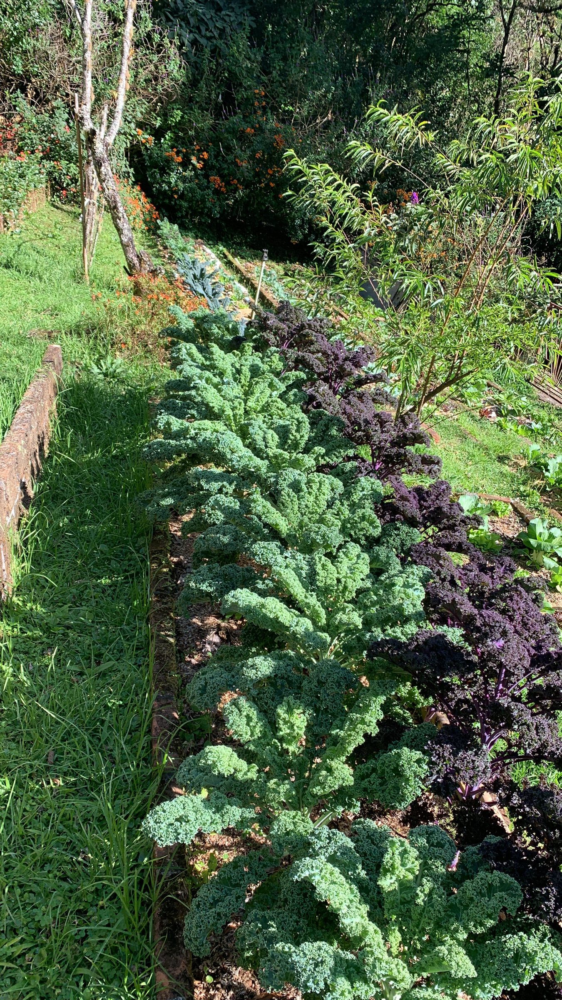

import MedicalDisclaimer from '../../../components/MedicalDisclaimer.astro';

## Propriétés nutritionnelles et bienfaits

Le kale, ou chou frisé (*Brassica oleracea* var. *sabellica*, aussi classé selon les sources sous *acephala*), est l'un des légumes-feuilles les plus denses nutritionnellement qui existent : une tasse de feuilles crues apporte environ 68 % des besoins journaliers en **vitamine K** et plus de 20 % en **vitamine C**, avec en prime une bonne dose de bêta-carotène (précurseur de la vitamine A) et de calcium d'origine végétale. Il doit sa couleur profonde et une partie de ses bienfaits à la **lutéine** et à la **zéaxanthine**, deux caroténoïdes associés à la santé oculaire, ainsi qu'à des glucosinolates qui se transforment, une fois le légume coupé ou mâché, en composés comme le sulforaphane — des molécules étudiées pour leurs propriétés antioxydantes et anti-inflammatoires. Son nom de variété, *acephala*, vient du grec « sans tête » : contrairement au chou pommé, le kale ne forme jamais de boule compacte, restant toute sa vie en rosace de feuilles ouvertes. Une précision utile : comme la plupart des choux, il contient aussi des composés goitrogènes qui peuvent, en très grande quantité et de façon prolongée, interférer avec la fonction thyroïdienne — un non-problème dans le cadre d'une consommation alimentaire normale, mais à garder en tête pour les personnes suivant un traitement thyroïdien.

<MedicalDisclaimer locale="fr" />

## Comment le manger

Le kale cru peut être franchement coriace, mais un massage énergique des feuilles avec un peu d'huile d'olive et de jus de citron pendant quelques minutes attendrit remarquablement sa texture et adoucit son amertume — une astuce simple qui change tout pour les salades. Il se cuisine aussi très bien sauté rapidement à l'ail, ajouté en fin de cuisson dans les soupes et les ragoûts (le caldo verde portugais en est l'exemple le plus emblématique), ou transformé en chips croustillantes au four avec un filet d'huile et une pincée de sel. On le glisse volontiers cru dans un smoothie, sa texture ferme se prêtant bien au mixage, et ses côtes centrales, souvent retirées car plus fibreuses que le limbe, se hachent finement pour être cuites un peu plus longtemps que les feuilles elles-mêmes. C'est un légume qui supporte bien une cuisson prolongée sans se déliter complètement, contrairement à des feuilles plus tendres comme l'épinard.

## Comment le cultiver biologiquement

Le kale fait partie des cultures les plus indulgentes du potager biologique : peu exigeant, résistant, et étonnamment tolérant aux erreurs de débutant.

- **Semis facile, en place ou en godets.** Les graines germent en une à deux semaines à des températures modérées, et contrairement au persil ou à la carotte, les jeunes plants de kale transplantent très bien.
- **Une plante de climat frais qui n'aime pas la chaleur excessive.** Comme la laitue, le kale a tendance à monter en graine et à devenir amer sous une chaleur prolongée — c'est une culture qui donne le meilleur d'elle-même dans la fraîcheur, jamais en plein été tropical.
- **Un gros mangeur.** Le kale pousse vite et produit beaucoup de feuillage sur une longue période ; un sol enrichi en compost au moment de la plantation, puis un apport régulier de matière organique, soutient une production continue sans épuiser le sol.
- **Récolte en feuille, jamais en une seule fois.** On cueille les feuilles extérieures, les plus grandes et les plus âgées, en laissant le cœur du plant continuer à produire — une méthode de récolte continue qui peut s'étaler sur plusieurs mois, voire toute une saison.
- **Un arrosage régulier et profond.** Un sol qui s'assèche complètement entre deux arrosages stresse la plante et accélère sa tendance à fleurir prématurément ; un paillage aide à maintenir une humidité plus constante.
- **Les ravageurs classiques des brassicacées** — chenilles de la piéride du chou, altises, pucerons — restent le principal défi en culture biologique ; un voile anti-insectes posé dès la plantation reste l'une des protections les plus simples et les plus efficaces.

## Le kale au jardin

Le kale trouve dans le climat frais et stable de la forêt nébuleuse d'Horqueta des conditions proches de l'idéal : c'est une plante qui, sous la plupart des tropiques, ne survit qu'en saison fraîche avant de fleurir et de devenir amère dès les premières chaleurs soutenues, alors qu'ici, l'altitude lui offre des températures modérées presque toute l'année, sans la pause forcée qu'impose la chaleur en plaine. (Un détail amusant pour les jardiniers venus de climats tempérés : ailleurs, une légère gelée d'automne rend le kale encore plus savoureux, le froid déclenchant une conversion de son amidon en sucres — un phénomène qui, en l'absence de gel à Boquete, ne se produira jamais ici, mais que le climat frais compense largement par une croissance longue et régulière plutôt que ponctuelle.) Les sols volcaniques riches en matière organique de la région conviennent parfaitement à son appétit de gros mangeur, et sa capacité à être récolté feuille par feuille pendant des mois en fait une culture particulièrement généreuse pour une ferme qui vend en circuit court.

## Les plantes amies (bonnes associations)

- **Les alliacées — oignon, ail, ciboulette.** Leur odeur perturbe efficacement plusieurs ravageurs du kale, notamment les altises et certains pucerons, en rendant plus difficile la localisation de la plante hôte.
- **Les herbes aromatiques comme l'aneth et la coriandre.** Elles attirent des insectes auxiliaires, syrphes et guêpes parasitoïdes en tête, qui aident à réguler les populations de pucerons.
- **Les légumineuses (haricots, pois).** En fixant l'azote atmosphérique dans le sol, elles enrichissent naturellement la terre au bénéfice du kale, gros consommateur d'azote.
- **Les soucis et les capucines.** Deux valeurs sûres du jardin biologique : elles attirent les syrphes prédateurs de pucerons, et la capucine agit même comme plante-piège en attirant certains ravageurs loin du kale.
- **La tomate.** Une association moins connue mais intéressante : certaines études suggèrent que sa proximité réduirait les infestations de la teigne des crucifères, un papillon dont les chenilles s'attaquent au feuillage du kale.

## Les plantes à éviter

- **Les autres brassicacées (chou, brocoli, chou-fleur).** Ce ne sont pas les plantes elles-mêmes qui posent problème, mais le fait qu'elles partagent les mêmes ravageurs et maladies ; les regrouper trop densément favorise leur propagation d'un plant à l'autre.
- **Le fraisier**, parfois cité par les jardiniers comme un mauvais voisin des choux en général, bien que la preuve scientifique de cette incompatibilité reste limitée et surtout issue de l'observation empirique plutôt que d'études contrôlées.
- **Le tournesol**, dont les racines libèrent des composés qui peuvent freiner la germination et la croissance de plusieurs plantes potagères voisines, le kale y compris s'il est planté trop près.

## Trucs à savoir

- **Le kale, le chou pommé, le brocoli, le chou-fleur et les choux de Bruxelles sont, au sens strict, la même espèce.** Tous descendent de *Brassica oleracea*, un chou sauvage du littoral méditerranéen, que des siècles de sélection humaine ont fait diverger en accentuant tantôt les feuilles, tantôt les bourgeons floraux, tantôt les bourgeons axillaires — une diversité impressionnante issue d'une seule plante ancestrale.
- **Son nom botanique signifie littéralement « sans tête ».** *Acephala*, du grec, décrit bien ce qui distingue le kale de son cousin le chou pommé : il ne forme jamais de boule compacte et reste toute sa vie en rosace de feuilles ouvertes.
- **C'est l'un des plus anciens choux cultivés.** On en trouve des traces dès la Grèce et la Rome antiques, bien avant que la sélection n'aboutisse aux choux pommés qu'on connaît aujourd'hui — le kale n'est donc pas une mode récente, mais l'une des formes les plus anciennes du chou domestiqué.
- **Il est devenu un pilier de plusieurs cuisines rurales bien avant d'être à la mode.** Du caldo verde portugais au kale traditionnel des cuisines d'Europe du Nord, cette variété non pommée a longtemps été un légume de subsistance apprécié pour sa résistance au froid, bien avant de devenir un symbole de l'alimentation saine dans les années 2010.
