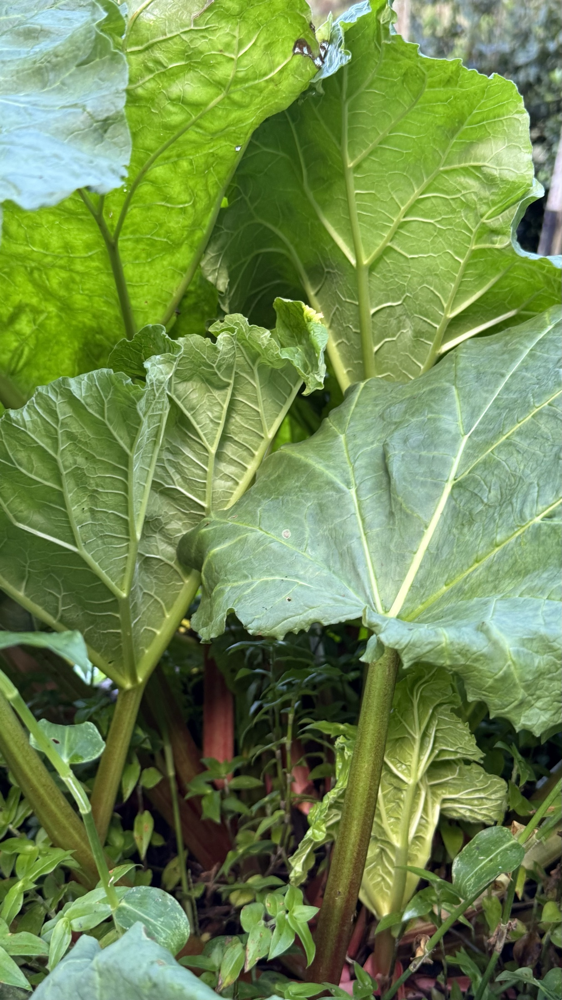

import MedicalDisclaimer from '../../../components/MedicalDisclaimer.astro';

## Propriétés nutritionnelles et bienfaits

La rhubarbe (*Rheum rhabarbarum*) appartient à la famille des Polygonacées, celle de l'oseille et du sarrasin. On n'en mange qu'une seule partie : le **pétiole**, cette longue tige charnue qui porte la feuille. Très peu calorique, elle est riche en **fibres** et en **vitamine K**, et apporte du potassium, du manganèse et un peu de vitamine C ; les tiges rouges contiennent aussi des **anthocyanes**, les pigments antioxydants des fruits rouges. Son acidité vient des acides malique et oxalique. La précaution essentielle concerne les **feuilles, qui sont toxiques** : elles concentrent l'acide oxalique et ne doivent jamais être consommées. Les tiges en contiennent beaucoup moins, mais assez pour que les personnes sujettes aux calculs rénaux en limitent la consommation ; le calcium de la rhubarbe, lié à ces oxalates, est d'ailleurs peu assimilable. La racine de rhubarbes voisines est un laxatif traditionnel de la médecine chinoise — un usage médicinal sans rapport avec la tige que l'on cuisine.

<MedicalDisclaimer locale="fr" />

## Comment la manger

Botaniquement un légume, la rhubarbe se cuisine presque toujours comme un fruit. Trop acide pour être mangée telle quelle, elle demande du sucre et une cuisson : en **compote**, en **tarte**, en crumble, en confiture. Elle s'entend à merveille avec la **fraise** — l'association classique —, mais aussi avec le gingembre, la vanille, l'orange et, chez nous, les fruits tropicaux. On coupe les tiges en tronçons sans les peler si elles sont jeunes ; les faire dégorger une heure avec le sucre avant la cuisson permet d'en mettre moins. En version salée, sa compote acidulée accompagne très bien les viandes grasses, le porc, le canard et les poissons gras, à la manière d'un chutney. On en fait aussi des sirops et des boissons rafraîchissantes. Les tiges se gardent une semaine au réfrigérateur et se congèlent très bien, coupées en morceaux.

## Comment la cultiver biologiquement

La rhubarbe est une vivace de longue durée : on la plante une fois, et elle produit pendant dix ans ou plus.

- **Plantation par éclat de souche.** On divise une touffe adulte en morceaux portant chacun un bourgeon ; c'est plus rapide et plus fidèle que le semis.
- **Un sol profond, riche et frais.** C'est une plante gourmande : beaucoup de compost à la plantation, puis un apport généreux chaque année.
- **De la place.** Au moins un mètre en tous sens : une touffe adulte est monumentale.
- **Un paillage épais** pour garder la fraîcheur du sol et nourrir la souche.
- **Patience la première année.** On ne récolte rien avant que le pied soit bien installé.
- **On tire, on ne coupe pas.** On saisit la tige à la base et on la détache d'un mouvement tournant ; on ne prélève jamais plus d'un tiers des tiges à la fois, et l'on jette les feuilles au compost.
- **Supprimer les hampes florales** dès leur apparition, pour que la plante garde ses forces pour le feuillage.
- **Diviser tous les cinq ans environ**, quand le cœur de la touffe s'épuise.

## La rhubarbe au jardin

La rhubarbe vient des régions froides d'Asie, et elle ne tolère pas la chaleur des tropiques de basse altitude. C'est l'altitude qui la rend possible ici : à 1 800 mètres, les nuits fraîches de Horqueta lui conviennent, et le pied de la photo, installé sur une terrasse du jardin, forme une touffe de feuilles larges comme des parapluies. La différence avec l'Europe, c'est l'absence d'hiver : sans période de repos, la plante pousse toute l'année, ce qui permet des récoltes étalées mais peut la fatiguer plus vite — nous récoltons modérément et la nourrissons généreusement. Nos tiges restent souvent plus vertes que rouges : la couleur dépend de la variété et du froid, et ne change rien au goût.

## Les plantes amies (bonnes associations)

- **Le fraisier.** Voisins au jardin comme dans la tarte ; les fraisiers couvrent le sol à son pied.
- **L'ail, l'oignon et la ciboulette.** Leur odeur est réputée éloigner certains ravageurs.
- **Les choux.** Une association traditionnelle : la rhubarbe passe pour protéger les Brassicacées de certains insectes.
- **Les haricots et les pois**, qui enrichissent en azote un sol que la rhubarbe sollicite beaucoup.

## Les plantes à éviter

- **L'oseille et les rumex sauvages.** De la même famille, ils hébergent les mêmes ravageurs.
- **Les cultures basses qui ont besoin de plein soleil.** Les feuilles immenses de la rhubarbe leur feraient de l'ombre.
- **Les cultures que l'on bêche souvent.** La souche n'aime pas être dérangée : mieux vaut lui réserver un coin permanent.

## Trucs à savoir

- **Les feuilles ne se mangent jamais.** Seule la tige est comestible.
- **Elle a été un médicament avant d'être un dessert.** La racine de rhubarbe de Chine a voyagé pendant des siècles sur les routes de la soie ; la tige n'entre en cuisine qu'au XVIIIᵉ siècle, quand le sucre devient abordable en Europe.
- **Aux États-Unis, c'est officiellement un fruit.** Un tribunal des douanes en a décidé ainsi en 1947, puisqu'on la cuisine comme tel.
- **On la « force » dans le noir.** Dans le Yorkshire, en Angleterre, la rhubarbe d'hiver pousse dans des hangars obscurs et se récolte à la bougie, pour des tiges tendres et rose vif.
- **Ses feuilles servent au jardin.** Macérées dans l'eau, elles donnent une préparation traditionnelle contre les pucerons.
