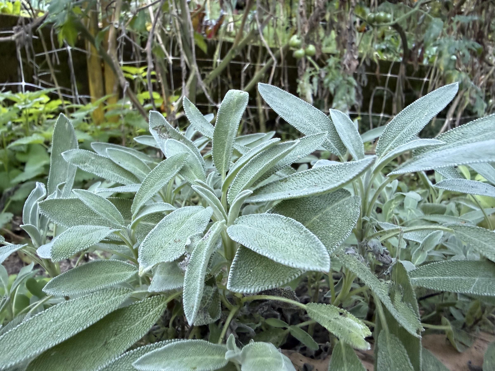

import MedicalDisclaimer from '../../../components/MedicalDisclaimer.astro';

## Propriétés nutritionnelles et bienfaits

La sauge officinale (*Salvia officinalis*) appartient à la famille des Lamiacées, celle de la menthe, du thym et du romarin. Consommée en petites quantités comme aromate, elle apporte surtout de la **vitamine K**, ainsi que des composés antioxydants comme l'**acide rosmarinique** et l'acide carnosique, qu'elle partage avec le romarin. Son nom vient du latin *salvare*, « sauver » ou « guérir » : la sauge occupe une place centrale dans la pharmacopée européenne depuis l'Antiquité, et un vieil adage médiéval demandait même pourquoi mourrait un homme qui avait de la sauge dans son jardin. La tradition l'utilise en infusion pour la digestion, en gargarisme pour les maux de gorge, et pour atténuer la transpiration et les bouffées de chaleur — des usages pour lesquels quelques études cliniques montrent des résultats encourageants, mais encore limités. Une précaution importante : son huile essentielle contient de la **thuyone**, un composé neurotoxique à forte dose. Si l'usage culinaire est sans danger, les préparations concentrées et l'huile essentielle sont déconseillées aux femmes enceintes ou allaitantes et aux personnes épileptiques, et une consommation médicinale prolongée en grande quantité est à éviter.

<MedicalDisclaimer locale="fr" />

## Comment la manger

La sauge a un goût puissant, légèrement camphré et amer, qui demande la main légère mais qui transforme un plat. Son usage le plus célèbre est italien : des feuilles entières frites quelques secondes dans le **beurre noisette**, jusqu'à devenir croustillantes, pour napper des raviolis, des gnocchis ou des pâtes à la courge. Elle est indispensable aux *saltimbocca alla romana*, ces escalopes de veau roulées avec du jambon cru et une feuille de sauge, et accompagne traditionnellement le porc, la volaille rôtie, le canard et les farces de fête. Elle se marie particulièrement bien avec les saveurs douces et grasses — courge, châtaigne, oignon confit, fromages de caractère. Les feuilles fraîches se gardent quelques jours au frais, et se sèchent très bien, en concentrant encore leur arôme. En infusion, quelques feuilles dans une eau frémissante donnent une tisane parfumée, traditionnellement bue après le repas.

## Comment la cultiver biologiquement

La sauge est une plante robuste et très peu exigeante — à condition de lui éviter son unique véritable ennemi : l'excès d'eau.

- **Bouturage ou semis.** La méthode la plus rapide est la bouture de tige semi-ligneuse, qui s'enracine en quelques semaines ; le semis fonctionne aussi, mais la plante met plus longtemps à s'installer.
- **Un sol pauvre et très bien drainé.** Originaire des coteaux secs et rocailleux de la Méditerranée, la sauge pourrit dans une terre lourde et détrempée. Un sol sableux ou caillouteux, sans apport excessif de compost, lui convient parfaitement.
- **Le plein soleil.** Plus elle reçoit de lumière directe, plus son feuillage est dense et parfumé.
- **Peu d'arrosage une fois installée.** Elle tolère remarquablement bien la sécheresse ; c'est presque toujours l'excès d'arrosage, et non le manque, qui la fait dépérir.
- **Une taille régulière.** Rabattre la plante d'un tiers après la floraison évite qu'elle ne se dégarnisse et ne devienne ligneuse ; on renouvelle généralement les pieds tous les quatre à cinq ans.
- **L'oïdium comme principal souci en climat humide**, favorisé par une mauvaise circulation de l'air ; un bon espacement et un emplacement bien ventilé sont la meilleure prévention.

## La sauge au jardin

Soyons honnêtes : la sauge n'est pas née pour la forêt nébuleuse. C'est une plante de garrigue, qui aime le soleil brûlant et les sols qui sèchent vite, quand Horqueta offre au contraire de la fraîcheur, de la brume et une humidité presque permanente. La stratégie qui fonctionne consiste à lui recréer un petit coin de Méditerranée : l'emplacement le plus ensoleillé et le plus ventilé de la propriété, sur une butte ou dans un bac surélevé, avec une terre allégée de sable et de graviers pour que l'eau de pluie s'évacue immédiatement. Le bancal de pierre où poussent déjà le thym et le romarin est l'endroit idéal : les pierres captent la chaleur du jour, et le drainage y est parfait. En saison des pluies, on surveille l'oïdium et on aère le pied par une taille légère.

## Les plantes amies (bonnes associations)

- **Le romarin, le thym et la lavande.** Des voisines méditerranéennes aux mêmes besoins — soleil, sol sec, peu d'arrosage — qui permettent de regrouper un « coin sec » cohérent au jardin.
- **Les choux et brassicacées.** Le parfum de la sauge est réputé éloigner la piéride et l'altise.
- **La carotte.** Son odeur aiderait à masquer celle de la carotte à la mouche qui la recherche.
- **Les fraisiers**, selon une tradition potagère qui les associe volontiers.

## Les plantes à éviter

- **Le basilic, le concombre et les plantes gourmandes en eau.** Non pas par incompatibilité chimique, mais parce que leurs besoins en arrosage sont opposés : les cultiver côte à côte revient à noyer la sauge ou à assoiffer sa voisine.
- **La rue**, traditionnellement considérée comme un mauvais voisin des Lamiacées.
- **Les cultures très feuillues qui lui font de l'ombre**, car la sauge a besoin de plein soleil pour rester dense et parfumée.

## Trucs à savoir

- **Son nom signifie « sauver ».** Du latin *salvare* — la sauge était considérée au Moyen Âge comme l'une des plantes médicinales les plus précieuses du jardin.
- **Le genre *Salvia* compte près d'un millier d'espèces.** Il est l'un des plus grands genres du règne végétal, avec de nombreuses sauges ornementales et aromatiques — dont beaucoup sont originaires d'Amérique centrale et du Sud.
- **Ses feuilles veloutées sont une protection.** Le duvet argenté qui les recouvre limite la perte d'eau et réfléchit le soleil, une adaptation typique des plantes de climat sec.
- **Les colibris adorent certaines sauges.** Les sauges ornementales à fleurs rouges ou violettes, très répandues en Amérique centrale, comptent parmi les plantes favorites des colibris — un excellent ajout pour attirer ces oiseaux au jardin.
