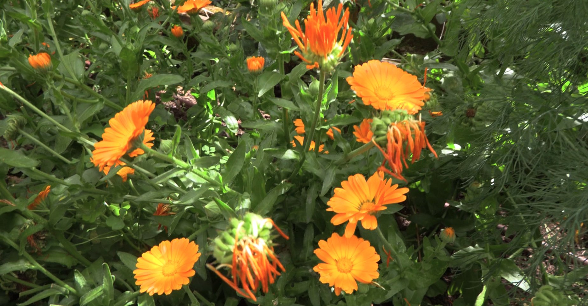

import MedicalDisclaimer from '../../../components/MedicalDisclaimer.astro';

## 特性と効能

カレンデュラ（*Calendula officinalis*、和名キンセンカ）は、地中海沿岸が原産のキク科の植物で、ヨーロッパでもっとも古くから肌の手入れに使われてきた植物のひとつです。花の色は**カロテノイド**によるもので、**フラボノイド**やトリテルペン——とくにファラジオールエステル——を含みます。**肌をしずめ、炎症をやわらげる**働きは、これらの成分によるものと考えられています。伝統的な使い方はよく確立されていて、ヨーロッパではカレンデュラの製剤が、軽い皮膚の炎症や、小さな傷の治りを助けるための伝統的な薬として認められています。放射線治療による皮膚の炎症についてなど、同じ方向を示す臨床研究もいくつかありますが、数はまだ多くありません。

農園では、私たち自身がそれをじかに経験しました。私たちは自分たちの花で、肌を美しく保つための製品を作っています。そして、ひどいやけどに使ったとき、「驚くべき」と言ってはばからないほどの良い作用を、自分たちの体で確かめました。これはひとつの体験談であり、約束ではありません。重いやけどは、まず医師にみせること。カレンデュラは、そのうえでの手助けです。注意点はふたつ。キク科（ブタクサ、カモミール、アルニカ）にアレルギーのある方は、カレンデュラにも反応することがあります。また、妊娠中の内服はすすめられません。

<MedicalDisclaimer locale="ja" />

## 使い方

**肌のために。** 基本は**浸出油（インフューズドオイル）**です。びんに、しっかり**乾燥させた**花を詰めます——これが肝心です。生の花では、オイルにカビが生えてしまいます。オリーブオイルかヒマワリ油を花がかぶるまで注ぎ、光の当たらない場所で、ときどき揺すりながら3〜4週間おいて、こします。この黄金色のオイルは、乾燥した肌、荒れた肌、ほてった肌にそのまま使えます。少量のミツロウと一緒にやさしく溶かせば、**バーム**になります。

**キッチンで。** 花びらは**食べられ**、ほんのりこしょうのような辛みと、かすかな苦みがあります。サラダ、ごはん、オムレツ、スープに散らしたり、バターやフレッシュチーズに混ぜ込んだり。昔は「貧者のサフラン」と呼ばれました。香りはありませんが、花びらが料理を黄色く染めてくれるからです。食べるのは花びらだけ。花の緑の中心は、苦みが強いので使いません。

**ハーブティーとして。** 乾燥させた花を数輪、沸かしたてのお湯1杯に入れれば、やさしい味のお茶になります。冷まして、湿布やうがいに使うのも昔ながらの方法です。

## オーガニックでの育て方

菜園でもっとも育てやすい花のひとつです。育つのが早く、長く咲き、こぼれ種でひとりでに増えます。

- **直まきにする。** 小さな爪のように曲がった大きな種を、深さ1センチにまきます。1〜2週間で芽が出ます。
- **日なたか、明るい半日陰。** 強い暑さよりも涼しさを好みます。暑いと花が止まってしまいます。
- **ふつうの土。** 肥えすぎた土では、葉ばかり茂って花が少なくなります。
- **株間は25〜30センチ。**
- **摘んで、また摘む。** 花を摘めば摘むほど、株は次々と花をつけます。朝、露が乾いてから、よく開いた花を摘みます。
- **日陰で乾かす。** 風通しのよい場所に花を重ならないように広げ、パリッと割れるようになるまで乾かします——湿潤な気候では、気をつかう作業です。
- **雨季にはうどんこ病に注意。** 疲れた株は抜き、こぼれ種から育った若い苗にあとを継がせます。

## 私たちの菜園のカレンデュラ

ここでは、カレンデュラは花壇に分けて植えてあるのではありません。野菜のあいだで育っています。写真では、菜園の段々畑で、トマトの足元に咲いています。畝のあいだのあちこちでも見かけます。私たちはこの花を、虫の**忌避植物**として使っています。強い香りとべたつく茎が、害虫の一部を遠ざけたり、からめとったりします。その一方で、花はアブラムシをよく食べるハナアブやテントウムシを呼び寄せます。薬剤をいっさい使わない菜園では、貴重な守りです。標高1,800メートルのオルケタの涼しさは、この花にぴったり。ほぼ一年じゅう花を咲かせるので、私たちはこまめに花を摘んで乾かし、オイルやバームを作っています。

## 相性のよい植物（コンパニオンプランツ）

- **トマト。** 私たちが実践している組み合わせです。カレンデュラはトマトの足元で咲き、その守りに一役買います。
- **キャベツ、インゲン、ズッキーニ。** アブラムシやイモムシを抑える益虫を呼び寄せます。
- **レタスとニンジン。** 日陰をつくることなく、畝の縁を彩ります。
- **ほかの役に立つ花（ボリジ、ナスタチウム、キンギョソウ）。** 一緒に、一年じゅう送粉者と益虫を養います。

## 避けたい植物

- **この花を嫌う植物は、ほとんどありません。** 菜園でもっとも寛容な仲間のひとつです。
- **か弱い若い苗。** こぼれ種でたくさん増えるので、間引かないと覆いかぶさってしまうことがあります。
- **水がたまり、風の通らない場所。** うどんこ病がすぐに出ます。

## 知っておきたいこと

- **その名は、暦に由来します。** *カレンデュラ* は、ローマ人が月の最初の日を呼んだ「カレンダエ」から。穏やかな気候では、ほとんど毎月花を咲かせます。
- **太陽を追いかけます。** 花は朝に開き、夕方に閉じます。フランス語の名「スーシ」は、「太陽に従うもの」を意味するラテン語 *solsequia* に由来します。
- **雨を知らせます。** 昔からの菜園の言い伝えでは、午前のなかばになっても花が閉じたままなら、その日は雨になるといいます。
- **マリーゴールドとまちがえないで。** 英語ではどちらも「マリーゴールド」と呼ばれますが、フレンチマリーゴールドやアフリカンマリーゴールド（*Tagetes*）は、メキシコ生まれの別の植物です。
- **長いあいだ、ニワトリに与えられてきました。** 乾燥させた花びらは、卵の黄身やバターを、より黄金色にするために使われました。
