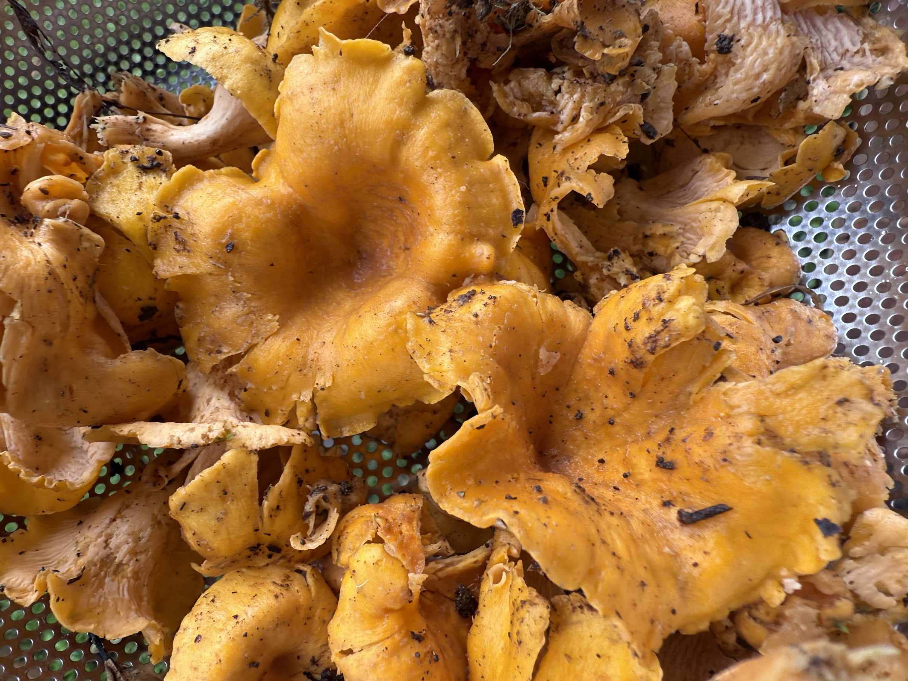
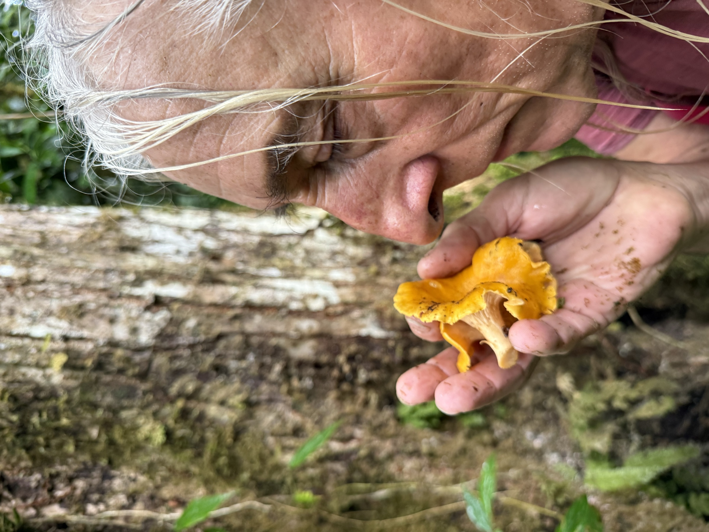

import MedicalDisclaimer from '../../../components/MedicalDisclaimer.astro';

## 栄養と効能

アンズタケは、植物でも野菜でもありません。アンズタケ属（*Cantharellus*）のキノコで、私たちが目にするのはその「実」だけ。残りは地下で、木々の根とからみ合って生きています。カロリーはとても低く、**食物繊維**、**カリウム**、銅、鉄、そしてビタミンB群、とくに**ビタミンB3**を含みます。なにより、**ビタミンD**を天然に豊富に含む数少ない食べもののひとつです。キノコは、私たちの肌と同じように、光を浴びてビタミンDをつくります。黄色がかったオレンジ色は、ニンジンと同じ色素、**カロテノイド**によるものです。基本的な注意点がひとつ。ほとんどの野生のキノコと同じく、アンズタケは**かならず加熱して**食べます。生では消化が悪く、胃腸の不調を起こすことがあります。

**そして、ほかのどんなことよりも優先される決まりがあります。確実に見分けられていない野生のキノコは、決して食べないこと。できれば、その土地の種類をよく知る人と一緒に確かめてください。** よく似たオレンジ色のキノコには、毒のあるものがあります。この記事は私たちのキノコ採りの話であり、同定のための図鑑の代わりにはなりません。

<MedicalDisclaimer locale="ja" />

## 食べ方

アンズタケは、しっかりとした肉質と、ほのかにこしょうのような辛みのある繊細な味、そしてこのキノコならではのアンズの香りをもっています。流水では洗いません——水を吸ってしまうからです。ブラシで汚れを落とし、ナイフの先で柄をこそげます。料理でいちばん大切なのは、まず熱したフライパンで**油をひかずに炒めて**水分を出すこと。それからバター、エシャロットかニンニクを加え、最後にパセリを散らします。こうして仕上げれば、トーストにのせるだけで十分。**オムレツ**、スクランブルエッグ、ローストチキン、生パスタ、リゾットにもすばらしく合います。生クリームをひとさじ加えれば、ソースになります。ほかのキノコと違って、乾燥にはあまり向きません。かたくなってしまうからです。保存するなら、炒めてから冷凍するか、酢漬けにするのがよいでしょう。

## 見分け方と摘み方

アンズタケは栽培できません。特定の木の根と結びついて生きていて、マッシュルームのように生産することに成功した人は、まだいません。だから大切なのは、見分ける目です。

- **ひだではなく、しわ。** かさの裏にあるのは、薄くて密な本当のひだではありません。縁の丸い**厚いしわ**が枝分かれしながら、柄へと流れるように続いています。いちばん大切な見分けのポイントです。
- **じょうごの形。** かさは、はじめは丸くふくらみ、育つにつれて中央がくぼみます。縁は波打ち、不ぞろいです。
- **白くて繊維質の肉。** 柄は、さけるチーズのように筋状にさけます。中は淡い色で、オレンジ色ではありません。
- **アンズの香り。** 新鮮なアンズタケを鼻に近づけると、熟した果物の香りがします。
- **地面に生え、木には生えません。** 木々の足元の苔や落ち葉のあいだに、1本で、あるいは小さくまばらに生えます。切り株に束になって密生することはありません。
- **ていねいに摘む。** 切り取るか、そっと外し、その場で汚れを落とします。ビニール袋ではなくかごに入れて運び、いちばん小さなものと、それぞれの場所の一部は残しておきます。

## 雲霧林のアンズタケ

アンズタケといえば、ヨーロッパや北米の森を思い浮かべます。けれどもアンズタケ属は中米の山々にも分布していて、いくつかの種が、高地の森の**カシ（オーク）**と共生しています。涼しく、苔むし、一年のかなりの期間、雨に恵まれるオルケタの雲霧林は、まさにこのキノコが求める湿り気を与えてくれます。私たちは雨季に、たっぷり雨が降った数日後、農園のまわりの森で見つけます。年が変わっても、同じ場所に出ることがよくあります。摘み取るキノコは、ずっと前からそこで生きている地下の生きものの、実にすぎないからです。これは散歩のついでの採集で、収穫ではありません。キッチンにはふたつかみ、みつかみあれば十分。残りは森のものです。

## 仲間の木々（その共生）

- **カシ（オーク）。** アンズタケは菌根菌です。菌糸が木の根を包み、水とミネラルを届け、かわりに糖を受け取ります。木がなければ、アンズタケもありません。
- **苔と落ち葉の層。** キノコが実をつけるのに必要な、変わらない湿り気を地面に保ってくれます。
- **古く、あまり手の入っていない森。** この共生は、できあがるまでに何年もかかります。木が切られたり、土が踏み固められたりすると、消えてしまいます。

## まちがえてはいけないキノコ

- **木に束になって生える、オレンジ色のキノコ。** オムファロトゥス属（ツキヨタケの仲間、英名ジャック・オー・ランタン）は、薄い本当のひだをもち、切り株に密な束になって生えます。**毒があり**、激しい胃腸の不調を引き起こします。
- **ヒロハアンズタケ（*Hygrophoropsis aurantiaca*）。** よりオレンジ色が濃く、やわらかく、薄くて密な本当のひだがあります。食べる価値は乏しく、消化によくないこともあります。
- **ひとつでも特徴が合わないキノコ。** 迷ったら、食べないこと。写真やアプリだけを頼りに判断してはいけません。

## 知っておきたいこと

- **フランス語では「ジロール」、または「シャントレル」。** 「シャントレル」は、その形から、杯を意味するギリシャ語 *カンタロス* に由来します。ドイツ語では、こしょうのような辛みから *プフィッファーリング* と呼ばれます。
- **虫がつくことはめったにありません。** 虫に好まれないので、摘むのにもっともきれいなキノコのひとつです。
- **「アンズタケ」は、じつは大きな一族です。** 遺伝子の解析によって、アメリカ大陸のアンズタケはヨーロッパのものと同じ種ではなく、近い親戚であることがわかりました。
- **ゆっくり育ちます。** 一晩で顔を出すキノコもあるなか、アンズタケは大きくなるまでに何週間もかかることがあります。
- **日光でビタミンDをつくります。** 私たちの肌と同じように、光の働きでビタミンDを生み出します。
