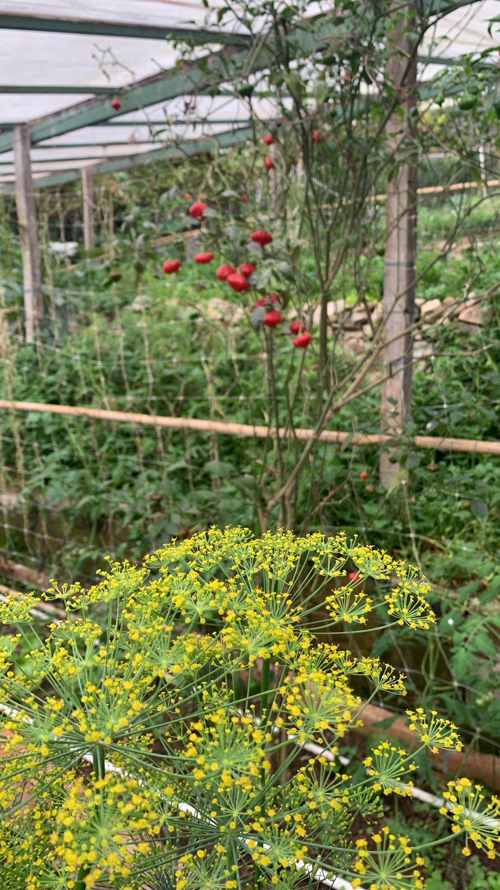

import MedicalDisclaimer from '../../../components/MedicalDisclaimer.astro';

## 栄養と効能

ディル（*Anethum graveolens*）は、ニンジン、パセリ、フェンネル、セロリと同じセリ科の植物です。生の葉には**ビタミンC**、プロビタミンA、葉酸、マンガンが含まれますが、一度に食べる量はごくわずかなので、ディルの値打ちはなによりもその香りにあります。種には精油が豊富で、主成分の**カルボン**とリモネンが、アニスとキャラウェイのあいだのような風味を生みます。古代から、**消化を助け**、お腹の張りや疝痛（せんつう）をしずめるために使われてきました。赤ちゃんに与えられた「グライプウォーター」の昔ながらの材料でもあり、北欧の言葉でのその名は「なだめる」という意味の言葉に由来するといわれます。こうした使い方は、しっかりした臨床試験よりも、伝統に支えられたものです。注意点はわずかです。セロリやニンジンにアレルギーのある方は、ディルにも反応することがあります。精油や、種の濃縮された製品は、妊娠中にはすすめられません。料理に使うぶんには問題ありません。

<MedicalDisclaimer locale="ja" />

## 食べ方

ディルは**魚**のハーブです。塩、砂糖、ディルでサーモンを漬ける北欧の *グラブラックス* には欠かせず、焼き魚にもセビーチェにもよく合います。新**ジャガイモ**、卵、キュウリ、ヨーグルトとも好相性。ザジキの一部のレシピや、中央ヨーロッパのキュウリのサラダ、ボルシチに香りを添えるのもディルです。葉は繊細なので、使う直前に刻み、加熱の最後に加えます。熱で香りが飛んでしまうからです。**花のついた傘形の花序**と種は香りがより強く、ピクルスや野菜の酢漬け、パン、ザワークラウトの香りづけに使います。黄色い花は食べられ、お皿の上でとてもきれいです。ディルは乾燥には向きません。保存するなら、刻んで冷凍するか、酢に漬けておくのがよいでしょう。

## オーガニックでの育て方

ディルは、育つのが早くて簡単な一年草です。ただし、育てる場所に直接種をまくことが条件です。

- **直まきにする。** まっすぐ伸びる直根は、植え替えを嫌います。すじまきにして、ごく薄く土をかけると、1〜2週間で芽が出ます。
- **日なたと、水はけのよい土。** 軽い土で十分です。肥料が多すぎると、葉はよく茂っても香りが弱くなります。
- **風の当たらない場所。** 1メートル以上に伸びる中空の茎は、倒れやすいのです。
- **少しずつ、何度もまく。** ディルはすぐに花を咲かせます。3〜4週間ごとにまき直すと、新鮮な葉を途切れなく収穫できます。
- **葉は花が咲く前に収穫する。** いちばん香りが高い時期です。種は、花序が茶色くなったら収穫します。
- **何株かは花を咲かせておく。** 傘形の花が役に立つ虫をたくさん呼び寄せ、株はこぼれ種で増えていきます。
- **花序にアブラムシがつくことがある。** たいていは、花に引き寄せられたテントウムシやハナアブが自然に抑えてくれます。

## 私たちの菜園のディル

ここでは、ディルはほかの作物のあいだで育っています。写真では、バジルにまじって黄色い花を満開に咲かせているのが見えます。その傘形の花は、トマトのそばでも開いています。私たちは、あえて花を咲かせています。大きく平らな花序は、**益虫**——ハナアブ、テントウムシ、小さな寄生バチ——にとって、菜園でいちばんの食卓のひとつ。その幼虫が、アブラムシやイモムシを食べてくれます。何の薬剤も使わない菜園では、仕事をしてくれるのは彼らなのです。標高1,800メートルのオルケタの涼しさは、ディルによく合います。弱らせるのは雨季で、にわか雨に茎を倒され、湿気がこもるころです。そのあとはこぼれ種で増え、若い苗が畝のあいだのあちこちに、また顔を出します。

## 相性のよい植物（コンパニオンプランツ）

- **キャベツの仲間。** 花を咲かせたディルは、モンシロチョウの幼虫をねらう寄生バチを呼び寄せます。
- **キュウリとズッキーニ。** 送粉者とアブラムシの天敵を呼び寄せます——そしてあとで、ピクルスの瓶のなかで再会します。
- **レタスとタマネギ。** 全般によい隣人です。
- **バジル。** 写真のように、ここでは一緒に育っています。

## 避けたい植物

- **ニンジン。** 同じ科なので同じ害虫を呼び寄せ、ディルはニンジンの生長を妨げるともいわれています。
- **フェンネル。** たがいに交雑して、風味のはっきりしない種ができることがあります。
- **トマト（ディルが大きく育ってから）。** 菜園の言い伝えでは、若いディルはトマトによく、花が咲くころにはじゃまになるとされています。株のすぐそばで大きく育てないようにします。

## 知っておきたいこと

- **その名は、安らぎを思わせます。** 英語の *dill* や北欧の言葉でのその名は、「あやす、なだめる」という意味の古い北欧語の動詞に由来するといわれます。
- **ひとつの植物に、ふたつのスパイス。** 葉と種では味が違います。葉は青くさわやか、種は温かみがあり、キャラウェイに近い風味です。
- **古代から栽培されています。** エジプト人もローマ人も、調味料として、また薬として使っていました。
- **フェンネルとよくまちがえられます。** 葉は似ていますが、ディルはもっと小さな一年草で、茎は1本で中空、球根のような株元はありません。
- **花も食べられます。** 香りは葉と同じで、もっとやさしい風味です。
