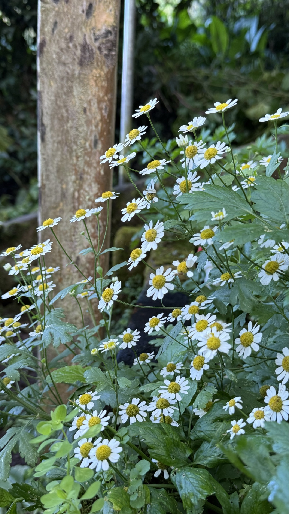

import MedicalDisclaimer from '../../../components/MedicalDisclaimer.astro';

## 栄養と効能

「カモミール」と呼ばれる植物はいくつかあり、見分けておく価値があります。私たちの菜園で育っているのは**フィーバーフュー**（*Tanacetum parthenium*、和名ナツシロギク）で、ラテンアメリカではよく、ただ *マンサニージャ*（カモミール）と呼ばれます。幅が広く平らで、切れ込みのあるやわらかな緑の葉が目印。寝る前のハーブティーでおなじみのジャーマンカモミール（*Matricaria chamomilla*）の、フェンネルのように細い葉とはまったく違います。どちらもキク科ですが、成分も使い方も同じではありません。フィーバーフューの名を知らしめているのは、葉に含まれる苦味成分**パルテノライド**です。古代から熱や頭痛に用いられ、現在はおもに**片頭痛の予防**について研究されています。いくつかの臨床試験が発作の頻度のゆるやかな減少を示唆していますが、結果は研究によってばらつきがあります。注意点は大切です。**妊娠中**・授乳中の使用はすすめられません。生の葉を噛むと口内炎を起こすことがあり、キク科（ブタクサ、キク、マリーゴールド）にアレルギーのある方は反応が出ることがあります。抗凝固薬と相互作用を起こす可能性もあります。長く使ったあとは、急にやめずに少しずつ減らしていきます。

<MedicalDisclaimer locale="ja" />

## 使い方

フィーバーフューは料理用のハーブではありません。葉ははっきりと**苦く**、樟脳と柑橘を思わせる香りがします。いちばん手軽なのは**ハーブティー**。乾燥させた花と葉を小さじ1杯、沸かしたてのお湯1杯に入れて5分蒸らし、少しのハチミツや、ミント、バーベナの葉を数枚加えて苦味をやわらげます。イギリスでは昔から、生の葉を1〜2枚、バターを塗ったパンにはさんで食べました。味をごまかし、葉が口に直接ふれないようにするためです。保存するには、花の盛りに茎を切り、小さな束にして、日陰の風通しのよい場所に逆さに吊るして乾かします。寝る前に飲む、やさしいリンゴの香りのお茶をお求めなら、必要なのはジャーマンカモミールです。フィーバーフューは別の植物で、もっと苦く、作用も強いものです。庭では、小さなデイジーの花束が切り花としてとても長もちします。

## オーガニックでの育て方

もっとも育てやすい薬草のひとつです。いったん根づけば、あとは自分で育ってくれます。

- **種は土の表面にまく。** とても細かい種は、発芽に光を必要とします。土をかぶせずに培養土の上に置けば、1〜2週間で芽が出ます。
- **日なたか半日陰。** 日なたでいちばんよく咲きますが、木もれ日程度の光でもよく育ちます。
- **ふつうの、水はけのよい土。** 肥えた土は必要ありません。苦手なのは水がたまることだけです。
- **株間は30センチ。** 一株が高さ40〜60センチの茂みになります。
- **花のあとに切り戻す。** 思いきって刈り込むと、葉が勢いを取り戻し、次の花が咲きます。
- **こぼれ種で増える、短命な多年草。** 株の寿命は2〜3年ですが、こぼれ種の苗があとを継ぎます。広がりを抑えたいときは、咲き終わった花を切り取ります。
- **害虫はごくわずか。** 苦くて香りの強い葉は、めったに食べられません。

## 私たちの菜園のフィーバーフュー

フィーバーフューはバルカン半島とコーカサスの山地が原産で、アメリカ大陸の涼しい地域にもずっと昔から帰化しています。標高1,800メートルのオルケタは、この植物にぴったりです。霜も厳しい暑さもないので、ひとつの季節だけでなく、ほぼ一年じゅう花を咲かせます。支柱の根元や畝の縁に、ほかの植物にまじって根づき、季節から季節へとひとりでに種を落として増えていきます。私たちがするのは、若い苗を、花を咲かせてほしい場所へ移すことだけです。雨季に株を弱らせるのは、多すぎる湿気です。花が終わるたびに切り戻して、株の風通しをよくしています。

## 相性のよい植物（コンパニオンプランツ）

- **キャベツなどのアブラナ科。** その強い香りが、アブラムシなどの好ましくない虫を遠ざけるといわれています。
- **バラ。** 同じ理由から、昔ながらの庭でよく見られる組み合わせです。
- **ミント、バーベナ、タイム。** ハーブティーの一角の仲間で、好む条件もよく似ています。
- **小道や畝の縁。** そこで花の縁取りとなり、作物のじゃまをせずに、こぼれ種で増えていきます。

## 避けたい植物

- **送粉者に頼る作物（ズッキーニ、キュウリ、イチゴ）。** フィーバーフューの香りはミツバチに嫌われるといわれています。数メートル離しておくのがよいでしょう。
- **か弱い若い苗。** こぼれ種でたくさん増えるので、すぐに覆いかぶさってしまうことがあります。
- **湿った土を好む植物。** 同じだけ水をやられるのは苦手です。

## 知っておきたいこと

- **英名「フィーバーフュー」は、ラテン語の *febrifugia*——「熱を追い払うもの」に由来します。** もっとも古い使い方のひとつです。
- **パルテノン神殿にまつわる言い伝えがあります。** *parthenium* という名は、神殿の建設中に落ちた職人の手当てに使われたことにちなむ、といわれます。
- **寝る前のお茶のカモミールではありません。** 見分けるには葉を見ます。フィーバーフューは幅が広く切れ込みがあり、ジャーマンカモミールは糸のように細い葉です。
- **タンジーやキクの親戚です。** 実際、長いあいだキクの仲間に分類されていました。
- **八重咲きの品種もあります。** 白いポンポンのような花の品種は、観賞用に栽培されています。
