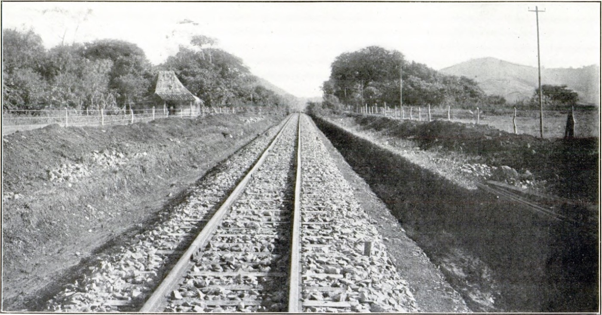
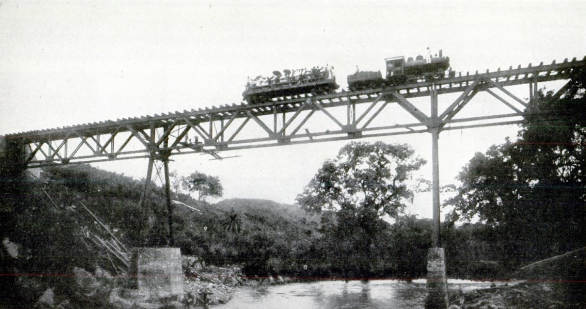

import NoteBox from '../../../components/NoteBox.astro';

## 入植者たちよりずっと前に

ボケテは、コーヒーとともに始まったわけではありません。渓谷の近くにある岩陰、カシータ・デ・ピエドラでは、考古学的な発掘調査によって、9,000年以上前にさかのぼる人類の居住が明らかになっています。2007年、考古学者ルース・ディカウ（スミソニアン熱帯研究所）は、そこで十二個の石からなる遺物群を発見しました——石英、黄鉄鉱、玉髄、そして加工されたデイサイトの円筒——およそ4,800年前のものと推定され、中央アメリカ低地における、シャーマニズムの実践を示す、現存する最古の物的証拠とされています。

その後、紀元前300年から西暦600年のあいだ、バルー火山を取り巻く高地には、この地域で最初の、階層化された農耕社会が営まれていました——いわゆる「バリレス文化」です。円錐形の兜をかぶった石像や、巨大な磨石で知られており、1947年、農場主が樽（バリル）の形をした円筒形の石を次々と見つけたことから、偶然発見されました。スペイン植民地時代、その後、ボケテの険しい地形は、ンゴベ族の人々にとっての避難所となり、彼らは植民地政府の手が及ばないその地で、自らの伝統を守り続けました。

「ボケテ」という名前そのものも、この歴史に由来します：それは「隙間」あるいは「開口部」を意味し——最初の牛追いたちが、そして後には金の採掘者たちが、太平洋へと向けて山脈を越えるために通った、その裂け目を指しているのです。

## 渓谷への定住

先住民以外による定住が本格的に始まったのは、19世紀後半のことです。最初の入植者たちは、近隣の郡——ブガバ、グアラカ、ダビッド、ドレガ——からやって来て、その後、小規模ながらも長く影響を残すことになる、ヨーロッパからの移民の波が加わりました：フランス、ドイツ、スイスの家族たち、そして北アメリカの人々です。1907年までに、渓谷にはすでに七つの集落がありました：リノ、バホ・ボケテ、キエル、バホ・モノ、ロス・ナランホス、ハラミジョ、そしてパロス・ボボス（現在のパルミラ）——これらはすべて、当時はまだ行政上、ダビッド郡の一部でした。

これらの入植者たちを引き寄せたもの：肥沃な火山性の土壌、沿岸部の暑さとは対照的な涼しい気候、そしてカリブ海と太平洋を結ぶ戦略的な通路であったことです。

## 郡の設立——1911年4月11日

1911年1月17日、パブロ・アロセメナ大統領によって承認された法律第20号により、ボケテはチリキ県の一郡として設立されました。自治体当局が正式に発足したのは1911年4月11日のことで——この日は、今日でも町の記念日として祝われています。この最初の行政府は、市長にフェリペ・ゴンサレス、地方裁判官にマクシモ・サンタマリア、議会議長にカミロ・カスティージョ、書記にドミンゴ・ターナー、そして会計にパウリノ・ルイスを迎えました。

興味深い事実があります：この郡の法律上の中心地は、（今日の町の中心である）バホ・ボケテではなく、リノでした——この、法律と現実とのずれが正式に是正されたのは、三十年後の1941年になってからのことでした。

## 開かれていく町：鉄道、ホテル、そして電気

ボケテは、わずか数年のうちに世界へと開かれていきました。1913年、コトワ農園——今日でも稼働を続ける、もっとも古いコーヒー農園の一つ——が、北アメリカからの移民によって設立されました。1914年には、町で最初のホテルが開業しました。アメリカ人のジョゼフ「ポップ」ライトが営む、五部屋だけの宿で、当時ダビッドから馬や牛車、あるいは徒歩でやって来た旅人たちのためのものでした——道路は、まだ存在していませんでした。同じ年、ダビッドとボケテ、そしてコンセプシオンを結ぶ、チリキ国有鉄道の建設が始まり、資料によって1916年4月22日、あるいは23日に開通しています。

1927年1月3日、ボケテ最初の発電所が稼働を始め、バホ・ボケテとリノに電力を供給しました——照明の料金は「お客様のご満足のいくように」課金され、30ワットの電球一つにつき、金貨1ドルでした。その二年後、1929年には、住民たちが政府に対し、照明とコーヒー加工機械のため——そして映画館のために、地元の水力発電所の建設を提案しました：これは、まだ車の通れる道すらなかった小さな町における、近代化への野心を物語る、興味深い事実です。

## この渓谷を形づくった人々

ボケテの歴史には、幾人かの人物が繰り返し登場します。フィンカ・ドン・パチの現在の所有者の高祖母にあたる**ブラシナ・サムディオ**は、早くも1873年にバルー火山の斜面に定住しました：彼女は、大コロンビア（グラン・コロンビア）のもとで発行された、ボケテ最古の土地権利書を所有しています——1903年にパナマ共和国が誕生する、実に三十年も前のことです——そして、この地域で初めて土地権利書を持った女性でもありました。

ノルウェー人技師の**トレフ・バケ・ムニケ**は、ゲーサルズ将軍のもとで、パナマ運河の非常用閘門の設計に携わった人物で、1924年に引退し、妻ユリアとともに、後にフィンカ・レリダとなる365ヘクタールの土地に居を構えました。1929年、彼らのコーヒー収穫は、パナマから初めてヨーロッパへと輸出されたコーヒーとなりました——通常価格の三倍で売れたのです。ムニケはまた、コーヒーチェリーの選別機「シフォン」も発明し、500種を超える地元の鳥類を記録しました。その記録は、後にシカゴのフィールド博物館に寄贈されています。

1946年、スウェーデン人のエリオット一家——ジャーナリストの**ヴェラ・J・エリオット**、その夫であるハンス・エリオット船長、そしてヴェラの兄弟カール・ヤンソン——が、「ポップ」ライトの最初のホテルを買い取り、当時この地域では前例のなかった、ブティックホテルという形態に作り変えました。その名は**ホテル・パナモンテ**。以降の数十年にわたり、「ドーニャ・ヴェラ」は、リチャード・E・バード提督（そこで南極の回想録を書き上げたとも言われています）、飛行家チャールズ・リンドバーグ、ロックフェラー家の一族、1957年には副大統領のリチャード・ニクソン、1959年と、再び1967年には女優のイングリッド・バーグマンを迎えました——そして後には、パナマにおけるエコツーリズムの先駆者とみなされる娘の**インガ・コリンズ**の采配のもと、イラン国王モハンマド・レザー・パフラヴィーとファラ・ディバ、そしてショーン・コネリーをも迎え入れています。

<NoteBox>
  

    <strong>道はなくとも、著名人には事欠かない小さな町。</strong>その対比を思い描いてみる価値があります：
    1940年代から60年代にかけて、鉄道か馬でしかたどり着けない、完全に農業だけの山村でありながら、当時
    もっとも著名な人々の何人もを迎えていたのです——それは、組織立った観光業が到来するはるか前から、
    ボケテの魅力と涼しい気候が、すでに人々を惹きつけていたことの証しなのです。
  

</NoteBox>

## 祭りを生んだ、あの洪水

1950年、アルト・キエル集落の創設者一族の一人である**ルイス・キエル**が、ボケテ最初のコーヒー祭りを創設しました。この催しは不定期で、1950年、1957年、1961年、1969年にしか開催されませんでした。そして**1970年4月9日**、カルデラ川の大洪水が住民の三分の一を襲い、八人の命が失われました。ホテル・ドス・リオスは被害を受け、始まったばかりの祭りは中断を余儀なくされました。

地域社会は、早くも1973年には立ち直り、規模を拡大した、いまでは毎年恒例となった形でこの祭りを復活させました：**フェリア・デ・ラス・フローレス・イ・デル・カフェ（花とコーヒーの祭り）**——今日、この町を象徴する催しの一つであり、それは、乗り越えなければならなかった災害から、直接生まれたものだったのです。

## 農業の郡から、世界的な目的地へ

観光への転換は、多くの人が思うよりも、はるかに最近の出来事です。ボケテが、海外移住を扱う専門誌の中で、選ばれる目的地として登場し始めたのは、2000年前後になってからのことでした——この傾向は、2000年代から2010年代にかけて、著しく加速していきます。1998年、それまで三つのコレヒミエント（バホ・ボケテ、カルデラ、パルミラ）から成っていたこの郡は、アルト・ボケテ、ハラミジョ、ロス・ナランホスの新設とともに、六つへと再編されました——これは、渓谷の成長を行政が追認したものでした。今日、ボケテには、三十を超える国々から来た、数千人規模の外国人永住者が暮らしています——それ自体が一つの物語であり、別の記事でお伝えしています。

[今日のボケテへの行き方 →](/ja/journal/boquete-travel-guide/)
[ご滞在のご予約 →](/ja/faqs-contact/)
