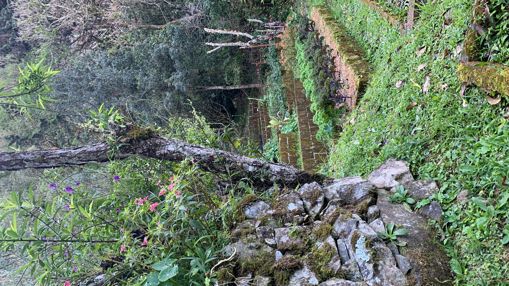

import MedicalDisclaimer from '../../../components/MedicalDisclaimer.astro';

## 栄養と効能

ケール（*Brassica oleracea* var. *sabellica*、文献によっては *acephala* に分類）は、葉物野菜のなかでも屈指の栄養密度を誇ります。生の葉1カップで、1日に必要な**ビタミンK**の約68%、**ビタミンC**の20%以上をまかなえるうえ、βカロテン（ビタミンAの前駆体）や植物性のカルシウムもたっぷり含んでいます。深い緑色と効能の一部は、目の健康との関連が知られる2つのカロテノイド、**ルテイン**と**ゼアキサンチン**によるもの。さらに、葉を切ったり噛んだりするとスルフォラファンなどの化合物に変わるグルコシノレートも含み、これらは抗酸化・抗炎症作用について研究が進められています。変種名の *acephala* はギリシャ語で「頭のない」という意味。キャベツと違って、ケールは一生涯、固い玉をつくらず、開いたロゼット状の葉のまま育ちます。ひとつ補足を：多くのアブラナ科野菜と同様、ケールにも甲状腺腫誘発物質が含まれ、ごく大量を長期間とり続けると甲状腺の働きに影響する可能性があります。通常の食事の範囲ではまったく問題になりませんが、甲状腺の治療を受けている方は心に留めておくとよいでしょう。

<MedicalDisclaimer locale="ja" />

## 食べ方

生のケールはかなり硬いこともありますが、オリーブオイルとレモン汁を少し加えて数分しっかり揉み込むと、驚くほど柔らかくなり、苦みもやわらぎます。サラダが見違えるシンプルなコツです。ニンニクとさっと炒めたり、スープや煮込みの仕上げに加えたり（ポルトガルのカルド・ヴェルデがその代表格）、オイルをひと回しして塩をひとつまみふり、オーブンでカリッとしたチップスにしたりと、加熱調理にもよく合います。生のままスムージーに入れても、しっかりした食感がよく攪拌されます。葉身より繊維が多いため取り除かれがちな中央の茎も、細かく刻んで葉より少し長めに火を通せばおいしく食べられます。ほうれん草のような柔らかい葉と違い、長く煮込んでも完全には崩れない野菜です。

## オーガニックでの育て方

ケールは、オーガニック菜園のなかでもとくに寛容な作物のひとつ。手がかからず、丈夫で、初心者の失敗にも驚くほど強い野菜です。

- **直まきでもポットまきでも簡単。** 穏やかな気温なら1〜2週間で発芽し、パセリやニンジンと違って、ケールの苗は植え替えにもよく耐えます。
- **暑さを嫌う冷涼気候の植物。** レタスと同じく、暑さが続くと薹（とう）が立って苦くなりがち。涼しい環境でこそ本領を発揮し、熱帯の真夏には向きません。
- **肥料食い。** ケールは生長が早く、長期間にわたって大量の葉をつけます。植えつけ時に堆肥を混ぜ込み、その後も定期的に有機物を補えば、土を疲れさせずに収穫を続けられます。
- **一度に刈らず、葉ごとに収穫。** いちばん大きく古い外葉から摘み取り、株の中心は残して生長を続けさせます。この「かき取り収穫」なら、数か月、ときにはワンシーズンまるごと収穫が続きます。
- **定期的に、たっぷりと水やりを。** 水やりの合間に土が完全に乾くと株がストレスを受け、早く花をつけやすくなります。マルチングで土の湿り気を一定に保つと効果的です。
- **アブラナ科おなじみの害虫** ——モンシロチョウの幼虫、ノミハムシ、アブラムシ——がオーガニック栽培での最大の課題です。植えつけと同時に防虫ネットをかけるのが、今もいちばん簡単で効果的な対策です。

## 私たちの菜園のケール

オルケタの雲霧林の、涼しく安定した気候は、ケールにとってほぼ理想的な環境です。熱帯の多くの地域では、ケールは涼しい季節にしか育たず、暑さが続きはじめるとすぐに花をつけて苦くなってしまいます。けれどもここでは標高のおかげで、一年を通してほぼ穏やかな気温が保たれ、低地のように暑さで栽培を中断する必要がありません。（温帯から来たガーデナーにはおもしろい話をひとつ。ほかの土地では秋の軽い霜がケールをいっそう甘くします。寒さによってデンプンが糖に変わるためです。霜の降りないボケテではこれは決して起こりませんが、そのぶん涼しい気候が、短期集中ではなく長く安定した生長をもたらしてくれます。）有機物に富んだこの地域の火山性土壌は、肥料食いのケールにぴったり。葉を一枚ずつ何か月も収穫できるので、地元のお客さまに直接届ける農園にとって、とても頼もしい作物です。

## 相性のよい植物（コンパニオンプランツ）

- **ネギ類——タマネギ、ニンニク、チャイブ。** その香りがノミハムシや一部のアブラムシなど、ケールにつく害虫を惑わせ、宿主となる植物を見つけにくくします。
- **ディルやコリアンダーなどのハーブ。** ハナアブや寄生バチといった益虫を呼び寄せ、アブラムシの数を抑える手助けをしてくれます。
- **マメ科（インゲン、エンドウ）。** 空気中の窒素を土に固定し、窒素をたくさん必要とするケールのために土を自然に肥やします。
- **マリーゴールドとナスタチウム。** オーガニック菜園の定番コンビ。アブラムシを食べるハナアブを呼び寄せ、ナスタチウムは害虫をケールから引き離す「おとり植物」としても働きます。
- **トマト。** あまり知られていませんが興味深い組み合わせ。近くに植えると、ケールの葉を食べるコナガの被害が減るという研究もあります。

## 避けたい植物

- **ほかのアブラナ科（キャベツ、ブロッコリー、カリフラワー）。** 植物そのものが問題なのではなく、同じ害虫や病気を共有するためです。密集させすぎると、株から株へと広がりやすくなります。
- **イチゴ。** キャベツ類全般と相性が悪いとガーデナーのあいだでいわれることがありますが、科学的な裏づけは限られており、管理された研究よりも経験的な観察によるものがほとんどです。
- **ヒマワリ。** 根から出る物質が、近くの野菜の発芽や生長を妨げることがあります。近くに植えすぎるとケールも影響を受けます。

## 知っておきたいこと

- **ケール、キャベツ、ブロッコリー、カリフラワー、芽キャベツは、厳密にいえば同じ種です。** いずれも地中海沿岸の野生キャベツ *Brassica oleracea* の子孫。何世紀にもわたる人の選抜によって、葉、花蕾、わき芽と、強調される部分ごとに枝分かれしてきました。たった一つの祖先植物から生まれた、驚くべき多様性です。
- **学名は文字どおり「頭のない」という意味。** ギリシャ語由来の *Acephala* は、いとこのキャベツとの違いをよく表しています。ケールは決して固い玉をつくらず、一生、開いたロゼットのままなのです。
- **もっとも古くから栽培されてきたキャベツ類のひとつ。** 古代ギリシャやローマの時代にはすでにその痕跡があり、今日の結球キャベツが選抜によって生まれるずっと前のこと。ケールは最近の流行ではなく、栽培キャベツの最古の姿のひとつなのです。
- **流行するはるか前から、田舎料理の主役でした。** ポルトガルのカルド・ヴェルデから北ヨーロッパの伝統的なケール料理まで、この結球しない品種は寒さに強い自給用野菜として長く重宝されてきました。2010年代に健康的な食生活のシンボルになる、ずっと前からの話です。
