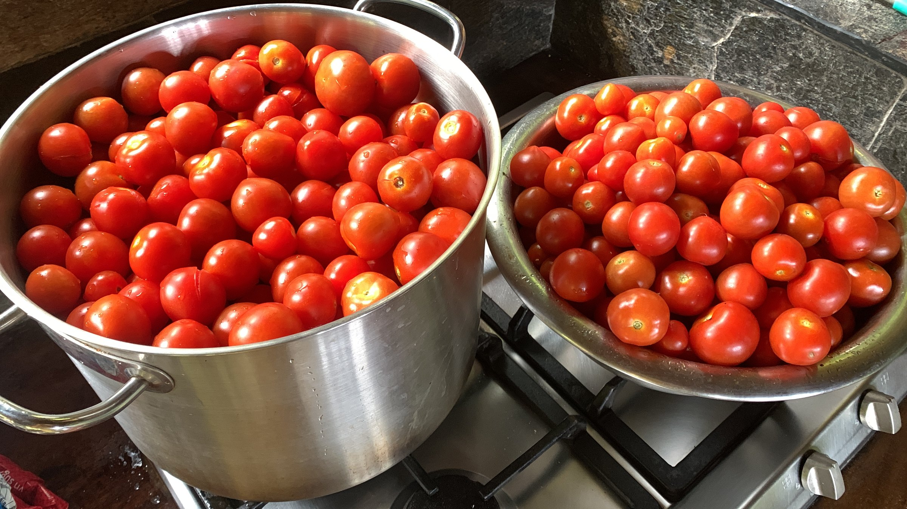
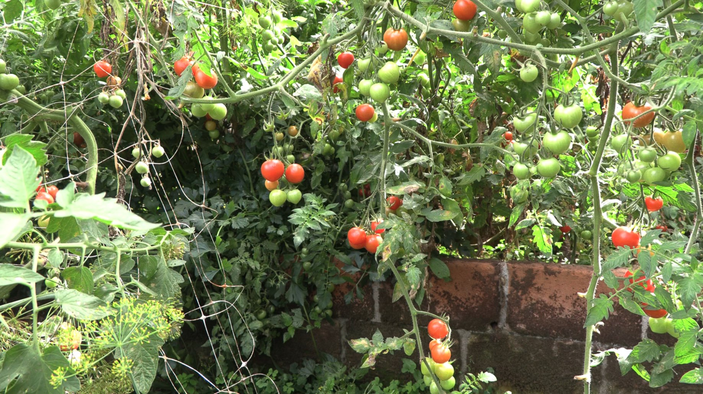

import MedicalDisclaimer from '../../../components/MedicalDisclaimer.astro';

## 栄養と効能

トマト（*Solanum lycopersicum*）の栄養面での評判は、何よりも赤い色のもとであるカロテノイド色素、**リコピン**によるものです。リコピンは、生よりも加熱したトマトのほうが体に吸収されやすいという特徴をもちます。加熱すると栄養が壊れるというふつうのルールの、注目すべき例外です。**ビタミンC**、**ビタミンK1**、カリウム（同じ重さならバナナに匹敵する量）、葉酸のよい供給源でもあります。種小名の *lycopersicum* はギリシャ語で文字どおり「オオカミの桃」。危険とされたナス科の果実を長く警戒していた、ヨーロッパの植物学者たちがつけた名前です。一方「トマト」という言葉は、ヨーロッパ人が来るずっと前からこの植物を育てていたアステカの人々の言語、ナワトル語の *tomatl* に由来します。水分と食物繊維が豊富でカロリーはごく低く、カロリーあたりの栄養密度がとりわけ高い、基本の食材なのです。

<MedicalDisclaimer locale="ja" />

## 食べ方

トマトは、生でも加熱しても、ほとんど無限の料理になります。新鮮で完熟したものを、スライスして塩をふるだけ、あるいはオリーブオイルとバジルでサラダにすれば、摘みたてこそが最高の味。青いうちに収穫して冷蔵室で追熟させるスーパーのトマトには、とても再現できない体験です。ソースとしてじっくり煮込めば、生とはまったく違う深いうま味が生まれます。イタリア料理やメキシコ料理をはじめ、世界中の数多くの食文化でトマトが中心にある理由です。冷たいガスパチョに、天日やオーブンで乾燥させたドライトマト（甘みがぐっと凝縮されます）に、あるいはニンニクとハーブと一緒にオリーブオイルでじっくりコンフィにしても。あまり知られていませんが、遅い時期にたくさん収穫して困ったガーデナーに好評なのが、まだ硬く酸味のある青いトマト。フライやジャムにするととてもおいしく、シーズンの終わりに何ひとつ無駄にしない方法です。

## オーガニックでの育て方

トマトは、オーガニック菜園でおそらくもっとも象徴的で、もっとも手のかかる作物です。たくさんの実をつけてくれるぶん、日光、規則正しい水やり、カビの病気への警戒を、同じくらい求めます。

- **定植の数週間前に室内で種をまく**か、すでに育った苗を買いましょう。トマトが実をつけるには、長く暖かいシーズンが必要です。最初の葉の下まで深く植えると、埋めた茎に沿って根がしっかり張ります。
- **支柱はほぼ必須。** 心止まりしない（伸び続ける）品種は、簡単に2メートルを超えるので、しっかりした支柱、ケージ、またはネットが必要です。そうしないと実が地面について腐ってしまいます。
- **深く規則正しく水やりを、葉にはかけずに。** 多すぎたり少なすぎたりの不規則な水やりは、実割れや尻腐れ病の原因になります。尻腐れはカルシウムに関わる生理障害ですが、多くの場合、土の本当の欠乏より水分ストレスによって引き起こされます。
- **疫病対策には風通しが欠かせない。** 湿潤な気候で、トマトがもっとも恐れる病気です。株間をゆったりとり、下葉を取り除き、必要ならトンネルや簡易ハウスで雨よけをすると、リスクを大きく減らせます。
- **わき芽かき。** 心止まりしない品種で葉のつけ根に出るわき芽を摘むと、株の力が少ない主茎に集中し、実が大きくなります。必須ではありませんが、限られた場所では収量がはっきり上がります。
- **色づききったものから、順に収穫。** 熟した実は簡単に株から外れます。シーズンの終わりには、まだ青いトマトを摘んで、夜の冷え込みを避けて室内で追熟させることもできます。

## 私たちの菜園のトマト

トマトは日光と暑さが大好き。この点で、オルケタの雲霧林は熱帯の低地と比べて本当の妥協を強いますが、実はその妥協がトマトに有利に働いています。ボケテ地域と、すぐ近くのセロ・プンタは、パナマでも有数の野菜産地として知られ、その筆頭がトマトです。まさにこの涼しい高地の気候のおかげで、涼しい夜が熟すスピードをゆるめて糖分と香りを凝縮させ、高地ならではの強い日射が、低地より穏やかな気温を十分に補ってくれるのです。肥沃で水はけのよい火山性土壌が、この恵まれた条件を完成させます。いちばんの課題は、やはり雲霧林特有の湿気。疫病にとって理想的な条件をつくってしまうのです。だからこそ、チリキ県の高地の多くの生産者はトマトをトンネルや簡易ハウスの中で育てており、場所が許すならぜひ検討したい方法です。

## 相性のよい植物（コンパニオンプランツ）

- **バジル。** 菜園でもっとも有名な組み合わせ。バジルはトマトにつく一部の害虫を遠ざけるといわれ、近くの実の味がよくなるというガーデナーも多くいます。科学的に測るのは難しい効果ですが、しっかり根づいた菜園の伝統です。
- **フレンチマリーゴールド（タゲテス）。** 根から出る物質が、土の中の一部のセンチュウを抑えるとされます。オーガニック栽培ではほかに手の打ちにくい、よくある問題です。
- **ニンジン。** よい定番の仲間。根の深いニンジンはトマトの浅い根と競合せず、トマトの葉がつくる軽い日陰を楽しみます。
- **ボリジ。** 送粉者を呼び寄せるほか、トマトの葉を食べるイモムシ、とくにオオタバコガの幼虫を捕食する益虫も呼び寄せます。
- **パセリ。** 縁に植えればトマトと競合せず、役に立つ益虫を呼び寄せるとされ、パセリ自身も隣の葉がつくる半日陰の恩恵を受けます。

## 避けたい植物

- **ジャガイモ。** ナス科の近いいとこで、トマトと同じカビの病気（疫病を含む）を共有します。近くで育てると、株から株へ広がるリスクが大きく高まります。
- **キャベツなどのアブラナ科。** 旺盛な生長でトマトと養分を奪い合い、一部のガーデナーによれば、わずかなアレロパシー作用もあるとされます。ただし証拠は限られており、問題の大部分はおそらく単純な競合です。
- **トウモロコシ。** トマトと共通の害虫がいます。同じイモムシが、襲う作物によってトウモロコシのアワノメイガのような害虫として、あるいはトマトの果実を食べる害虫として呼ばれているのです。隣り合わせに植えると、害虫が作物から作物へ移りやすくなります。

## 知っておきたいこと

- **トマトはヨーロッパで長いあいだ有毒だと考えられていました。** 16世紀に伝わったトマトはナス科に属し、その仲間のいくつかは実際に有毒です。また、ピューター（白目）の食器で食べたこと（鉛を多く含み、トマトの酸で溶け出します）が、ヨーロッパの貴族のあいだで実際に中毒を起こし、悪い評判を強めたのではないかとも考えられています。
- **アメリカでは法律上は野菜、植物学的には果実。** 1893年、アメリカ連邦最高裁判所が純粋に関税上の理由からこの問題に決着をつけました（*ニックス対ヘデン*事件）。ただし、液果（ベリー）という科学的な分類は何も変わっていません。
- **在来の固定種（エアルーム）は数千品種。** 形も色も味も驚くほどさまざまで、スーパーでふつう見かける、ひと握りの規格化された商業品種とは対照的です。
- **原産はメキシコではなくアンデス。** 野生のトマトは南米のアンデス地方が原産とされますが、今日私たちが育てているものに近いかたちに栽培化されたのは、メキシコのアステカの人々のもとでした。
