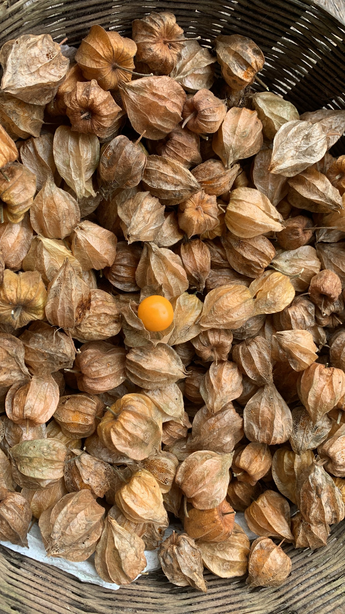

import MedicalDisclaimer from '../../../components/MedicalDisclaimer.astro';

## 栄養と効能

ウチュバ（*Physalis peruviana*）には、育つ国の数とほとんど同じだけの名前があります。コロンビアではウチュバ、ペルーではアグアイマント、エクアドルではウビージャ。ほかにもフィサリス、ゴールデンベリー、ケープグーズベリー、そしてフランスでは**アムール・アン・カージュ**——「籠の中の恋」——と呼ばれます。実を小さなランタンのように包む萼（がく）にちなんだ名前です。大粒のサクランボほどのこのオレンジ色の実は、**ビタミンC**と、カロテノイドとしての**プロビタミンA**が豊富で、ビタミンB群、鉄、リン、食物繊維も含みます。さらに、ホオズキ属特有の成分である**ウィタノライド**やフィサリンも含まれ、実験室では抗炎症作用が研究されています。有望な研究ではあるものの、人での確かな応用にはまだ遠い段階です。大切な注意点がひとつあります。多くのナス科植物と同じく、この植物は**葉、茎、未熟な青い実**にアルカロイドを含むため、これらを食べてはいけません。食べられるのは、黄金がかったオレンジ色に完熟し、萼が乾いて紙のようになった実だけです。

<MedicalDisclaimer locale="ja" />

## 食べ方

ウチュバは、何よりもまず**生**で、食べる直前にランタンから取り出していただきます。その味わいは驚きに満ちています。酸っぱさと甘さが同時にあり、ミニトマト、パイナップル、マンゴーを思わせる香りがします。そのまま食べても、フルーツサラダに加えても。萼を花びらのように実の上に折り返して、デザートの飾りにもします。ヨーロッパの菓子店でよく見かけるのは、この姿です。アンデスでは、**ジャム**やシロップ、焼いた肉に添える甘酸っぱいソースによく加工されます。ペルーでは、アグアイマントを干して、酸味のあるレーズンのようにしても楽しみます。ダークチョコレートとも相性抜群。萼を持って溶かしたチョコレートにくぐらせれば、見た目も華やかなお菓子になります。ルッコラやフレッシュチーズと合わせれば、塩味のサラダにも心地よい酸味を添えてくれます。萼に包んだままなら、涼しい場所で数週間保存できます。

## オーガニックでの育て方

ウチュバは、気前がよく手のかからない多年草で、何年も実をつけ続けます。いちばん必要とするのは、場所と支柱です。

- **苗床に種をまく。** とても小さな種は、暖かい培養土で2〜3週間で発芽します。苗が15センチほどになったら植え替えます。茎の挿し木もとてもよく根づきます。
- **支柱が必要な、勢いのある株。** 高さも幅も1〜1.5メートルに達することがあります。支柱や軽い誘引をしておけば、実をたくさんつけた枝が地面に倒れ込むのを防げます。
- **水はけがよく、肥えすぎていない土。** 窒素が多すぎる土では、葉ばかり茂って実がつきにくくなります。堆肥は控えめで十分です。
- **長く続く収穫。** 植えつけから4〜5か月で最初の実がなり、その後は途切れなく花を咲かせ、実をつけ続けます。萼が乾いて麦わら色になったら収穫どき。熟した実は、自然に株元へ落ちることもよくあります。
- **手入れの剪定。** 大きな収穫のあとに行い、株の風通しをよくして、実のなる新しい芽を促します。
- **深刻な害虫は少ない。** イモムシやカメムシが少しつく程度です。とても湿潤な気候では、風通しをよくすることで、茂った葉のカビの病気を抑えられます。

## 私たちの菜園のウチュバ

ウチュバは、オルケタに順応させる必要がありません。ここで、故郷の山々とほとんど同じ条件に出会えるからです。*Physalis peruviana* はアンデスに自生し、ふつうは標高1,500〜3,000メートルの、涼しく湿った、霜の降りない気候で育ちます。標高1,800メートルのボケテの雲霧林は、まさにそのとおりの環境です。世界最大の生産国コロンビアも、まさに高地でこの果実を栽培しています。農園では、ほとんど手のかからない作物です。日当たりのよい段々畑に根づけば、支柱とこまめな収穫のほかにはほとんど何も求めず、何か月も実をつけ続けます。地面に落ちた実から、ひとりでに増える傾向もあります。親株のまわりに若い苗が自然に生えてくることが多く、別の場所へ簡単に植え替えられます。

## 相性のよい植物（コンパニオンプランツ）

- **背の低いハーブ（バジル、パセリ）。** 株がつくる軽い日陰を楽しみ、益虫を呼び寄せます。
- **蜜源になる花（マリーゴールド、ボリジ）。** 結実に役立つ送粉者を呼び寄せます。ただしウチュバは、大部分が自家結実性です。
- **前作としてのマメ科。** 土を窒素でほどよく、過剰にならない程度に肥やしてくれます。

## 避けたい植物

- **すぐ近くのほかのナス科（トマト、ジャガイモ、ナス、タマリロ、ナランヒージャ）。** 同じ病気や害虫を共有します。間隔をあけ、輪作で交互に育てるのがよいでしょう。
- **フェンネル。** 全般的なアレロパシー作用のためです。
- **直射日光を必要とする背の低い作物。** 大きく育ったウチュバの茂った葉が、日陰をつくってしまうことがあります。

## 知っておきたいこと

- **フランスでは「籠の中の恋」と呼ばれます。** 小さな紙の籠に閉じ込められたような、萼に包まれたこの果実にぴったりの、詩的な名前です。
- **トマトと同じ科の植物です。** トマト、ジャガイモ、ナランヒージャと同じくナス科で、いちばん近い親戚は、サルサ・ベルデに使われるメキシコのトマティーヨです。
- **萼が、何週間も実を守ります。** ランタンに包まれたままなら、むいた状態よりもずっと長もちします。
- **19世紀に世界を旅しました。** 南アフリカに伝わって「ケープグーズベリー」の名で知られるようになり、その後オーストラリアやインドへ。今ではほぼすべての大陸で栽培されています。
